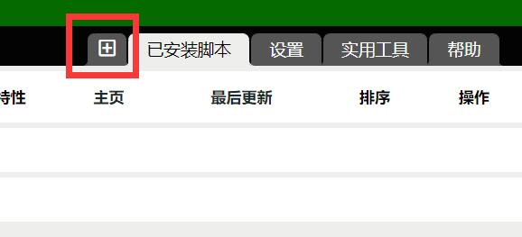
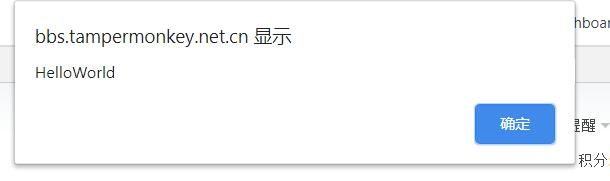
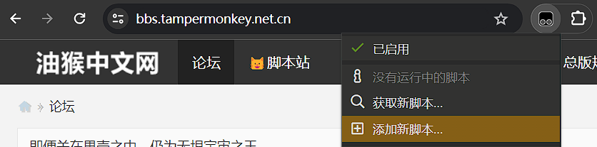

# 第一个脚本-HelloWorld

写出属于你的第一个简单油猴脚本

## 简介

打算写一些关于油猴脚本开发的资料，希望大家都能够写出属于自己的脚本!

暂时没有详细的规划，可能突然出现灵感就下笔了。大体预计是从易到难的更新。后期可能会进行整理。未经允许，禁止转载!

扩展主要使用：**Tampermonkey**，当然如果你使用其他的也没有关系，只要你熟悉它。后面都用油猴代称。本系列指南中，脚本也都指基于油猴使用的脚本。

### 本节主要内容

描述脚本的作用和油猴，脚本的基本结构，创建一个脚本，使它能够在我们的论坛首页弹出`HelloWorld`对话框


### 本节目标

1. 了解`JavaScript`和一些`DOM操作`

2. 了解油猴之类的扩展的操作和使用


## 脚本的作用和油猴介绍

脚本可内嵌至网页中，用以实现一些自动化的操作，有的脚本可以修改前端所展示的内容(比如广告屏蔽和一些内容展示)，还有的脚本可以修改前端的一些逻辑和数据(比如修改你支付时的金额)等等.....它们方便我们的生活，也带来了一定危险，这一切取绝于你。

当然一个脚本是无法直接的做到上述内容的，所以我们需要一个工具那就是油猴。油猴它可以帮我们把脚本嵌入到你所想嵌入的网页中，让你的脚本运行起来。

油猴还提供了很多 `API` 供脚本调用，用以实现一些单单靠前端 js 难以实现的内容和绕过一些安全限制。

## 使用油猴

### 新建脚本

我们打开油猴的扩展面板，点击左边的这个+号




然后就可以看见油猴帮你生成的一些代码，就像下面一样:

```js
// ==UserScript==
// @name         New Userscript
// @namespace    http://tampermonkey.net/
// @version      0.1
// @description  try to take over the world!
// @author       You
// @match        http://*/*
// @grant        none
// ==/UserScript==

(function() {
    'use strict';

    // Your code here...
})();
```

油猴的脚本需要包含很多属性，以便油猴识别你想在什么页面执行，需要什么api和权限，你脚本的一些作者信息支持网站是什么，等等。

这里就不一一描述，可以前往[油猴官方文档](https://www.tampermonkey.net/documentation.php?ext=dhdg)查看。

### 创建一个脚本

让我们创建一个脚本，并使它能够在我们的论坛首页弹出'HelloWorld'的对话框

修改上面的代码，实现能够在我们的论坛首页弹出'HelloWorld'的对话框写好后的代码我将发布到脚本列表给大家玩玩(应该属于垃圾脚本，其他人不要发哦)

目前主要涉及 `match` 属性，它的作用是匹配网站，*表示通配。

将其修改为匹配我们的论坛**首页**

```js diff
-// @match        http://*/*
+// @match        https://bbs.tampermonkey.net.cn/
```

在代码中`// Your code here...` 处，写一个弹窗的代码：

```js
alert('HelloWorld')
```

然后Ctrl+S 快捷键保存，或者在编辑菜单中点击也可以。

然后当你进入我们[网站首页](https://bbs.tampermonkey.net.cn/)的时候就会弹出这个框框来欢迎你~（最好直接点击这个地址）



然后一个脚本就完成啦....

<details>
<summary>查看完整代码</summary>

```js
// ==UserScript==
// @name         New Userscript
// @namespace    http://tampermonkey.net/
// @version      0.1
// @description  try to take over the world!
// @author       You
// @match        https://bbs.tampermonkey.net.cn/
// @grant        none
// ==/UserScript==

(function() {
    'use strict';
    alert('HelloWorld')
    // Your code here...
})();
```

当然，还可以根据文档规范一些参数，进行一些修改

```js
// ==UserScript==
// highlight-next-line
// @name         第一个脚本-HelloWorld
// highlight-next-line
// @namespace    https://learn.scriptcat.org/
// @version      0.1
// highlight-next-line
// @description  第一个脚本！弹出HelloWorld对话框
// highlight-next-line
// @author       李恒道 & 涛之雨
// @match        https://bbs.tampermonkey.net.cn/
// @grant        none
// ==/UserScript==

(function() {
    'use strict';
    alert('HelloWorld');
    // Your code here...
})();
```

</details>


当然，这是最最最最简单的一个，只是希望带你了解一下脚本的一个大概开发过程。

脚本地址：[https://bbs.tampermonkey.net.cn/thread-89-1-1.html](https://bbs.tampermonkey.net.cn/thread-89-1-1.html)

### 另外一种创建方式

除了先进入油猴插件点击添加，还可以打开站点后，直接通过插件快捷菜单添加。



如上图所示，在需要植入油猴脚本的网页，`点击油猴的图标`-`添加新脚本...`

```js diff
// ==UserScript==
// @name         New Userscript
// @namespace    http://tampermonkey.net/
// @version      0.1
// @description  try to take over the world!
// @author       You
-// @match        http://*/*
+// @match        https://bbs.tampermonkey.net.cn/
+// @icon         https://www.google.com/s2/favicons?sz=64&domain=tampermonkey.net.cn
// @grant        none
// ==/UserScript==

(function() {
    'use strict';

    // Your code here...
})();
```

与之前的创建方式相比，有两行不一样的代码，`@match` 和 `@icon`。

`@match` 用于匹配网站，`@icon` 用于设置脚本的图标。

这样可以快速创建当前页面的脚本，省去了手动修改的步骤。（好吧，其实也没省多少）
