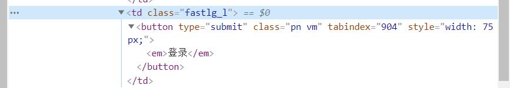

# 脚本自动化之模拟点击和表单填写

介绍模拟点击和表单填写原理，使用脚本实现自动化登录论坛

:::warning

论坛页面经过多次改版，如果按本节已无法正常登录，

可以尝试在[吾爱论坛](https://www.52pojie.cn/)进行测试<span style={{color: "transparent"}}>（身为吾爱破解管理，对此表示强烈谴责）</span>

:::

修正的方案也很简单，就是在点击登录后等待账号密码的输入显示再进行下一步操作

所以我用了一个定时循环来等待加载，加载完成后再取消循环

[更新后页面自动登录例子](https://bbs.tampermonkey.net.cn/thread-1326-1-1.html)

## 模拟点击

前端开发的同学应该都写过下面类似的代码，主要是监听一个按钮的 click 事件，用以实现一些功能。

```jsx live
function ClickTest() {
  return (
    <button id="btn" onClick={() => alert("按钮被点击了")}>
      按钮
    </button>
  );
}
```

我们模拟点击其实就是希望能够执行这个按钮点下后的事件。

### 方法一:

如果是上面的 html 的写法，我们可以直接找到点击后的事件，然后直接执行。不过这种方法使用场景有限，不是很推荐。

```js
click();
```

### 方法二:

如果是 js 监听事件的方法，我们可以先用 `document.querySelector` 找到 `btn` 元素，然后执行 `btn.click()`。

这是比较推荐的方法。当然除了 `document.querySelector` 外还可以用 `jQuery`，`document.getElementByXXX` 之类的方法，只要能够找到并操作 DOM 元素就行了。

因为我个人习惯 `querySelector`，所以后续也使用 `querySelector` 来编写

```js
var btn = document.querySelector("#btn");
btn.click();
```

## 表单填写

关于表单填写也就是 `form`，我们需要自动化的实现在 `input`，`checkbox`，`select` 等元素中填写或者选择我们希望的内容

例如自动选择正确答案和自动填写账号，其实也非常简单。

我们只需要使用 `querySelector` 查到我们想操作的元素就行了。

例如我想操作某个输入框:

```js
var input = document.querySelector("#input");
input.value = "油猴中文网";
```

操作多选框:

```js
var checkbox = document.querySelector("#checkbox");
checkbox.checked = true;
```

## 使用自动化登录论坛

接下来使用我们刚刚的内容来实现一个自动化登录论坛的脚本。

我们期望的功能是打开论坛首页时，检测是否登录，如果未登录就自动填写配置好的账号密码进行登录，并且勾上自动登录选项。

### 第一步，判断是否登录

在未登录的时候，我们的上方是一个登录框框，而不是用户的信息

那么我们可以查找上方是否有编辑框来判断是否是登录状态。(当然还有其它的很多办法)


按下 `F12` 打开开发者工具，选中用户这个框，可以看见他有一个 `id` 和一些其它信息，`id` 一般是这个页面唯一的，那么我们可以直接使用 `id` 来查询它，来看看它在不在这个页面上，在就表示没有登录。


代码就像这样:

```js
if (document.querySelector("#ls_username") == null) {
  //没有找到表示登录了，不再执行后续代码
  return;
}
//未登录，执行登录代码
```

### 第二步，填写账号密码
这里我们要将我们的账号信息填入进去，并且勾上自动登录选项
和上面的一样，使用 `f12` 开发者工具，找到用户名编辑框，密码编辑框，自动登录多选框。然后填入 `value` 和 `checked` 设置为 `true`。
代码就像这样:

```js
document.querySelector("#ls_username").value = "账号";
document.querySelector("#ls_password").value = "pwd";
document.querySelector("#ls_cookietime").checked = true;
```

最后一步，点击登录按钮，就可以啦!

但是发现好像这个按钮没有 `id`，没关系，我们可以使用它的上级 `class` 和 `type` 等信息来定位:


```js
document.querySelector(".fastlg_l button").click();
//这里的意思是先找到class名为fastlg_l的dom元素，在找在这个元素下叫做button的子元素
```

其实这些内容都很简单，我相信你很快就能上手。如果你是一名前端开发，甚至可能你还会觉得就这?

脚本安装地址: https://bbs.tampermonkey.net.cn/thread-92-1-1.html

## 常见错误

如果没找到元素存在以下可能

### 1. 在查找元素的时候页面还没有加载

解决方案：使用定时循环/`MutationObserver`/`ElementGetter 库`

(推荐：使用 `ElementGetter 库`)

### 2. 存在 `iframe` 框架

解决方案：

1. match 匹配到脚本内部

2. 在同域的情况下可以获取到 `iframe` 元素后通过 `conetentWindow` 属性进入 `iframe` 的作用域操作内部作用域
