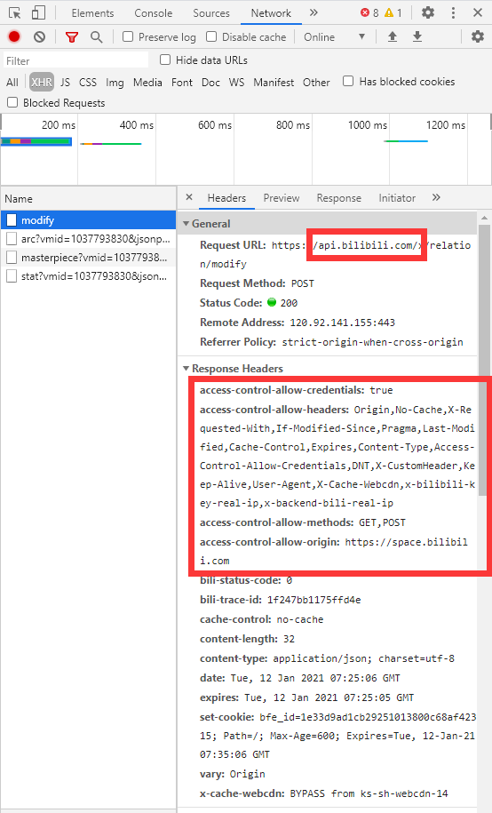

# 脚本ajax的跨域请求

介绍 `ajax` 和跨域问题，油猴中的 `ajax` 请求

我们将使用 `GM_xmlhttpRequest` 来绕过同源策略做一个访问我们油猴中文网就会自动关注我们的up主(夹杂私货手动狗头)

:::danger

本文及相关代码涉及到的作者（李恒道）B站账号（天才少年李恒道）已经被盗，

请勿上当受骗！

:::

本篇文章默认你已经懂了 `XMLHttpRequest` 和 `F12开发者工具(Network) `，如果不懂请先补习一下。

## `AJAX`

下面的一大段内容更多是科普和说明我们在脚本里面为什么不能直接使用 `XMLHttpRequest` 去访问我们自己的 `api`。

<details>
<summary>
点击查看
</summary>
[AJAX](https://zh.wikipedia.org/zh-cn/AJAX) 即 `Asynchronous Javascript And XML`，主要用于不刷新页面与网站后端通信。例如你在b站网页上的点赞/投币/收藏，在评论区翻页，就是使用了ajax技术。

AJAX通常使用 [XMLHttpRequest(XHR)](https://developer.mozilla.org/zh-CN/docs/Web/API/XMLHttpRequest)，但是由于此api的设计不太友好，于是又有了[Fetch API](https://developer.mozilla.org/zh-CN/docs/Web/API/Fetch_API) 来解决这些问题，不过也有其它的封装让XHR的使用体验更友好，例如: `axios` 和 `jQuery` 的 `ajax` 等，此处就不再展开。
</details>

## 跨域

跨域即两个不同域名之间的访问。

例如我在开头说的访问我们[油猴中文网](https://bbs.tampermonkey.net.cn/)就会自动关注我们的<s>[up主](https://space.bilibili.com/1037793830)</s>，那么肯定就需要从我们的域名`https://bbs.tampermonkey.net.cn/` 访问到哔哩哔哩的域名`https://space.bilibili.com/1037793830`，这就产生了跨域访问。

这个时候为了跨网站通信的安全性就涉及到了同源策略。

## 同源策略

如果上述可以正常访问那肯定是不合理且不安全的。

假如正常访问了，只是看页面还好，万一直接投币甚至转账那是无法接受的。

就比如我可以随便从我家跑到你家看东西(`GET`)，放东西(`POST`)，丢东西(`DELETE`)一样。

因此，引出了[同源策略](https://developer.mozilla.org/zh-CN/docs/Web/Security/Same-origin_policy)对此来加以限制。

如果两个 `URL` 的 `protocol`、`port` (如果有指定的话)和 `host` 都相同的话，则这两个 URL 是同源。这个方案也被称为“`协议/主机/端口元组`”，或者直接是 “`元组`”。

实际如下图所示，提示了错误。且不可以访问。


如果希望可以解决这个问题，能够让我们跨域访问，主要有 `JSONP`，[`CORS`](https://developer.mozilla.org/zh-CN/docs/Web/HTTP/Access_control_CORS) 和 `反向代理`这三种方式。(限于篇幅和主题，本文不展开详细描述)

像b站点击关注哪里就是使用的 `CORS`，因为用户页面的域名是:`space.bilibili.com`，而关注api的域名是:`api.bilibili.com`，两个域名并不符合同源策略，但请求的服务器授权了该域名可以合法访问，所以可以正常通信：



## 脚本的跨域访问

前面啰嗦了一大把，终于可以进入正题了。

至于油猴为什么可以绕过同源策略进行跨域访问，就牵扯到浏览器扩展开发了，以后再说。

所以扩展和脚本还是不能乱装啊，多么不安全。

如果我们需要让我们的脚本能够完全的访问其它的 `api`，那么大概只有两种方法，一种是 `CORS`，另外一种是通过油猴扩展去获得更高级的权限，让我们的脚本不受同源策略所限制。

`CORS` 方法如果你调用的 `api` 不是自己写的，不能自己去增加 `CORS` 策略，那么就几乎无解，好处是对你的 `api` 安全。(不过都脚本了，哪里还管安全....)

所以脚本一般使用 `GM_xmlhttpRequestAPI`，我们需要通过 `// @grant GM_xmlhttpRequest` 去申请此权限。

这个方法更详细的文档：[GM_xmlhttpRequest](https://www.tampermonkey.net/documentation.php#GM_xmlhttpRequest)，看起来像 `XHR` + `jQuery` 的结合体。

## bilibili自动关注up主

如果想实现访问我们的论坛然后自动关注我们的up主，那么我们得先知道，bilibili关注 up 主的 `api` 是什么。

我们先通过 `f12` 的开发者工具，然后使用 `Network` 去查看 bilibili 关注 up 主的网络请求包是怎么样的。

主要关注 `Request URL`：`https://api.bilibili.com/x/relation/modify`，`Request Method`:`POST`，`Form Data`。

先来完成我们的脚本第一版，如果有问题再继续调整。

就像写 `ajax` 请求一样

```js
// ==UserScript==
// @name         油猴中文网-自动关注up主
// @namespace    https://bbs.tampermonkey.net.cn/
// @version      0.1
// @description  油猴中文网-自动关注up主
// @author       Wyz
// @match        https://bbs.tampermonkey.net.cn/
// @grant        GM_xmlhttpRequest
// highlight-next-line
// @connect      api.bilibili.com
// ==/UserScript==

(function() {
    'use strict';

    GM_xmlhttpRequest({
        url:"https://api.bilibili.com/x/relation/modify",
        method :"POST",
        data:"fid=1037793830&act=1&re_src=11&jsonp=jsonp&csrf=e37f1881fd98f16756d16ab71109d37a",
        headers: {
            "Content-type": "application/x-www-form-urlencoded"
        },
        onload:function(xhr){
            console.log(xhr.responseText);
        }
    });
})();
```

执行一下，会弹出跨站请求授权，当然点击允许啦！这是油猴的安全机制，不在计划内的请求需要用户授权。

当然，如果你不希望弹出这个内容，那么你可以在脚本中加入上面代码中高亮的 `// @connect api.bilibili.com` 这一行来设置允许通过的域名，使用 [`@connect`](https://www.tampermonkey.net/documentation.php#_connect) 配置确保此跨域请求是计划内的行为。

不知道是延迟还是什么的原因，我刷新了几次之后才关注成功。

不过到此，虽然可以关注了，但是还不能算完，因为这个请求里有一个参数：`csrf`。
这个值为校验值，与账号相关，需要从cookie里面去获取，如果你直接将上面的脚本代码发给别人运行，因为对方的csrf和你的不同，那么就会输出这个内容：

```js
{"code":-111,"message":"csrf 校验失败","ttl":1}
```

但是如果想直接取出 `cookie` 目前并没有什么好办法，因为 `gm_cookie` 是 `beta` 版本的功能，并未加入 `stable`。

所以这个脚本只能用理解，如果你想写一个较为完全的脚本还需要继续努力哦~
