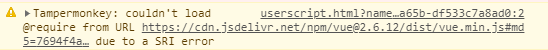

# 外部资源引用

引入外部资源，例如 `jQuery`，`vue`，和自己写的一些css样式，js脚本等。

最终目标是写一个脚本，给论坛增加一个黑夜模式(背景全是黑的)。

## js资源的引用

有些时候可以引入一些js资源文件帮助我们更加方便的开发脚本，例如引入 `jQuery`，`vue` 等框架。

当然还有其它更多的用法，例如脚本加上鉴权，脚本`url`后加一些`token`等等。

### 使用`@require`加载

油猴给我们提供了一个 `@require` 属性给我们来引用用户脚本，并且油猴给我们提供了`md5`，`sha256`等校验方法来校验引用的脚本是否正确，例如下面这样:

```js
// @require      https://cdn.jsdelivr.net/npm/vue@2.6.12/dist/vue.min.js#md5=xxxx
```
如果md5不正确，console中则会显示下面的内容



:::danger

如果是采用这种方式引入的话，那么引入的js执行的上下文是在油猴的环境中，可能会导致js无法正常执行。

例如沙盒环境中操作前端 `window` 是需要使用 `grant unsafeWindow`，引入的js文件可能并不会考虑这些。一个小坑需要注意。

:::

:::warning

另外如果 `grant none` 运行在非沙箱的情况下，js代码可能会与前端冲突(例如前端引入了一次 `jQuery`，这里又 `require` 了一次 `jQuery`)

这种情况下可以使用沙箱模式运行，这样只存在沙箱的上下文中，不会影响到前端，不过这种情况，可以直接使用前端的js，如果版本符合你的需求的话。
:::

沙盒中的 `document` 的可以正常使用，所以可以引用 `vue`，`jquery` 之类的框架，但是如果js脚本涉及到 `window` 的操作，需要使用下面的方法。

### 使用脚本加载

对于上面的小坑可以使用这种方法解决

在我们的脚本中写如下代码，原理就是往我们的页面中加入 `script` 标签去加载js文件。需要注意的是，`head` 标签，`body` 标签等不同的位置中插入，js加载的时间是不同的，不过一般 `onload` 之后再执行脚本一般没问题。

::::warning

注入代码的时候，脚本的 `run-at` 属性，最好使用 `document-start`。

注意 js 加载顺序和脚本执行顺序，不要在js还没加载完的时候，脚本就使用这些js代码了。

:::tip

可以合理使用 `script` 标签的 `onload` 属性。

:::
::::

下面是一个在页面中插入 `vue` 的例子：

```js
let script = document.createElement('script');
script.setAttribute('type', 'text/javascript');
script.src = "https://cdn.jsdelivr.net/npm/vue@2.6.12/dist/vue.min.js";
document.documentElement.appendChild(script);
```

## CSS 资源的引用

CSS 可以用来改变我们页面的布局效果，很多框架都有对应的 CSS 依赖需要引用。

### 使用油猴加载

本思路也可以用于其他资源的加载，例如图片，`json`，`xml`，更新公告信息等等。

油猴提供了 [`@resource`](https://www.tampermonkey.net/documentation.php#_resource) 属性，油猴将资源预加载后，可以通过 [GM_getResourceURL](https://www.tampermonkey.net/documentation.php#GM_getResourceURL) 和 [GM_getResourceText](https://www.tampermonkey.net/documentation.php#GM_getResourceText) 获取资源 `url` 或者内容。

获取到 css 内容之后可以通过 [GM_addStyle](https://www.tampermonkey.net/documentation.php#GM_addStyle) 将 css 样式添加到前端页面。

就像下面这样：

```js
// ==UserScript==
...
// @resource css https://blog.icodef.com/wp-content/themes/Kratos-3.0.7/assets/css/kratos.min.css?ver=3.2.4
// @grant    GM_getResourceURL
// @grant    GM_getResourceText
// @grant    GM_addStyle
...
// ==/UserScript==

console.log(GM_getResourceURL("css"),GM_getResourceText("css"));
GM_addStyle(GM_getResourceText("css"));
```

:::info

`GM_getResourceText` 会返数据的内容，

`GM_getResourceURL` 则会返回数据的 [`dataURL`](https://developer.mozilla.org/zh-CN/docs/Web/HTTP/Basics_of_HTTP/Data_URLs), 本例中，即 `data:text/css;base64,[base64]` 

:::


:::tip

`require` 和 `resource` 支持 [window.crypto](https://developer.mozilla.org/en-US/docs/Web/API/Crypto) 校验，例如 `SHA-256`, `MD5`, `SHA-1`, `SHA-384` 和 `SHA-512`。

例如油猴文档的例子：

```js
// @resource SRIsecured1 http://example.com/favicon1.ico#md5=ad34bb...
// @resource SRIsecured2 http://example.com/favicon2.ico#md5=ac3434...,sha256=23fd34...
// @require              https://code.jquery.com/jquery-2.1.1.min.js#md5=45eef...
// @require              https://code.jquery.com/jquery-2.1.2.min.js#md5-ac56d...,sha256-6e789...
// @require              https://code.jquery.com/jquery-3.6.0.min.js#sha256-/xUj+3OJU...ogEvDej/m4=
```


详见[油猴文档](https://www.tampermonkey.net/documentation.php#api:Subresource_Integrity)。

:::

### 使用脚本加载

这种方法与上面的加载js一样，不再做过多描述，缺点就是由于没有使用油猴预加载资源，会很明显的感觉到页面的刷新。

```js
let script = document.createElement('link');
script.setAttribute('rel', 'stylesheet');
script.setAttribute('type', 'text/css');
script.href = "https://blog.icodef.com/wp-content/themes/Kratos-3.0.7/assets/css/kratos.min.css?ver=3.2.4";
document.documentElement.appendChild(script);
```

## 实例：给论坛添加黑夜模式

我们直接引入外部js就可以了啦~

这是一个dark mode的插件:[Darkmode.js](https://github.com/sandoche/Darkmode.js)

```js
// ==UserScript==
// @name         论坛黑夜模式demo
// @namespace    http://tampermonkey.net/
// @version      0.1
// @description  给网站添加一个黑夜模式
// @author       You
// @match        https://bbs.tampermonkey.net.cn/*
// @run-at       document-start
// @grant        unsafeWindow
// @require https://cdn.jsdelivr.net/npm/darkmode-js@1.5.7/lib/darkmode-js.min.js
// ==/UserScript==

unsafeWindow.onload=function(){
    //因为这个脚本只操作document，所以在沙箱环境中也是没有问题的
    new Darkmode().showWidget();
}
```

### 其他引用库的使用

参见[引用库使用](/实用知识库/引用库使用)