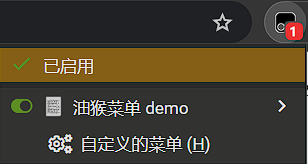

# 右键菜单与 GM 存储函数介绍

介绍油猴存储相关函数，油猴脚本的右键菜单能力，

并提供一个菜单点击计次的脚本演示。

## `GM_getValue` 和 `GM_setValue`

两个函数的官方文档地址：[`GM_getValue`](https://www.tampermonkey.net/documentation.php#api:GM_getValue)，[`GM_setValue`](https://www.tampermonkey.net/documentation.php#api:GM_setValue)。

这两个函数可以使用 `KV` 键值对的方式存储数据，将数据保存在浏览器的储存中(`tampermonkey` 插件是 `websql` 中)

:::info

具体容量由扩展实现使用的存储介质所决定，

不过一般来说肯定是够用的，不用太关注。

:::

这个函数可以用来保存一些配置数据，例如，某些脚本的配置是写在脚本代码中的，更新脚本后配置会被覆盖，很不方便。

这时就可以使用 `GM_getValue` / `GM_setValue` 函数来读取/写出配置。

:::warning

这个函数在 Greasemonkey 中是异步的，Tampermonkey 是同步的，

我们这里只针对 Tampermonkey 来讲解。

注意: 在两个不同的脚本中存储的数据是无法直接共享的。

:::

### 使用方法

方法非常简单，我们一笔带过。

:::warning

两个函数都要使用 `grant` 去申请

:::

```js
// ==UserScript==
// @name         New Userscript
// @namespace    http://tampermonkey.net/
// @version      0.1
// @description  try to take over the world!
// @author       You
// @match        https://bbs.tampermonkey.net.cn/
// @grant        GM_setValue
// @grant        GM_getValue
// ==/UserScript==

GM_setValue("qqq", 123);
console.log(GM_getValue("qqq"));
```

## 右键菜单

之前在说 [run-at](https://www.tampermonkey.net/documentation.php#meta:run_at) 的时候，有一个属性，不知道大家有没有注意。

除了 `document-start/body/end/idle` 这些控制脚本运行时间的参数外，还有一个 `context-menu`的属性，用于右键点击菜单的时候执行脚本。

如果你使用了 `context-menu`属性，那么当你在所匹配的页面上右键时，菜单中就会以你脚本名显示出一菜单项，点击之后就是执行你的脚本代码。

:::note

文档的最后还提了一下 `#include`和 `#exclude`，

这两个属性和 `#match`功能差不多，

🤡 实际上我也没用过这两，忽略好了

:::

```js
// ==UserScript==
// @name         右键菜单和valude demo
// @namespace    http://tampermonkey.net/
// @version      0.1
// @description  try to take over the world!
// @author       You
// @match        https://bbs.tampermonkey.net.cn/*
// @run-at       context-menu
// ==/UserScript==

alert("菜单被点击了");
```

### 自定义的菜单

除了使用 `@run-at context-menu` 生成菜单外，油猴还提供了两个函数 [GM_registerMenuCommand](https://www.tampermonkey.net/documentation.php#api:GM_registerMenuCommand) 和 [GM_unregisterMenuCommand](https://www.tampermonkey.net/documentation.php#api:GM_unregisterMenuCommand)，分别用于注册菜单和删除菜单。

这两个函数更加灵活，但是不能显示在页面上，需要在油猴图标脚本弹出菜单里点击。

```js
// ==UserScript==
// @name         油猴菜单 demo
// @namespace    http://tampermonkey.net/
// @version      0.1
// @description  try to take over the world!
// @author       You
// @match        https://bbs.tampermonkey.net.cn/*
// @grant    GM_registerMenuCommand
// @grant    GM_unregisterMenuCommand
// ==/UserScript==

let id = GM_registerMenuCommand(
  "自定义的菜单",
  function () {
    alert("菜单被点击");
    GM_unregisterMenuCommand(id); //删除菜单
  },
  "h"
);
```
效果：



:::info

第三个参数 `accessKey` 为快捷键，上述例子中输入 `h` 即可触发。

本脚本在点击一次之后会将菜单删除。

:::


## 菜单点击计数器

利用油猴的存储功能来保存菜单被点击的次数，然后刷新次数

~~(纯属使用而使用……想不到什么实战的例子……)~~

```js
// ==UserScript==
// @name         右键菜单和valude demo
// @namespace    http://tampermonkey.net/
// @version      0.1
// @description  try to take over the world!
// @author       You
// @match        https://bbs.tampermonkey.net.cn/*
// @grant    GM_setValue
// @grant    GM_getValue
// @grant    GM_registerMenuCommand
// @grant    GM_unregisterMenuCommand
// ==/UserScript==

let id = GM_registerMenuCommand(
  "菜单第" + GM_getValue("click_num", 0) + "点击",
  click,
  "h"
);

function click() {
  GM_unregisterMenuCommand(id);
  GM_setValue("click_num", GM_getValue("click_num", 0) + 1);
  id = GM_registerMenuCommand(
    "菜单第" + GM_getValue("click_num", 0) + "点击",
    click,
    "h"
  );
}
```

## 其他 `GM_*Value` 函数

### GM_deleteValue

从存储之中删除名称，参数仅有一个，为值的名称

### GM_addValueChangeListener

对指定的名字进行监听，该函数返回一个 `id`

该函数可以跨函数通信，格式为

```js
// name  值的名称
// old_value  旧值
// new_value  新值
// remote     区分这个值的改变的所属，如果是由本标签页引起的，则为false。如果由其他标签页引起的，为true。
GM_addValueChangeListener(
  name,
  function (name, old_value, new_value, remote) {}
);
```

为了方便理解我也写了一个小例子

<details>
<summary>
点击查看例子
</summary>
```js
// ==UserScript==
// @name         存储函数监听例子
// @namespace    http://tampermonkey.net/
// @version      0.1
// @description  try to take over the world!
// @author       You
// @match        https://www.baidu.com/
// @match        https://bbs.tampermonkey.net.cn/*
// @icon         https://www.google.com/s2/favicons?domain=tampermonkey.net.cn
// @grant        unsafeWindow
// @grant        GM_setValue
// @grant        GM_getValue
// @grant        GM_deleteValue
// @grant        GM_removeValueChangeListener
// @grant        GM_addValueChangeListener
// ==/UserScript==
let num = 0;
if (unsafeWindow.location.href.indexOf("bbs") !== -1) {
  setInterval(() => {
    num++;
    if (num % 2 === 0) {
      GM_setValue("test", num);
    } else {
      GM_deleteValue("test");
    }
  }, 5000);
} else {
  GM_addValueChangeListener(
    "test",
    function (name, old_value, new_value, remote) {
      console.log("监听到了更改", name, old_value, new_value, remote);
    }
  );
}
```
</details>
大家可以分别访问[油猴中文网](https://bbs.tampermonkey.net.cn/)以及[百度首页](https://www.baidu.com/)体验一下

### GM_removeValueChangeListener

移除一个监听器，

`GM_addValueChangeListener` 的函数会返回一个监听器的 `id`

如果我们传给 `GM_removeValueChangeListener`，则移除该监听器。

类似于 `setInterval` 与 `clearInterval` 的关系

## GM_listValues

列出存储的所有名称，无任何参数
