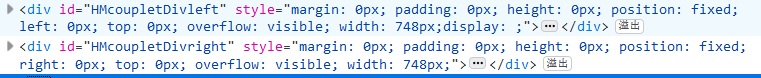
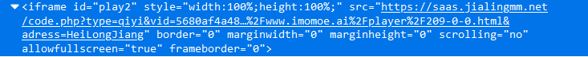
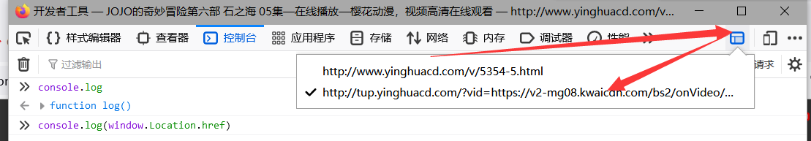
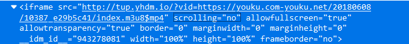

## `GM_addStyle` 介绍

`GM_addStyle` 可以将 `CSS` 添加到网页中

函数将创建一个 `style` 标签，并且将传入的内容插入到标签中

这节课我们以樱花动漫网为例子。

貌似存在好多网站，这节课我就简单以这两个网站为例子：

- [$www.imomoe.ai$](http://www.imomoe.ai)
- [$www.yhdm.io$](http://www.yhdm.io/)

## 去广告例子

### 添加普通样式
首先解决 [$www.imomoe.ai$](http://www.imomoe.ai)。

我们先看右下角的广告:


使用元素定位功能定位到元素位置


在右边写上 `display:none` 后，广告消失了。


这里我们写的是 css 样式，`display` 是展示的意思，`none` 代表无。

同理，定位视频两边的广告：



同样设置 `display:none` 就可以了。

这里我发现一个非常有意思的事情：

第一个右下角的广告如果不加载，两边的广告也不会加载。

所以我就稍微偷一下懒了！

```js
if (weburl.indexOf("www.imomoe.ai") != -1) {
  GM_addStyle("#HMRichBox{display:none !important}");
  GM_addStyle("#bdshare{display:none !important}");
}
```
<details>
<summary>对上面代码的解析</summary>

`bdshare` 是分享按钮，我觉得没什么用，就也给去掉了。

`#HMRichBox` 是 css 中 `ID 选择器`的语法，其中，`#` 表示这是一个 id 元素，`HMRichBox` 是这个 id 的值。

我们用一个大括号包含我们想写的内容，之间每一个规则都用 `;` 来分割。

这次只有一个规则，所以也可不加，直接写上 `display:none` 就好了

:::tip `!important` 是什么意思呢？

原网页就有 `display:xxxx`，不同的 css 规则具有不同的高低等级，`important` 通常可以提高到最高等级

这里为了防止原网页的覆盖，所以加上了 `important`

:::
</details>

### 多网页匹配

此外，我们发现暂停的时候偶尔也会出现广告，确定其 `class` 为 `player_pause`。

所以我们可以写 `.player_pause{display:none !important}` ,其中 `.` 代表根据 `class` 名来定位元素，`player_pause` 是我们要查找的 `class` 名，

我们写出 css 样式后发现使用 `GM_addstyle` 是不起效果的。

查看网页发现其实播放器是一个 `iframe`，也就是在当前网页中包含了另一个网页



那我们应该怎么处理？

油猴仅会在与 `match` 和 `include` 配置项匹配，且**不在** `exclude` 中的网页上加载。

这种匹配不仅包括顶级页面，也包括页面中的 `iframe`。

:::tip

如果希望油猴仅在顶级页面（不在 `iframe` 页面）上加载，

可以使用 [`// @noframes`](https://www.tampermonkey.net/documentation.php#meta:noframes) 配置

:::

通过测试，直接添加 `saas.jialingmm.net/*` 是没有效果的，我们访问一下地址：

```
https://saas.jialingmm.net/code.php?type=qiyi&vid=5680af4a488b920b2e2bbba3fb8abae3,302725300&userlink=http%3A%2F%2Fwww.imomoe.ai%2Fplayer%2F209-0-0.html&adress=HeiLongJiang
```

:::tip

可以看到，`address` 写了`黑龙江`，

~~所以李恒道在黑龙江~~（当然这不是重点）

:::


切换作用域，打印 `window.location.href` 获取到地址


<details>
<summary>
如何切换作用域
</summary>

|浏览器|示意图|
|--|--|
|火狐||
|谷歌||
:::tip

也可以通过点击 iframe 切换当前作用域


:::


</details>

切换作用域后，发现这是一个动态跳转的网页，目前的 api 链接是 `api.xiaomingming.org`,所以我添加了 `// @match api.xiaomingming.org/*`，并使用 `GM_addStyle` 注入 CSS。

这样就彻底干净了!

## 第二个网页

第二个例子，是 [$www.yhdm.io$](http://www.yhdm.io)

右下角的广告问题相信大家已经知道怎么处理了

:::note

(吐槽：为什么都叫樱花动漫，但是域名不同，广告 id 都相同！)

:::

我们继续谈谈视频内的暂停广告


这里依然使用了 iframe



我们访问这个链接是 `http://tup.yhdm.io`，直接跟上一个网站同样处理就好了。

## 完整代码

最后附上脚本代码

```js
// ==UserScript==
// @name         【油猴中文网bbs.tampermonkey.net.cn】樱花去右下角广告以及弹窗
// @namespace    http://www.yhdm.io/
// @version      0.1
// @description  去除樱花动漫网广告，来源油猴中文网，bbs.tampermonkey.net.cn
// @author       【李恒道】来源油猴中文网，bbs.tampermonkey.net.cn
// @match        http://tup.yhdm.io/*
// @match        http://www.yhdm.io/*
// @match        http://www.imomoe.ai/*
// @match        api.xiaomingming.org/*
// @grant        GM_addStyle
// @grant        unsafeWindow
// @supportURL   https://bbs.tampermonkey.net.cn/forum.php?mod=viewthread&tid=270
// @homepage     https://bbs.tampermonkey.net.cn/forum.php?mod=viewthread&tid=270
// ==/UserScript==
let weburl = unsafeWindow.location.href;
if (weburl.indexOf("api.xiaomingming.org") != -1) {
  GM_addStyle("#player_pause{display:none !important}");
}
if (weburl.indexOf("tup.yhdm.io") != -1) {
  GM_addStyle("#img-random-hm1{display:none !important}");
}
if (weburl.indexOf("www.yhdm.io") != -1) {
  GM_addStyle("#HMRichBox{display:none !important}");
  GM_addStyle("#bdshare{display:none !important}");
}

if (weburl.indexOf("www.imomoe.ai") != -1) {
  GM_addStyle("#HMRichBox{display:none !important}");
  GM_addStyle("#bdshare{display:none !important}");
}
```
::::tip

涛之雨注：

一般来说，去广告的 CSS 污染影响会比较小，

因此理论上可以不需要匹配域名，直接注入全部的 css：

```js
// ==UserScript==
...
// ==/UserScript==
  GM_addStyle(`
#player_pause,
#img-random-hm1,
#HMRichBox,
#bdshare{
  display:none !important
}
`);
```

当然，匹配域名肯定是没有错误的，只是说会更简单

:::danger

此方法可能会出现 CSS 污染的问题，

请具体情况具体分析！
:::

::::