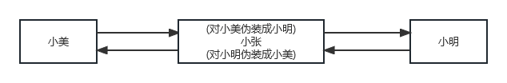
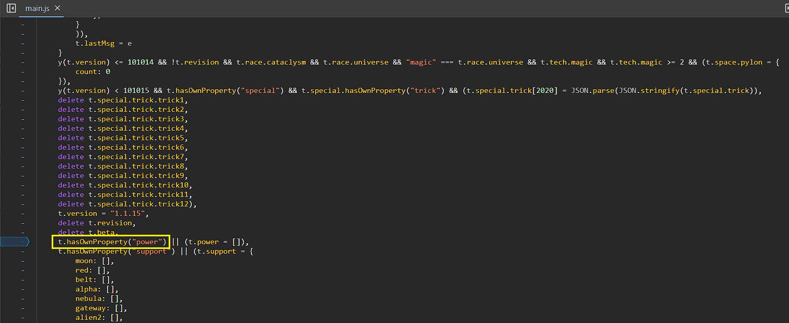
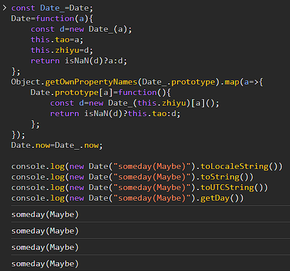
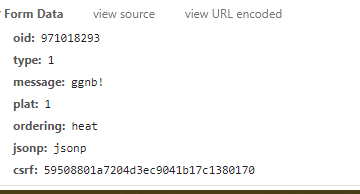

# hook实现b站评论小尾巴

介绍 `hook` 在油猴脚本中的使用，涉及到 `this`，原型链等。

最后我们将使用 `hook` 技术，让我们在b站发评论的时候自动带上小尾巴。

## hook

关于 `hook` 的技术之前在[时间加速](/油猴教程/入门篇/h5视频倍速,时间加速和run-at/)这一篇中简单的说过一次。

当时描述为 `劫持`，让实际调用的方法变成我们的方法，这时候就可以对它为所欲为了。

包括且不限于选择不调用它走自己的逻辑，或者处理它的参数再进行调用等等。

本节的目标就是 hook 发评论时候的方法，处理参数再继续调用。

:::note

熟悉 web 后端开发的同学可能觉得有点像中间件，

嗯我也觉得，

再次感叹技术真是互通的。

:::

我们再次以通俗的方式理解一下劫持的含义：

假设你是小张同学，发现小美和小明每天在互相写信交流，于是你决定看看他们到底互相在说什么。


此时小张发动了超能力，提前伪装成了小明，于是小美把信交给了小张(伪装版小明)，而他偷偷看一遍，再决定是否把信交给小明



当交给小明的时候，他会提前伪装成小美，于是小明收到信后，会把回信再次交给小张(因为他是伪装版小美)，同理，小张会再次阅读一遍信，然后决定是否把信真的交给小美，于是两个人之间稀里糊涂就被小张介入开始从中作梗，这就是劫持。

在网络安全领域，这也就是常说的 [中间人攻击(`MITM`)](https://baike.baidu.com/item/%E4%B8%AD%E9%97%B4%E4%BA%BA%E6%94%BB%E5%87%BB/1739730?fr=ge_ala) 的原型。


## 常见劫持方式

接下来让我们看看常见的劫持方法。

### 全局函数

像我们之前时间加速中的 `setInterval`，当时我们的方法就是下面这样，很简单。

```js
//将系统提供的setInterval保存
let hookSetInterval = window.setInterval;
//将系统的setInterval替换为我们自己的
window.setInterval = function (a, b) {
  //经过处理后再调用系统的setInterval
  return hookSetInterval(a, b / 2);
};
```

### 全局对象中的方法

浏览器会把一些常用的函数以及对象写入到全局对象 `window`，并且一些开发者也喜欢将一些对象写入到 `window`，如果在调用之前我们就对其进行劫持，就可以在以后的调用中实现控制该函数的调用行为。

例如我们会 hook `XMLHttpRequest`，这是一个全局对象，用于发送网页请求，获取网页数据，这节中我们就是利用此思路去实现的哔哩哔哩评论小尾巴。

举个例子，假设一个开发者在 `window` 中写入了 `startAd` 函数，其作用是在网页加载后显示广告。

那么我们可以通过以下代码来阻止显示广告

```js
window.startAd = function () {
  console.log("stop Ad");
  return true;
};
```

### 原型链上的方法

原型链是什么，可以参考[MDN 文档](https://developer.mozilla.org/zh-CN/docs/Web/JavaScript/Inheritance_and_the_prototype_chain)。

如果一个对象将函数挂载到了原型链上，我们可以直接触及到原型链来对其进行 `hook`，对于浏览器的一些 `API` 也可以使用该方法。

关于原型链的推导可以参考: [原型与原型链](/实用知识库/JavaScript%20知识篇/原型与原型链/)

现在我们假设有一个 `hookGlobalObject` 的对象，他的原型链上有一个 `prototypeFunc` 需要我们进行劫持，我们可以写出如下代码

```js
let prototypeFunc = hookGlobalObject.prototype.prototypeFunc;
hookGlobalObject.prototype.prototypeFunc = function (p) {
  return prototypeFunc("hook" + p);
};
```

### 使用到了 `this` 的方法

如果调用的方法使用到了 `this`，其实与 `hook` 对象中的方法一样，只是调用的时候使用 `apply` 或者 `call`，让对象里的 `this` 指向我们期望的 `this`，否则会影响结果。

我们假设有一个 `globalObject` 的函数，使用 `new` 调用它会返回一个对象，而我们需要劫持其中的 `thisFunc`，所以这里我们劫持了 `globalObject` 对象，劫持函数内通过 `new hookGlobalObject()` 提前生成返回对象，并保存他的 `thisFunc` 原方法，后对 `thisFunc` 进行劫持成我们自己的方法，注意我们的 `thisFunc劫持方法` 在调用 `原thisFunc` 方法的时候，因为该方法需要 `this`，需要我们必须使用 `apply/call` 来改变调用 `hookThisFunc` 函数的 `this` 的指向。

```js
let hookGlobalObject = window.globalObject;
window.globalObject = function () {
  let ret = new hookGlobalObject();
  let hookThisFunc = ret.thisFunc;
  // hook对象中的方法
  ret.thisFunc = function (p) {
    return hookThisFunc.apply(this, ["hook" + p]);
  };
  return ret;
};
```

关于 `this` 的知识，可以参考 [this 的作用](/实用知识库/JavaScript%20知识篇/this的作用/) 以及 [this 的推导](/实用知识库/JavaScript%20知识篇/this的推导/)

### 匿名函数

如果是匿名的函数，我们将很难处理，局限性也更大，匿名函数如果直接使用变量，因为作用域的原因，我们根本无法访问到。

如果想 `hook` 达到我们的修改的话几乎没有办法，而且对 `hook` 的匿名函数来说，很多时候还要复制粘贴他原本的源码去修改来达到目的，如果源码一大串几乎可以放弃了。

例如下面的例子:

```js
function run() {
  const print = () => {
    console.log("i am anonymous");
  };
  print();
}
run();
```

我们想要 `hook` `print` 函数几乎是不可能的，唯一的办法只有重写一整个 `run` 函数，如果 `run` 函数过大那么就可以直接放弃了

::::info
还有一个曲线的办法，就是我们可以对 `console.log` 这个基础 `API` 来进行劫持。
这样可以一定程度上影响到内部代码的运行逻辑。

:::danger

这种方式很有可能污染到其他部分，

并且逻辑代码过多很可能会影响到整个网页的性能，

如果万不得已请勿使用。
:::
::::

:::tip

可能的例子：
（修订者自己的例子，其他更好的例子欢迎补充）

<details>
<summary>
[入门] 涛之雨的：gitbookVIP
</summary>
代码链接：[gitbookVIP](https://scriptcat.org/s/1436)

代码（0.6版本）：从29行到35行

```js
[].constructor.prototype._reduce=[].constructor.prototype._reduce||[].constructor.prototype.reduce;
[].constructor.prototype.reduce=function(){
    return(JSON.stringify(this).includes('github-sync')?this.map(a=>{
        for(const i in a)a[i]===false&&(a[i]=true);
        return a;
    }):this)._reduce(arguments[0],arguments[1]);
};
```

代码核心作用是将他的数组中每一个没有权限(`false`)权限都改成有权限(`true`)

</details>

<details>
<summary>
[进阶] 涛之雨的：摸鱼派：进化-Evolve
</summary>
代码链接：[摸鱼派：进化-Evolve](https://scriptcat.org/s/1408)

代码（0.1.1版本）：从68行到119行

其中，核心代码如下：
```js
Object.prototype.hasOwnProperty = function (...a) {
  if (this && this.seed && this.resource) {
    // highlight-next-line
    Object.prototype.hasOwnProperty = k; //恢复拦截
    dataList=this;
    return k.apply(deepProxy(this), a);
  }
  return k.apply(this, a);
};
```
代码劫持的内容：


通过 `hasOwnProperty` 拦截到对应的数据，返回使用 `Proxy` 包裹的代理数据。

同时，为了保证代码的稳定性和速率，如代码高亮部分所示，在拦截到对应参数后，立即恢复原生 `hasOwnProperty`，最大程度上的减少了对性能的影响。

</details>

<details>
<summary>
[进阶] 涛之雨的：hyperbeam VIP
</summary>
（VIP功能似乎已失效，主要看日期的劫持）

代码链接：[hyperbeam VIP](https://greasyfork.org/zh-CN/scripts/457795-hyperbeam-vip/code)

代码（0.1版本）：从21行到35行

其中，核心代码如下：
```js
;(()=>{
  const Date_=Date;
  Date=function(a){
    const d=new Date_(a);
    this.tao=a;
    this.zhiyu=d;
    return isNaN(d)?a:d;
  };
  Object.getOwnPropertyNames(Date_.prototype).map(a=>{
    Date.prototype[a]=function(){
      const d=new Date_(this.zhiyu)[a]();
      return isNaN(d)?this.tao:d;
    };
  });
  Date.now=Date_.now;
})();
```

代码将Date劫持了！让他可以显示文本：



好吧。。。其实没啥意义 =\_= 只是为了让他显示到期时间的时候，可以看起来更炫酷一些

> 到期时间：`someday(Maybe)`

（但是其实这也算是油猴的意义，修改了显示的内容，只不过可能会看起来更“优雅”）
</details>

:::info 友情提醒

看起来可能例子的原理都很简单，很容易理解

但是归根到底其实油猴的核心思想也是 `hook` (`MITM`)，

- 你没有权限，通过油猴拦截，赋予权限
- 你无法自动操作，通过油猴植入，添加功能
- ...

编写脚本重要的不仅是思路，还要注入点，同时成功编写代码

:::

### 小结

一般来说，能 hook 的方法，应该满足他能访问到的对象，我们也能够访问得到，我们脚本能访问到的对象应该全在 `window`这个全局的变量上，所以上述例子都是以全局为基准的。

另外对于匿名的方法或者离 `window`对象的距离越远，那么 hook 的成本将越大，这时候就应该切换其它的思路了。

就像上面所说的，我们可以 hook 掉 `document.querySelector`，在判断参数为 `'#object-anonymous'`时，innerHTML 变为其它的。

也就是从其它我们能 `hook` 到的对象来入手，曲线救国，但当使用这类手段的时候请务必考虑性能问题以及是否污染到了其他函数的调用逻辑。

## 实战！ Bilibili 评论小尾巴

这里我们劫持了 `XMLHttpRequest`，具体的 `API` 使用文档参考[`MDN`](https://developer.mozilla.org/zh-CN/docs/Web/API/XMLHttpRequest)

本节来使用 `hook` `xhr` 这个方法来实现小尾巴，这个方法是毕竟容易想到的，因为如果你要发评论，就肯定会发请求，大部分都是 `XMLHttpRequest`，当然还有`fetch`这个标准。

我们直接 `hook` 掉 `XMLHttpRequest`，在发送的数据后面添加小尾巴。

我们先抓下包，判断这个评论的数据包是怎么样的。红框处就是调用这个请求的 js 代码，我们点进去就可以判断是 `fetch` 还是 `xhr` 了，如果根据调用栈继续往上找还能看到数据是怎么来的，这个我们以后讲。


然后看一些 post 的数据:



这时候我们就可以 `hook` 掉 `xhr` 原型链上的 `send` 方法：

每次 `send` 时判断是否有 `message` 这个参数，有我们就对 `message` 的内容进行替换。

当然 `message` 这个参数，万一其它 post 也有，我们也可以通过 `xhr` 这个对象判断 `url` 是否符合，因为目前指南比较初级，所以这里就按简单的来了。

这里使用到了正则表达式进行检测，如果不懂那么大概理解一下hook思路就好

```js
let tail = "\n----臭水沟捞的奔腾机";

let hookXhrSend = XMLHttpRequest.prototype.send;
XMLHttpRequest.prototype.send = function (body) {
  console.log(body);
  if (/&message=(.*?)&/.test(body)) {
    //替换body内容
    body = body.replace(
      /&message=(.*?)&/,
      "&message=$1" + encodeURIComponent(tail) + "&"
    );
  }
  hookXhrSend.apply(this, [body]);
};
```

:::tip 正则表达式的进阶说明

上面的正则表达式中的 `/&message=(.*?)&/` 部分推荐改成 `/message=([^&]+)/`，尽量减少 `.*?` 的使用，如果使用不恰当可能会造成[ReDos](https://www.anquanke.com/post/id/177100)

上述代码可以改为

```js
let tail = "\n----臭水沟捞的奔腾机";

let hookXhrSend = XMLHttpRequest.prototype.send;
XMLHttpRequest.prototype.send = function (body) {
  console.log(body);
  // highlight-next-line
  if (/message=([^&]+)/.test(body)) {
    //替换body内容
    body = body.replace(
      // highlight-start
      /message=([^&]+)/,
      matched => matched + encodeURIComponent(tail) + "&"
      // highlight-end
    );
  }
  hookXhrSend.apply(this, [body]);
};
```

在新例子中使用了箭头函数，把匹配到的内容作为变量拼接。
在之前一个例子中的“$1”也是一样的效果，只是写法不同。

相关参考链接：

- [箭头函数](https://developer.mozilla.org/zh-CN/docs/Web/JavaScript/Reference/Functions/Arrow_functions)
- [正则表达式的$n用法](https://developer.mozilla.org/zh-CN/docs/Web/JavaScript/Reference/Global_Objects/RegExp/n#%E8%AF%AD%E6%B3%95)

:::
