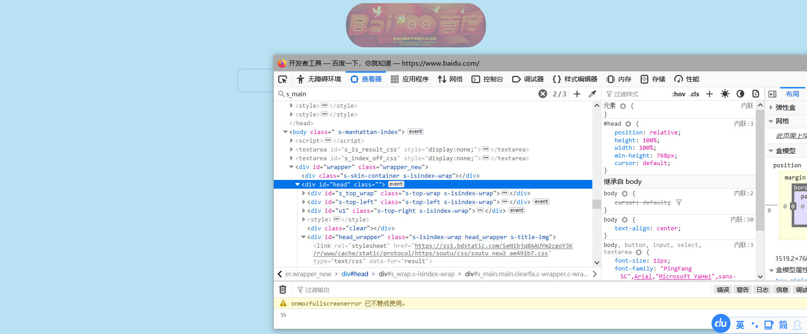
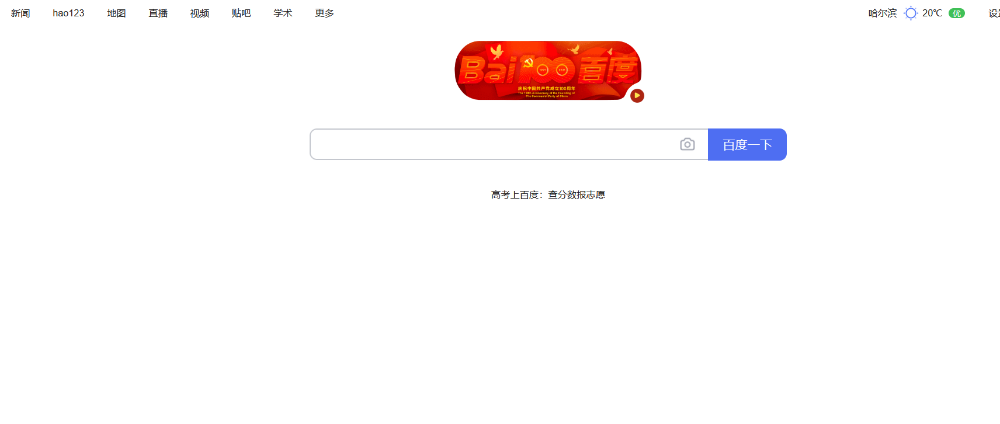
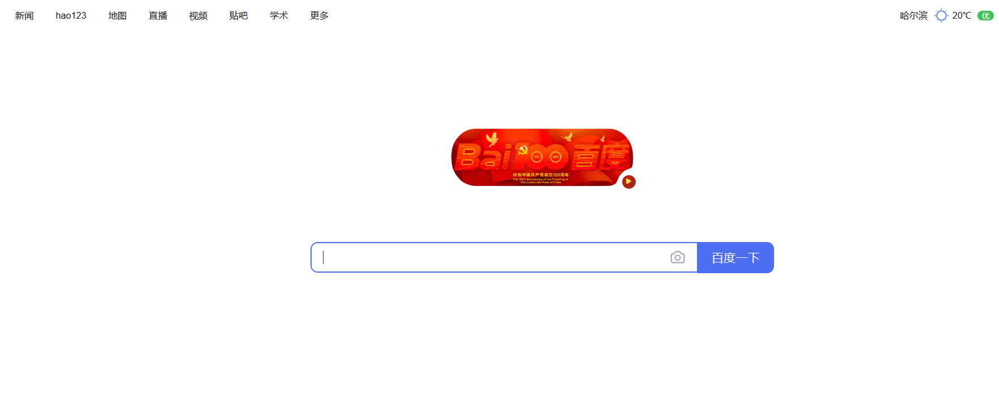
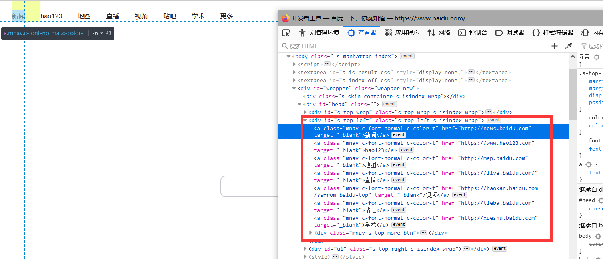
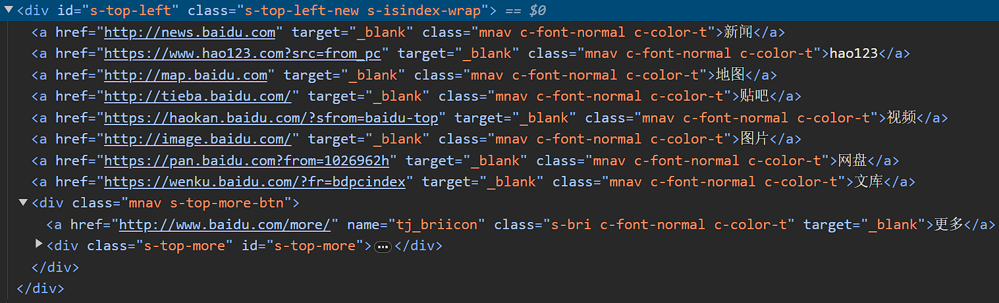
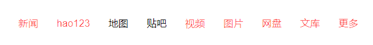

:::danger

由于页面元素的不断变化，本节内容的代码可能会过时，不起效果，

但是内容仍然可以作为学习的参考。

:::


# 百度去广告及判断去除元素

本节我们将学习利用 `CSS` 去除广告，排布位置，修改 `CSS` 等并对网页元素进行循环遍历判断。

## 去除广告

首先我们找到下面的广告 `id` 是 `s_main`


由此我们可以书写代码：

```js
GM_addStyle("#s_main{display:none !important}");
```

但是这个时候发现还存在滚轴，这个时候通常是因为有某些元素设置了最小高度导致的。

我们可以直接选择元素点击一下，找到了



将其设置为 auto 即为默认

```js
GM_addStyle("#head{min-height:auto !important}");
```

我们接下来查看代码，发现虽然滚轴变成灰色的了，但是依然存在。


这个时候可以排查是否一些上层元素存在 `scroll` 等 `CSS` 属性。

经过排查，在 `HTML` 上找到了 `overflow-y`，这个需要改为 `hidden` 才可以隐藏，具体某个值可以直接双击页面上的 `CSS` 属性进行更改。


我们查 `CSS` 属性发现默认值是 `hidden`，所以可以写出如下的 `CSS` 代码

```js
GM_addStyle('html{overflow-y: hidden !important}')
```

接下来我们就得到了一个相对干净的百度：



这个输入框有点太靠上了，可以挪下去一点。通过元素选择，我们找到了：


修改 `height` 或者 `min-height` 都是可以的

```js
GM_addStyle('#head_wrapper{min-height: 600px; !important}')
```

再找到图标，将图标与按钮稍稍分离一点


这个时候我们可以使用 margin-bottom 属性进行分割

书写代码

```js
GM_addStyle("#lg{margin-bottom: 40px; !important}");
```



我们就得到了一个相对干净的百度了。

接下来对左上角的元素进行清理



我们查看元素可能发现 class 都是一致的，这个时候我们可以使用 `querySelectorAll` 获取全部的元素，然后循环元素数组，通过 `innerHTML` 判断哪个是我们想要删除的元素。

```js
const list = document.querySelectorAll(".mnav");
```

::::warning

注意，返回的并非是一个~~数组~~，而是一个**节点列表**。

虽然与数组相似，但是不要对其进行删除等操作！

:::tip

但是事实上我们可以通过 `ES6` 的解析语法将其转换为数组

```js
[...document.querySelectorAll(".mnav")]
```

:::

::::


我们可以使用 for 进行循环，

```js
for (let index = 0; index < list.length; index++) {}
```

:::tip

上述 `for` 函数的运行流程如下：

1. 运行`第一个参数`内语句，一般用于初始化变量
2. 对`第二个参数`进行判断，如果为真则执行`{}`内的语句，否则直接跳出循环，
3. 执行结束后，运行`第三个参数`内语句
4. 跳回到上述`2.`
以此反复

:::

由此，我们可以书写代码

```js
for (let index = 0; index < list.length; index++) {
  let item = list[index];
  console.log(item.innerHTML);
}
```

其输出内容如下


我个人比较喜欢贴吧和地图，所以对其他进行删除，可以对元素使用 remove 来删除元素

```js
for (let index = 0; index < list.length; index++) {
  let item = list[index];
  console.log(item.innerHTML);
  if (item.innerHTML !== "贴吧" && item.innerHTML !== "地图") {
    item.remove();
  }
}
```
接下来我们就得到了一个干净的百度

脚本地址:[百度去广告测试脚本](https://bbs.tampermonkey.net.cn/forum.php?mod=viewthread&tid=689)


::::tip 想一想

:::warning

下面的内容涉及到较为复杂的 `CSS` 选择器的使用，如果不是很熟悉，或者看的不明白的地方，可以先跳过。

:::
除了使用 `JS` 对元素进行循环判断，还可以通过纯 `CSS` 来隐藏这些元素

修订时（2023.12.23）新版的 `DOM` 布局如下



可以看到在 `id:s-top-left` 的div下，使用 `a` 标签依次列举出了各个链接。

下面是不同的方法，同一个效果，可以使用不同的方法实现，一般肯定是兼容性越强越好。

:::info
这里为了演示选中效果，我将 `display:none` 改为了浅红色字体。
:::
<details>
<summary>
[兼容性最差] 使用 `nth-child` 选择元素
</summary>
我们可以使用 `CSS` 的 [`nth-child`](https://developer.mozilla.org/zh-CN/docs/Web/CSS/:nth-child) 伪类选择器来选择第几个元素，然后将其隐藏。

数一下，我们需要选择第 1，2，5，6，7，8 个 `a` 标签，此外最后的那个“更多”的`div`也要选择上移除，所以我们可以书写如下代码：

```css
/* 选择#s-top-left下一层的第1个 a 标签 */
#s-top-left>a:nth-child(1),
/* 选择#s-top-left下一层的第2个 a 标签 */
#s-top-left>a:nth-child(2),
#s-top-left>a:nth-child(5),
#s-top-left>a:nth-child(6),
#s-top-left>a:nth-child(7),
#s-top-left>a:nth-child(8),
/* 选择#s-top-left下一层div下的所有 a 标签 */
#s-top-left>div a {
  color: rgba(255, 0, 0, 0.6);
}
```

当然，这样列举看起来就很蠢，`nth-child` 除了可以选择单个元素，还可以选择范围。

由此我们可以优化成下面的代码：


```css
/* 选择#s-top-left下一层的第 1~2 个 a 标签 */
#s-top-left>a:nth-child(n+1):nth-child(-n+2),
/* 选择#s-top-left下一层大于 5 的标签 a 标签 */
#s-top-left>a:nth-child(n+5),
#s-top-left>div a {
  color: rgba(255, 0, 0, 0.6);
}
```

</details>

<details>
<summary>
[与上一个完全等价] 使用 `nth-child` 配合 `:not` 反向选择元素
</summary>
当然，分成两段还是有点蠢，`:not` 伪类选择器可以选择不是某个元素的元素，我们直接排除第三个和第四个就可以了。

所以代码如下：

```css
/* 选择....不是（第三~四个）的 a 元素 */
#s-top-left>a:not(:nth-child(n+3):nth-child(-n+4)),
#s-top-left>div a
{
  color: rgba(255, 0, 0, 0.6);
}
```
</details>

<details>
<summary>
[最优解！] 通过 `href` 属性和 `:not` 动态选择元素
</summary>
上述方法都是利用顺序来选择元素，但是这样的话，如果列表顺序发生变化，那么就需要重新修改代码。

我们可以通过匹配 `href` 属性来选择元素，因为这个属性相对稳定，不会发生变化。

地图的地址是 `map.baidu.com`，贴吧的地址是 `tieba.baidu.com`，为了方便，我们可以仅匹配 `map` 和 `tieiba`。

使用 `CSS` 的 [`attribute*=`](https://developer.mozilla.org/zh-CN/docs/Web/CSS/Attribute_selectors#attrvalue_6) 属性选择器，可以选择属性值包含某个值的元素。

因此，尝试和 `:not` 结合，理一下思路，我们需要选择：

`#s-top-left` 下

- 不是（`href` 属性包含 `map`）
- 不是（`href` 属性包含 `tieba`）
  
的其他元素。

代码如下：

```css
#s-top-left a:not([href*=map]):not([href*=tieba]) {
    color: rgba(255, 0, 0, 0.6);
}
```

这样不论他的顺序如何变化，都可以正确选择了。

（前提是`#s-top-left` 这个 ID 不变）
</details>

上述各方法结果均如下：



::::
