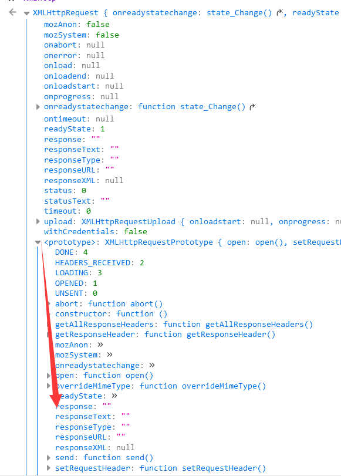

# XHR 返回内容劫持

本章我们将学习到如何对 `xhr` 返回的内容进行劫持。

:::info 特别鸣谢

本章代码为 `cxxjackie` 大佬所作，[论坛地址](https://bbs.tampermonkey.net.cn/thread-1062-1-1.html)

:::

本章仅进行代码的分析和学习

## 逻辑分析

我们先输出一下 `xhr` ,可以看到 `xhr` 的 `response` 和 `responseText` 等在原型链 `prototype` 上：



这两个属性都是只有 `get` 没有 `set`，这代表我们只可以获取他而不可以设置他的内容。


所以我们书写代码如下

```js
// 首先我们对xhr的open函数进行劫持，需要获取原open函数
// open是初始化xhr的内容，send是发送数据
// 这里我们在初始化内容的时候进行劫持。
// 我们其实可以在任何一个我们满足劫持需求的地方进行劫持
const xhrOpen = XMLHttpRequest.prototype.open;
XMLHttpRequest.prototype.open = function () {
  // 这里保存了this到xhr变量，为了提高代码的可读性
  const xhr = this;
  if (arguments[1] == "xxxxx") {
    // 获取response的操作符，
    // 如果想要劫持responseText就需要改为responseText
    // getOwnPropertyDescriptor获取的是一个对象上属性的相关的描述符
    // 可以拿到get，set，enumerable，configurable等。
    const getter = Object.getOwnPropertyDescriptor(
      XMLHttpRequest.prototype,
      "response"
    ).get;
    // 这里对xhr的response属性做了一个defineProperty
    // 当触发xhr.response的时候会访问对应的get
    // 而get调用我们之前获取的getter函数，需要注意修改this指向
    // 获取原返回内容，进行一定的修改，返回新的修改内容
    Object.defineProperty(xhr, "response", {
      get: () => {
        let result = getter.call(xhr);
        return result + " hook";
      },
    });
  }
  return xhrOpen.apply(xhr, arguments);
};
```
## 常见问题

### 为什么设置到 `xhr` 上而不是 `xhr` 的原型链上

因为这样可以形成对某一个 `xhr` 进行劫持，如果设置到原型链上相当于对所有的 `xhr` 进行了一次劫持，如果你的劫持 `get` 内有大量的回调代码会严重拖慢运行的速度，并且 `response` 以及 `responseText` 只有 `get` 函数而没有 `set` 函数，是不允许重定义的。

### 为什么我没有对原型链的 `response` 进行劫持，却成功劫持了？

因为查找 `response` 的属性的时候是按顺序查找的，首先在 `xhr` 上查找是否有 `response`，然后在 `xhr` 的 `proto` 也就是构造函数的 `prototype` 上查找 `response` 属性，如果找不到就一层一层往上找，这里我们进行了劫持之后会直接在 `xhr` 自身找到，甚至不会找到 `xhr` 的 `proto` 上的 `response`，所以实现了劫持的操作。

### 为什么我无法进行劫持

可能网页使用了 `fetch` 通信，或注入时机过晚

## 本节对应实战

[抖音短视频无水印下载](/油猴教程/实战篇/抖音短视频无水印下载/)
