```mdx-code-block
import Tabs from '@theme/Tabs';
import TabItem from '@theme/TabItem';
```

# 脚本基础调试与控制台介绍

在本章节你将学会基础的脚本调试问题以及控制台的常用功能介绍。

## 脚本调试相关

如何对脚本进行调试

一般下断分为两种

一种是 console.log()输出对应信息

对此进行分析，然后修改代码，例如:

```js
var a = 6;
console.log(a);
```

这个时候控制台会输出相应消息

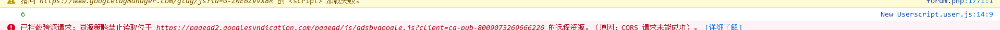

点击右侧即可跳转到你的代码位置

可以进行下断等操作

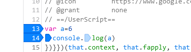

:::tip
因为 console.log 输出代表你的代码已经执行

除非你代码有循环等，再次执行可以停在这里

否则你需要重新刷新页面，让该代码执行，才可以在你下断的位置上断下
:::

还有一种方式就是通过`debugger`语句

```js
var a = 6;
debugger;
```

这样当我们打开控制台的时候，运行到 debugger 这条语句的时候，就会自动停止在 debugger 的位置

如果你不想停在 debugger 也很简单

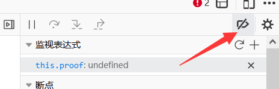

这里跳过断点即可，当然，如果你只想在这个位置不在运行 debugger，也可以在行数上右键，永不再此处暂停。

## 脚本抓包问题

:::info 如何对网络进行抓包

点击下面的标签查看对应浏览器的方法

<Tabs queryString="service">
  <TabItem value="install" label="火狐浏览器" default>
        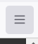

        菜单-》更多工具-》远程调试

        

        选择此 Firefox

        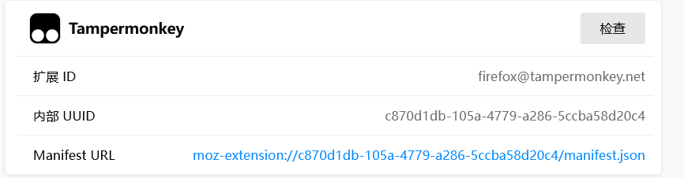

        选择检查

        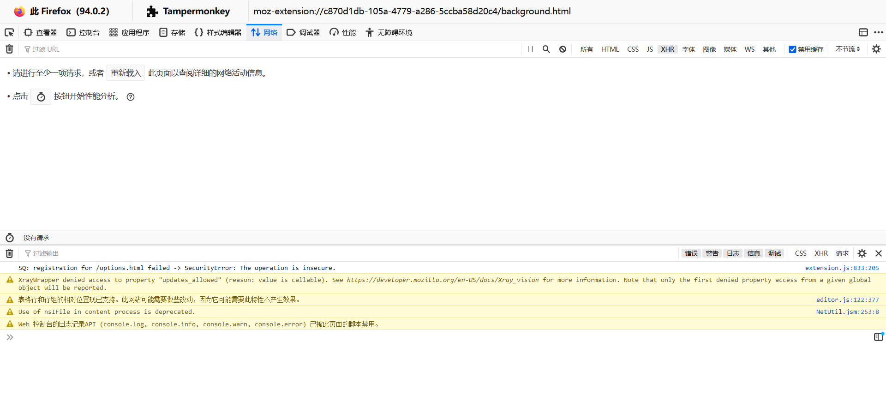

        这个时候进入的这个控制台可以正常抓油猴的 GM_XHR 等数据包

</TabItem>

  <TabItem value="server" label="Chrome浏览器">
        菜单-》更多工具-》拓展程序

        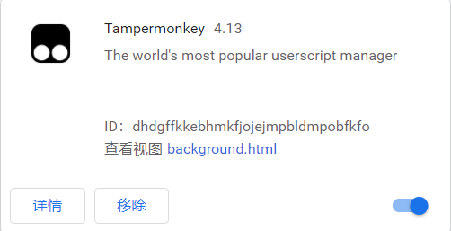

        点击`background.html`

        打开的这个即可抓包

        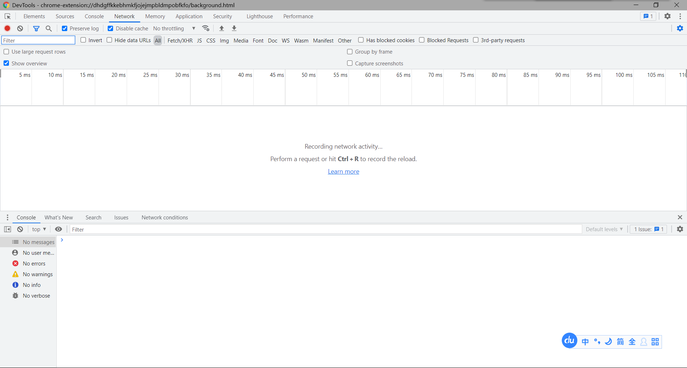

  </TabItem>
</Tabs>
:::

## 网页调试相关

### 断点以及搜索

在平时我们可以根据一些关键词来进行搜索，点击对应的行数就可以跳转到对应js文件中

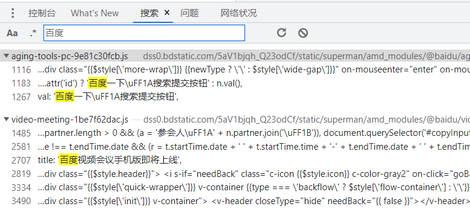

如果看到代码是压缩成一团的，点击格式化按钮即可看到稍微干净一点的js文件

但是因为已经被压缩过，所以大部分变量的名字都是无意义的

我们只能依靠慢慢分析和整理代码

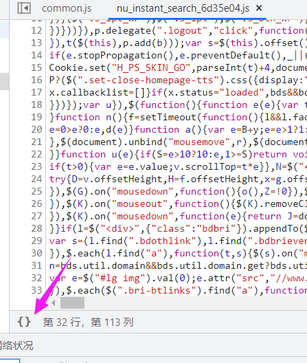

点击格式化后就可以看到

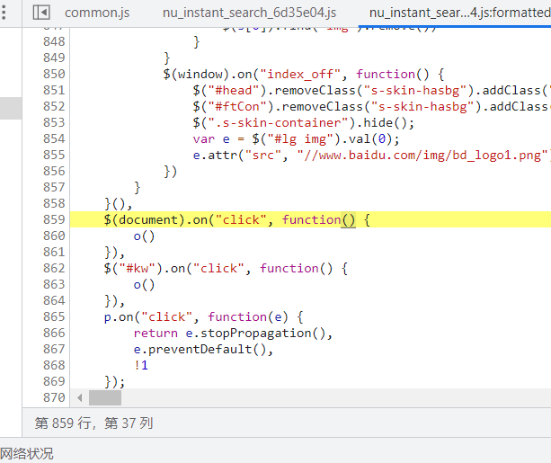

干净以后

如果我们点击行数，就会有一个小蓝标

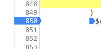

当代码执行到这里的时候，就会停滞在我们点击的地方，这个叫做断点

:::tip

当出现在一个位置不停断下的时候，大部分不是我们想要的

这时候可以在行数右键写条件断点，写入相关的js表达式，只有满足条件的时候才会断下

:::

### 操作区介绍

这个时候右侧就是我们的主要操作区

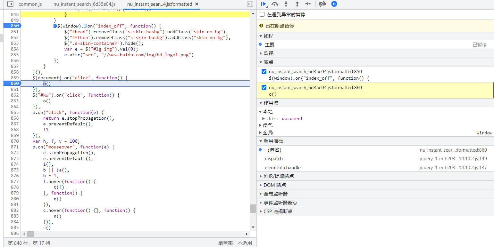

:::tip 遇到不停debugger的办法

在行数右键，选择一律不在此处暂停，但是这种方法不适用于频繁debugger，会造成严重的卡顿

这个时候也可以依次点击这两个按钮，忽略所有断点，但是这时候只能依赖我们肉眼进行调试了

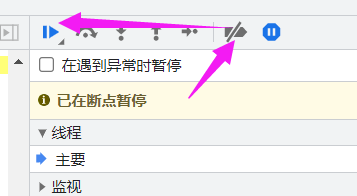

:::

那么我们接下来来了解一下这些按钮的作用

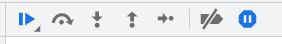

第一个按钮是执行，我们目前卡在断点这里，没有继续执行，如果点击则会继续运行代码

第二个按钮是执行代码但不进入

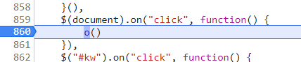

比如我们现在停在这里，如果我们点击第二个按钮，则立刻执行完函数并继续停在下一步

第三个按钮是执行代码但进入

当遇到函数时，会进入到函数内部

第四个按钮为执行到返回

即当点击该按钮，会在该函数执行完毕并返回的时候断下

第五个按钮为单步调试，即一行内有多个js表达式，单步调试一次只走一次计算，这个一般来说不会常使用

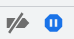

最后这两个按钮

一个是忽略所有断点，这个时候遇到断点不会再下断

第二个是是否遇到异常时暂停，即当碰到js代码出现异常的时候是否停下，蓝色为启用

### 监视变量

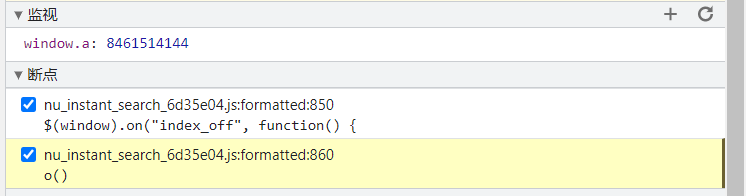

监视可以添加上我们想要监控的变量，点击刷新则可以更新看到当前的变量，注意这个是存在作用域限制的

如果要添加，点击右侧加号

会打开一个输入，可以在里面填写想要观察的变量名称

填写完毕后点击enter

添加后会显示变量的当前值，如果未设置或者无法找到

会显示not avaiable

只有断点逐步执行或你点击右侧刷新按钮的时候

才会更新变量值

### 断点

断点则显示了我们在哪里地方打了断点

单选可以取消或者选中

### 作用域

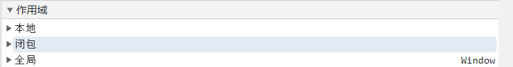

作用域则显示了当前作用域的变量，闭包作用域的变量以及函数，全局的变量以及函数

闭包则是


```js
function a(){
   b=6
  return ()=>{
  console.log(b)
  }
}
```

这种封闭内部的数据，禁止外部访问的情况叫做闭包

### 堆栈

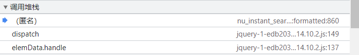

这里是调用堆栈，我们可以看到函数的调用流程

经常需要打出来相应的断点

然后一层一层的分析

### XHR 断点

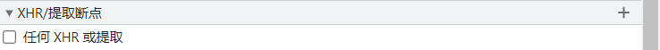

XHR断点则是在触发xhr或者fetch的时候可以对其进行下断，不过一般我是不用这个功能的，我更喜欢在XHR看堆栈，然后追溯一些关键点的函数进行下断


### DOM断点

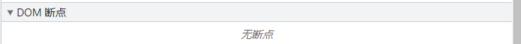

我们在html元素上右键有设置中断的条件

如子树修改，属性修改，移出元素等等

这个时候一旦触发了响应的条件，就会在对应的js代码位置停下

### 事件断点

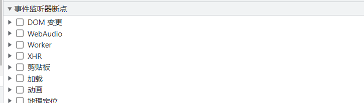

事件断点即我们点击了对应的断点，就会在触发相应条件的情况下断下

### CSP违规断点

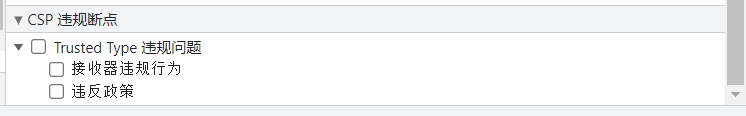

CSP违规断点资料相对较少，我也没有太多的知识储备

CSP即网站内容安全策略，允许限制网站中的行为以此提高安全性

如CSP可以禁用内联脚本或eval

减少了跨站攻击脚本的可能性

而Trusted Types策略可以动态分析并防止网站出现注入攻击

这个不属于油猴的范畴内，就不多表述

个人有兴趣可以多查阅一下资料

## 网页抓包相关

在该内容部分中，我们阐述了如何分析网页的抓包以及网页数据相关知识。

我们先来看一下

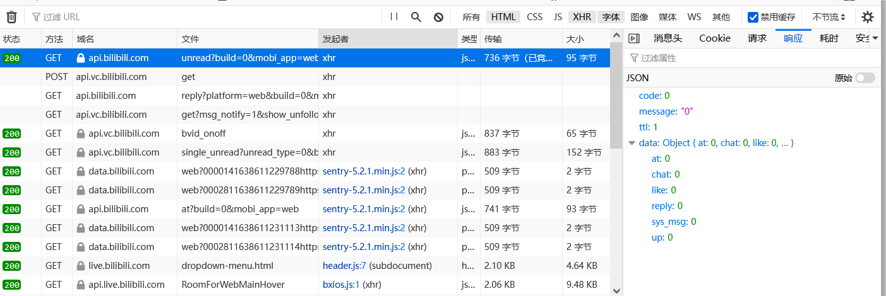

点击垃圾桶图标会清空我们的全部数据

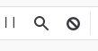

这里依次是暂停以及搜索，第三个是拦截

当我们想做每日签到之类的，不想让该请求向服务器发送，但是还想指导我们到底看到了什么就可以使用拦截

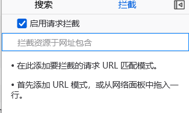

拦截为一个 url，类似于 match 匹配规则

### 请求分类

我们也可以选择查看的请求类型


这里分别为所有，html 文件，css 文件，js 文件，xhr 请求，字体文件请求，图像，媒体，websocket，以及其他类型

我们可以多选，因为我们抓包一半不需要看其他的，只需要看 xhr 就行

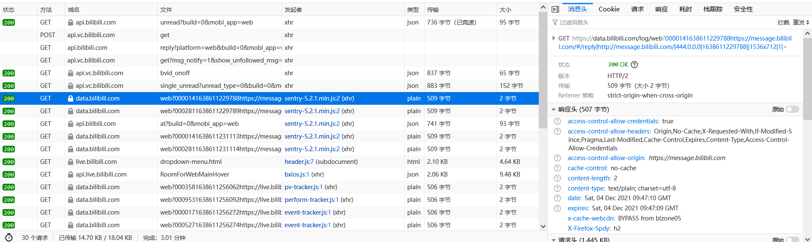

我们先看左半部分的内容，表格的解释如下：

|  属性  |                                        含义                                         |
| :----: | :---------------------------------------------------------------------------------: |
|  状态  |                           服务器告诉我门的这个请求的状态                            |
|  方法  |                        GET、PUSH、PUT 等等，为请求的方法类型                        |
|  域名  |                                 我们请求的域名地址                                  |
|  文件  |                                   我们请求的路径                                    |
| 发起者 | 到底由哪个 js 文件以及行数发起了这个请求，我们也可以在这里看到到底是 XHR 还是 FETCH |
|  类型  |                      json 为 json 化的对象，而 plain 为纯文本                       |
|  传输  |                                传输所占用的文件大小                                 |
|  大小  |                                    文件实际大小                                     |

接下来我们来了解一下右侧的请求数据属性

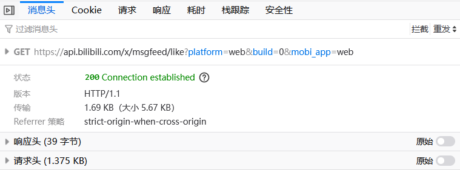

首先显示了 GET 和路径，然后是状态，版本，传输，referer 是跨域限制

响应头即服务器传输给你的头数据

请求头即你提交给服务器的头数据

:::tip
注意，如果你写 GM_xhr 函数的时候，如果碰到一些乱七八糟的问题，推荐比对一下协议头，防止服务器对协议头的一些参数进行验证
:::

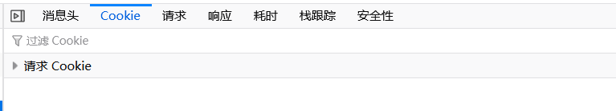

Cookie 为我们存储的证明我们身份的数据，在提交的时候一起携带了上去，GM_xhr 在进行 post 的时候通常会自动带上，一般无需在意

请求为我们提交的数据

响应为服务器给我们的数据

堆栈跟踪是非常重要的一个东西，即调用函数一直到发送数据的函数顺序，我们通常在这里根据函数名就能找到非常多的信息，但是这里并没有太显眼，有机会大家可以自己看一看，后续我们会有其他文章教大家如何使用的。

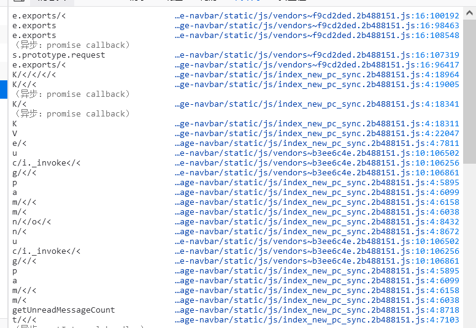

耗时和安全性没什么用，我们可以忽略

### 我应该怎么找到我想要的函数？

我们可以复制一部分的网址，最好是动态数据之前，域名之后

如www.baidu.com/search?151a531wda3dw

这个时候搜 search 通常有妙用

火狐为 Ctrl+Shift+F

Chrome 下方栏有搜索

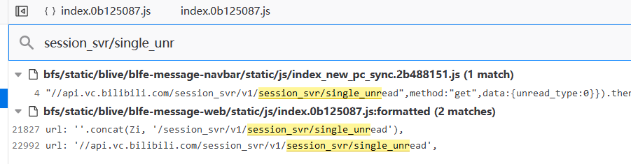

### 为什么我原样贴进去了 post，但是不好使？

可能 post 存在加密，这个时候你要自己调试 js 代码，找到加密的位置，想办法自己重写一份或者调用原有的加密

也可以看一下协议头，确定自己的协议头与网页的协议头基本一致，没有太大的差别

然后打开油猴管理器的网络界面，对其进行抓包，与原网页的包进行对比，确定到底存在什么差异

以上如果都确定无误，可以考虑删除脚本放弃了

## 网页存储相关

:::tip 关于一些固定数据的来源建议
如果是跟账户有关的数据，每次登录改变，但当次访问不改变的时候，可以尝试翻一下网页源代码或查看存储内的数据
:::


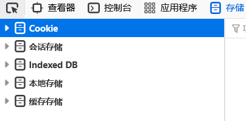

其各种类型的存储解释如下表：

|  名称   |               含义               |
| :-------: | :------------------------------: |
|    Cookies    | 存储你的用户数据 |
|   会话存储  | 关闭页面，跳转页面等后会清除 |
| 本地存储  | 除主动删除以及设置过期时间外，一直存在 |
| 缓存存储 | 为了缓存 Response 对象，这个相对较为小众 |
| Indexed DB | 浏览器提供的本地数据库 |

:::tip

Indexed DB 是因为目前浏览器数据存储不适合存储大量数据

Cookies 不超过 4K，每次请求都会携带发送回服务器

而 LocalStorage 在 2.5MB 至 10MB，根据浏览器不同

同时不提供搜索功能，不能建立自定义索引

所以发明了 Indexed DB，是浏览器提供的本地数据库

可以被网页创建以及操作

适合存储大量数据，提供查找接口，简历索引等等

具体资料可以参考[浏览器数据库 IndexedDB 入门教程](http://www.ruanyifeng.com/blog/2018/07/indexeddb.html)
:::


