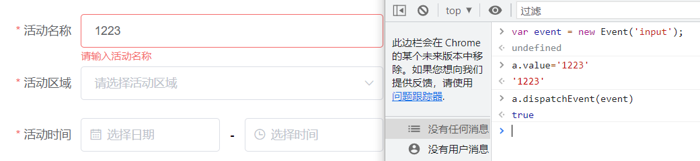
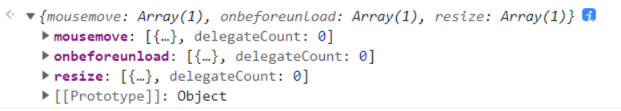
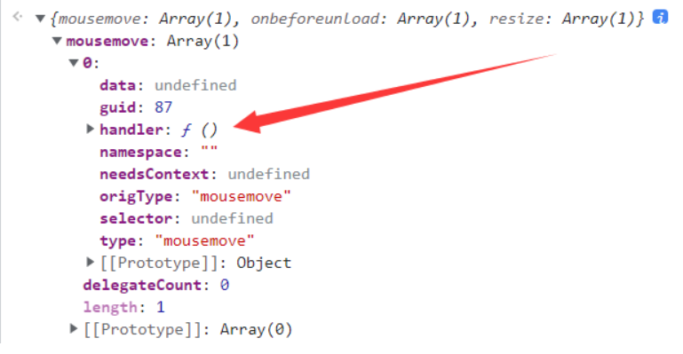
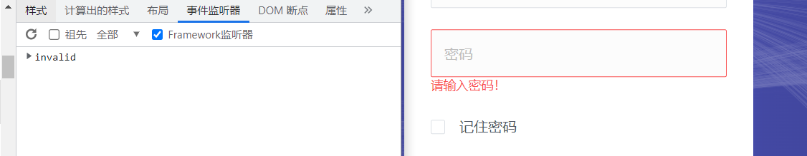

# 元素规则校验和检测的触发

:::note 联合作者：cxxjackie/李恒道

本文基于 cxxjackie 口述而写，

请大家观看的时候默念 cxxjackie 永远的神！

:::


## 前言

在平时，我们经常会碰到一个问题：明明设置了输入框或选择框的 `value`，但是点击提交的时候依然会提示没有输入数据，无法正常提交。

这是因为元素存在数据校验或者规则校验，我们触发一下规格校验使其正常检测一下就可以运行了。

那我们该如何触发数据呢？

这时候我们可以通过 new Event 生成对应的事件并且触发监听器

```js
var event = new Event("change");
element.dispatchEvent(event);
// element 是我们对应的 Dom 元素，
// 通过对元素调用 dispatchEvent 传入事件，即可以正常触发。
```

###  Event 函数的参数
<table>
  <thead>
    <tr>
      <th>内容</th>
      <th>说明</th>
    </tr>
  </thead>
  <tbody>
    <tr>
      <td>函数使用结构</td>
      <td>`new Event(typeArg, eventInit);`</td>
    </tr>
    <tr>
      <td>参数 `typeArg`</td>
      <td>创建事件的名称</td>
    </tr>
    <tr>
      <td>`eventInit`</td>
      <td>
`eventInit` 是一个可选的列表，具有以下字段，默认值均为 `false`：
|字段名称|说明|
|--|--|
|`bubbles`|该事件是否冒泡|
|`cancelable`|该事件能否被取消|
|`composed`|事件是否会在 `Shadow DOM` 根节点之外触发侦听器|
      </td>
    </tr>
  </tbody>
</table>
:::tip

以上三个值如果不理解也没关系，为了更通用推荐全部设置为`true`

:::

## 例子

我们以一个输入框为例


查询到的监听器如下


:::tip Framework 监听器的作用

`framework` 监听器是 `Chrome` 自己搞出来的，其作用是尝试解析框架的事件委托，比如 `jQuery` 的委托，不勾选的话事件会定位到 `jQuery` 源码，勾选后**有可能**定位到源头（实际上没这么智能）。

然而框架毕竟多种多样，这种解析很不靠谱，像 `Vue`、`React` 的就完全没用，`jQuery` 视不同版本也可能有 `bug`。

我的建议是默认不勾选，需要时勾一下看一下。

可以参考https://umaar.com/dev-tips/158-framework-event-listeners/

:::

因为这里我们测试的输入框，根据查询各种事件名含义，最后确定了较为重要的有 `input`、`change`、`blur`、`focus` 四个事件。

我们首先尝试一下 `input` 事件



可以看到并没有效，我们再试了一下 `change`，也不行，这是为什么呢？难道是我们的理论出错了么？

并不是，这是因为有的组件会直接监听，而有的组件会存在监听器触发的先后顺序。

前者我们直接之前那样书写即可，而后者，我们需要在触发 `input` 监听器之前，先触发其他监听器。

这里应该是 `focus`，因为 `foucs` 是聚焦焦点，而 `blur` 是失去焦点，焦点就是点击后产生光标。

关于每个监听器的含义大家可以百度一下，那么我们大概排序一下，可以确定应该是：

`focus` 聚焦 > `input` 输入内容 > `change` 内容改变 > `blur` 取消聚焦

我们再测试一下：


我们按这个顺序触发，可以发现已经没了检测，所以证明是对的

:::warning
这里 `dispatchEvent` 的内容是我声明好的变量，

已经提前使用 `new Event('事件名')` 声明好事件了
:::

根据多次测试，我们可以知道 `change` 没有任何作用

所以就变成了 `focus` > `input` > `blur` 进行触发即可

## `Jquery` 的处理

一部分复古网页依然在使用 `jquery`，如果你 `window.$` 能看到美元符号，并且能在源代码中看到 `$.on` 代码

我们可以使用 `$._data(对象,'events');` 来获取事件列表



:::warning

在 `0.18.0` 版本之前应该使用 `data` 函数，而非 `_data` 函数

:::

可以看到有许多绑定的监听器



通常，找到对应的 `handle` 处理器即可

## `React` 框架的处理方案

### `React` 输入框

我们偶尔会遇到这样的输入框：

在其元素上看不到任何监听器，这个时候可能是 `React` 框架



:::tip

如果是 `React` 框架建议安装 `React Developer Tools` 插件，

可以更简单的查看事件以及属性

:::

我们可以尝试使用

```js
// 创建一个事件
const evt = new Event("change");
// 对其进行事件触发
ele.dispatchEvent(evt);
// 获取元素的所有键名，并通过find函数进行查找
// find函数会根据传入的函数进行判断，返回正确的值，
// 而我们的函数是判断前缀是否是__reactEventHandlers
const prop = Object.keys(ele).find((p) => p.startsWith("__reactEventHandlers"));
// 获取到对应键名的对象，得到该对象的onchange函数，并且传入event
ele[prop].onChange(evt);
```

:::warning
如果这种方式也不行，说明并非 React 框架或有一定程度的魔改。此时只能考虑自己查看框架源码找核心注入点进行 hook 了。
:::

我们可以查看一下`ele[prop]`实际是什么


可以看到有 `onChange`，`onKeyDown` 等等

:::warning
这些我们都可以进行尝试是否是我们想要的，

但是要注意 `new Event` 的时候其**事件名**也要相应的改变
:::

### `React` 搜索下拉框

通常我们需要输入一些内容，触发下拉框然后触发点击。

这时候就像我们之前所说的：需要进行组合事件。

比如：

```js
// 通过最上方组件按 child 级找到底层哪个进行焦点触发，
// 先进行焦点触发
parent[prop].children[0][0].props.onFocus();

// 触发焦点后组件才进行 input 的渲染，这里我们找到 input
input = document.querySelector("#idname input");

// 我们对 input 输入框触发修改，来让其进行搜索
input.__reactEventHandlers$xxxx.onChange({
    target: { value: "1234" }
});

// 然后获取返回结果，这里需要进行一定的延时
list = document.querySelector(".select li");

// 获取渲染出来的选择列表,并对需要的进行点击
list.__reactEventHandlersxxx.onClick();
```

回调触发选择的列表元素，完成下拉框的选择。

如果不想这样可以参考下面的关于直接在数据修改的方法

### 我不想做网页点击代码，直接想在数据上进行修改

这时候我们可以直接在 `React Developer Tools` 查看数据的绑定项，然后在代码中做相应的修改。


可以看到这里 `state` 的 `currentItem` 是存储选择的对象的


我们可以直接组件的最上级的元素，然后根据存储对象的属性名一层一层往下找，这里可以发现在组件的最上层的元素的 `react` 属性的 `children.owner.memoizedState` 里存在 `currentItem` 属性，所以我们直接设置即可。

但是这里又有一个问题，我们设置了属性，可以发现数据虽然改变了，但是页面没有改变，这是因为我们没有使用选择框进行点击，选择框点击后修改选择框内容，从而改数据，而是直接修改了网页的数据。

这个问题我目前没有找到很好的办法，即使找到目测也有一定的复杂程度，更推荐修改数据之后顺手 `innerHTML` 一下吧，也算挺方便的。

:::tip 直接修改数据可能导致响应不触发

如果直接修改属性内容，可能也会导致页面的校验出现问题

这时候应该调用响应的触发函数并传入修改数据，来完成元素的数据校验

如

```js
target.children[0]._owner.memoizedState.currentItem = 数据;
```

无法触发响应

```js
target.children[0]._owner.memoizedProps.onSelected({ name: 2002, key: 2002 });
```

调用相关的函数，并传入对应的数据，可触发响应
:::

### `React` 中找不到 `__reactEventHandlers`

这个时候可以在控制台输入 `el.__react` 来看看都有哪些属性

也可能在 `__reactProps` 等属性中有对应的事件

也可以尝试在 `__reactFiberxxx.alternate.return.memoizedProps` 寻找数据
