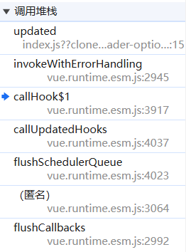
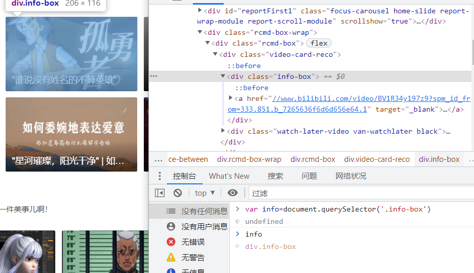
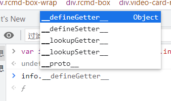
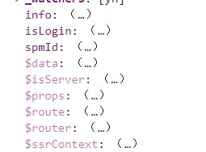
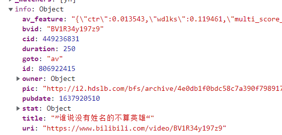
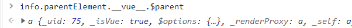
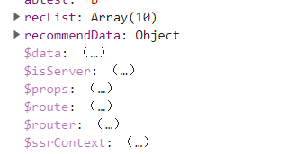
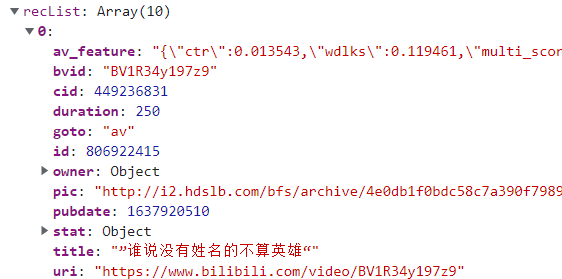

# Vue 初探与代码分析

:::note 联合作者：cxxjackie/李恒道

由于研究还不是特别深入，所以可能存在一些事实性的出入

以后会慢慢修改和补正

:::

:::danger 警告

关于对页面进行调试，强烈建议使用 Chrome，经测试火狐浏览器显示数据不完整，其他浏览器情况未知

:::

## 正文

如果你存在输入后存在校验，自动清空，无法点击按钮等问题，可以去[元素规则校验和检测的触发](/油猴教程/中级篇/元素规则校验和检测的触发)寻找相关的处理方法，目前处理基本已经完善

## 基础概念

`Vue`在我们`new Vue`的时候会创建一个`Vue的实例`，实例根据我们的模板内容做解析，绘制虚拟 DOM，并渲染到页面上

同时每一个 Vue 组件也都是一个实例

那我们如何找到实例对象？

在一些元素上打印出`vue`属性即可

为什么存在 vue 属性这点可以在 vue 源码中的

```js
 Vue.prototype._update=function (vnode, hydrating) {
   ...
    if (vm.$el) {
      vm.$el.__vue__ = vm;
    }
   ...
}
```

这里可以看到了挂载`__vue__`属性为自身的 vue 实例

这里的$el 是根节点

如

```html
<div>
  <span>123</span>
</div>
```

这时候只有根节点 div 具有 vue 属性

## 如何查找 vue 属性

我们可以确定一个大概的范围，如果没有找到**vue**就通过该 DOM 元素的父或者子逐级排查。

一旦找到一个 vue 实例，即可通过`$parent`以及`$children`属性找到上下级的 vue 实例。

这里简单介绍一些属性

|  属性名   |               含义               |
| :-------: | :------------------------------: |
|    $el    | 该属性对应 Vue 实例的根 DOM 元素 |
|   $root   | 该属性对应 Vue 实例的根 Vue 实例 |
|  $parent  | 该属性对应 Vue 实例的父 DOM 元素 |
| $children | 该属性对应 Vue 实例的子 DOM 元素 |

## 如何注入 vue 组件事件周期

之前我们已经知道了 Vue2 在 update 函数中会对 dom 进行赋值`vm.$el.__vue__ = vm`;

如果想要得到 Vue 的组件事件该怎么做？

可以写一个简单的 demo

```js
<template>
  <div id="app">
    <button @click="inc=inc+1">{{ inc }}</button>
  </div>
</template>

<script>
import HelloWorld from './components/HelloWorld.vue'

export default {
  name: 'App',
  data(){
    return {
      inc:0
    }
  },
  updated(){
    console.log('updated')
  }
}
</script>
```

在触发打印的位置下一个断点

堆栈如下



其中第一个函数`updated`是我们自己的函数，第二个函数`invokeWithErrorHanding`是为了捕获用户函数错误从而进行包装的函数，第三层函数`callHook`应该就是我们需要的了，追进去看看

```js
function callHook$1(vm, hook, args, setContext) {
  if (setContext === void 0) {
    setContext = true;
  }
  // #7573 disable dep collection when invoking lifecycle hooks
  pushTarget();
  var prevInst = currentInstance;
  var prevScope = getCurrentScope();
  setContext && setCurrentInstance(vm);
  var handlers = vm.$options[hook];
  var info = "".concat(hook, " hook");
  if (handlers) {
    for (var i = 0, j = handlers.length; i < j; i++) {
      invokeWithErrorHandling(handlers[i], vm, args || null, vm, info);
    }
  }
  if (vm._hasHookEvent) {
    vm.$emit("hook:" + hook);
  }
  if (setContext) {
    setCurrentInstance(prevInst);
    prevScope && prevScope.on();
  }
  popTarget();
}
```

我们可以发现组件的事件钩子都是从实例的$options 通过对应的事件名进行获取

所以我们也可以相应的进行读取，插入，劫持等等操作，例如

```js
dom.__vue__.$options["updated"].push(() => console.log("inject"));
```

如果发现不存在属性也不要紧，源码中并没有针对该数组的特殊处理

只需要使用`dom.__vue__.$options['updated']`初始化一下即可，其他事件周期同理

## 实战

以 b 站为例，我们目标是通过 vue 属性提取出来视频的基本数据

我们该怎么获取列表呢？

先以一个 div 为基准



我们先获取 info-box 的节点



发现不存在 vue 属性，接下来往上级或者下级找，因为我用的 dom 元素偏下，所以往上层找


可以发现看到了 vue 属性，接下来我们看这些数据，下边的那些数据通常我们不用太过于在意，但是最好也点开看一下

着重看深紫色的部分，因为`$`开头的基本都是组件携带的组件数据



经过翻找

我们可以看到 info 就是我们想看到的视频数据



那我们如果想获取一整个视频列表，我们应该怎么办呢？

就是找他的 parent 属性，然后再查看数据



我们可以找到



打开看一下，发现存在一个数组，每个数组都是一个视频数据



这个时候我们就可以提取数据做我们想要做的事情了！

或对其进行修改来达到显示我们想要的显示的东西，数据会自动进行触发响应

那么到这里我们就成功实现目标了！
