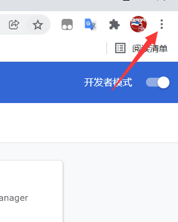
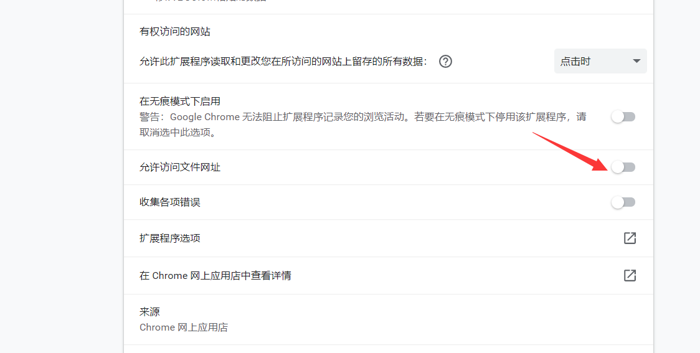
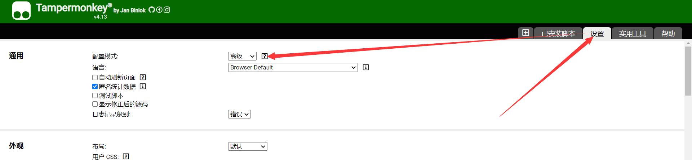
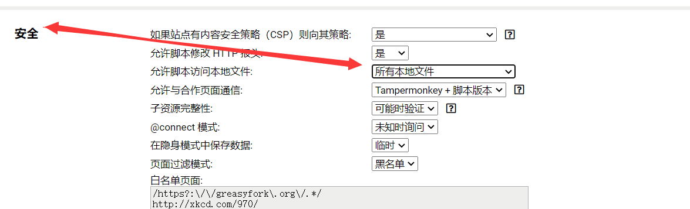

# 本地文件访问权限与外部开发

:::danger 警告

请注意，如果你准备打开本地文件访问权限，请注意风险性

如果你不了解此功能的危害性，无法权衡利弊，则不建议开启

关于安全性可以大概参考[沙盒机制的前世今生](/油猴教程/入门篇/沙盒机制的前世今生)

:::

:::note 关于浏览器选择问题

该情况通常应用于脚本开发

根据我的个人设置测试，火狐浏览器是无法打开本地文件权限的

所以本文强制使用 Chrome 浏览器

如果你使用其他浏览器目前还无法提供较为明确的方案

:::

## Chrome 浏览器如何开启文件访问权限

点击右侧三个点



更多工具-》拓展程序-》详情


打开允许访问文件网址



## 打开 Tampermonkey 文件访问地址

打开设置-》高级



进入安全项-》允许脚本访问本地文件，选择所有本地文件



你就可以获取到本地文件啦~

## 如何读取本地 txt

注意，如果读取本地 txt 文件，则一定是 file:///开头，是三个斜杠！

我们可以使用 GM 函数获取

```js
// ==UserScript==
//...
// @resource txt1 file:///D:/2.txt
// @grant GM_getResourceText
// ==/UserScript==

const txt = GM_getResourceText("txt1");
console.log(txt);
```

这种情况是在脚本一次性初始化的时候获取 txt

如果你想动态获取 txt 则可以

通过 GM_XHR 函数进行获取，文本可能出现乱码，所以我们可以使用二进制下载，然后进行编码转换等操作，例子如下：

:::tip

GM_XHR 函数访问本地文件的时候会忽略我们正常 post 或 get 的一些参数以及属性。

如 overrideMimeType 之类的字段都会被自动抛弃

:::

```js
GM_xmlhttpRequest({
  method: "get",
  responseType: "arraybuffer",
  url: "file:///C://Users/30832/Downloads/2.txt",
  headers: { "Content-Type": "text/json,charset=utf-8" },
  onload: async function (r) {
    console.log("-----------------------");
    console.log(r);
    console.log("responseText=", await ab2str(r.response));
  },
});

//ArrayBuffer转字符串
function ab2str(u, f) {
  return new Promise((resolve, reject) => {
    var b = new Blob([u]);
    var r = new FileReader();
    r.readAsText(b, "utf-8");

    r.onload = () => {
      resolve(r.result);
    };
  });
}
```

我们也可以通过 require 函数来外部引用代码

这个时候我们可以使用 vscode 编译器等

这个时候代码是完全同步并且无缓存的，但是关于 UserScript 头是必须要在脚本编辑器里来进行写的

```js
// ==UserScript==
// @name         New Userscript
// @namespace    http://tampermonkey.net/
// @version      0.1
// @description  try to take over the world!
// @author       You
// @match        https://bbs.tampermonkey.net.cn/*
// @icon         https://www.google.com/s2/favicons?domain=baidu.com
// @require      file:///C:/CloudMusic/1.txt
// ==/UserScript==
```

## 关于编辑器问题的额外补充

关于 require 引用也算经常跟大家重复这些问题

如果你不 require `file地址`

而去 require `网络js地址`，包括 `127.0.0.1` 等局域网地址

依然是存在缓存的，也就是说即使你设置经常刷新，依然会刷新多次才能同步一次你的代码

所以油猴目前常见的方案也就只有这样来进行外部通信，使用外部编辑器来进行书写代码

我也尝试了使用 `tamperdav`

但是效果不显著，其同步速度是极其缓慢的，完全不适用于开发

而且会莫名其妙的同时激活 `ftp 软件`、`putty 软件`等乱七八糟的软件

所以不推荐使用 `tamperdav`

`tampermonkey` 对外部编辑器支持还是蛮差的，所以更推荐使用 `scriptcat` 做外部编辑器支持

另外重复一遍，碰到require问题最好优先回忆这部分

你 require 代码相当于

```js

function (){

// require的代码

// 你的油猴代码部分

}()
```
