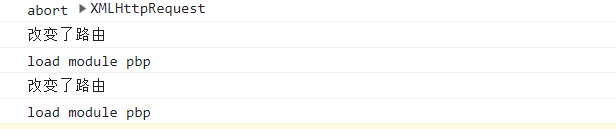
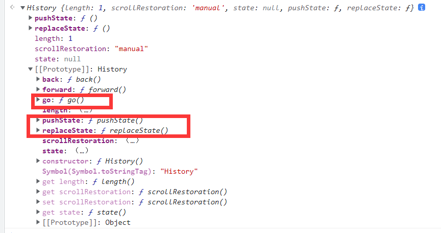
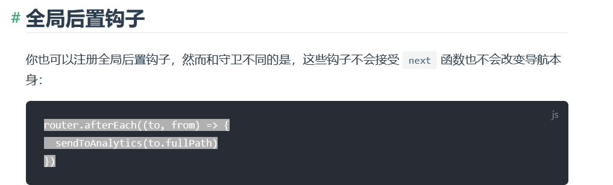

# 监听前端路由改变

在本文中我们首先探讨了通用路由的监听，文章后部分将会探讨框架的监听问题，由于框架过多，所以没办法一一补足，如果您有其他框架的处理经验欢迎补足

## 监听前端通用路由改变

通常来说如果是单页前端页面的话，如 vue 等，都会在首次加载之后浏览器的路由交由前端进行控制，这样可以提高用户的体验，并且极大的节省服务器资源

### history 的监听

在 history 模式的时候都会使用

pushState，ReplaceState，go 函数等

这里给一个 pushState 函数的劫持

```js
let originPush = history.pushState;
history.pushState = function (...arg) {
  console.log("改变了路由");
  return originPush.call(this, ...arg);
};
```



可以看到了路由的改变提示



我们可以以此类推，对这三个函数进行劫持，有些网站还会对这些函数做进一步封装，如 b 站就对这些函数做了封装

但是对于我们来说劫持哪个函数并不重要，因为无论劫持的是哪个 pushState，最后都一定会经过我们的函数，所以我们无须在意

### hash 的监听

以 vue 源码为例，在里面我们可以看到

```js
var eventType = supportsPushState ? "popstate" : "hashchange";
window.addEventListener(eventType, handleRoutingEvent);
```

supportPushState 是根据浏览器的一些环境判断来使用 popstate 和 hashchange

我们写脚本的时候不如暴力一点，直接全部监听上即可

## 监听 Vue 路由改变

:::danger

如果你没有一定的逆向基础和框架源码的阅读基础，可能无法看懂，可以跳过本章继续向后学
:::

我们本节课目标监听 vue 的路由跳转改变，地址是[猫：走路，我们是认真的！](https://www.bilibili.com/video/BV16z4y1o7Mr/?spm_id_from=333.788.recommend_more_video.1)

### Vue 路由分类

Vue 的路由是由 Vue-router 来进行控制的

分为三种 history、hash、abstract 模式

history 就像

```
https://www.bilibili.com/video/BV16z4y1o7Mr/?spm_id_from=333.788.recommend_more_video.1
```

这种，是不带用#符号的，叫历史路由

而如果是 hash 模式，是带有#符号的

地址如 `http://localhost:8082/#/`

而 abstract 模式普通开发还不怎么常用，以后我们再跟大家聊。

### 问题

问题来了，我们如果想监听地址的改变，到底应该怎么做呢？

目前来说有两种方法，第一种就是根据 hash 模式以及 history 模式的路由跳转进行相应的监听，就是我们前文提供的方法

但如果我们想触及框架获得一些有关于框架的特殊能力，就需要分析框架的源码了，首先观察[vue-router 官方手册](https://router.vuejs.org/zh/guide/advanced/navigation-guards.html#%E5%85%A8%E5%B1%80%E8%A7%A3%E6%9E%90%E5%AE%88%E5%8D%AB)



我们想使用的是后置钩子

```js
router.afterEach((to, from) => {
  sendToAnalytics(to.fullPath);
});
```

我们观察[vue-router 源码](https://github.com/vuejs/vue-router/blob/dev/dist/vue-router.js)

```js
VueRouter.prototype.afterEach = function afterEach(fn) {
  return registerHook(this.afterHooks, fn);
};
```

然后看 registerHook

```js
function registerHook(list, fn) {
  list.push(fn);
  return function () {
    var i = list.indexOf(fn);
    if (i > -1) {
      list.splice(i, 1);
    }
  };
}
```

大概阅读一下，可以看到是对 list 插入一个函数

而 afterEach 插入的是 afterHooks 数组

我们搜索 afterHook 数组

翻阅源代码，找到是在 vue-router 实例初始化的时候拿到的

```js
var VueRouter = function VueRouter(options) {
  if (options === void 0) options = {};

  {
    warn(
      this instanceof VueRouter,
      "Router must be called with the new operator."
    );
  }
  this.app = null;
  this.apps = [];
  this.options = options;
  this.beforeHooks = [];
  this.resolveHooks = [];
  this.afterHooks = [];
  this.matcher = createMatcher(options.routes || [], this);

  var mode = options.mode || "hash";
  this.fallback =
    mode === "history" && !supportsPushState && options.fallback !== false;
  if (this.fallback) {
    mode = "hash";
  }
  if (!inBrowser) {
    mode = "abstract";
  }
  this.mode = mode;

  switch (mode) {
    case "history":
      this.history = new HTML5History(this, options.base);
      break;
    case "hash":
      this.history = new HashHistory(this, options.base, this.fallback);
      break;
    case "abstract":
      this.history = new AbstractHistory(this, options.base);
      break;
    default: {
      assert(false, "invalid mode: " + mode);
    }
  }
};
```

我们可以看到初始化部分

```js
this.app = null;
this.apps = [];
this.options = options;
this.beforeHooks = [];
this.resolveHooks = [];
this.afterHooks = [];
```

那我们的目标非常简单，找到 vue-router 实例，对其 afterHook 投入一个函数，目标就搞定了，那我们该怎么找到 vue-router 实例呢

这里可能需要大量的学习，所以这里我直接给出答案了

vue-router 源码在

```js
Object.defineProperty(Vue.prototype, "$router", {
  get: function get() {
    return this._routerRoot._router;
  },
});
```

对 vue 的原型定义了一个$router，返回了 vue-router 实例，任何的 vue 实例都可以访问这个对象

那我们该怎么拿到 vue 实例呢？通过`__vue__`

可以参考[Vue初探与代码分析](/油猴教程/中级篇/Vue初探与代码分析)

一般页面的#app 是一个根路径，通常存在`__vue__`属性,所以我们直接

```js
document.querySelector("#app").__vue__.$router.afterHooks.push(() => {
  console.log("路由发生改变");
});
```

通过 vue 拿到 vue 实例，通过$router 拿到 vue 路由对象，然后找到全局后置路由钩子，投入一个函数来进行监听


可以看到监听成功！
