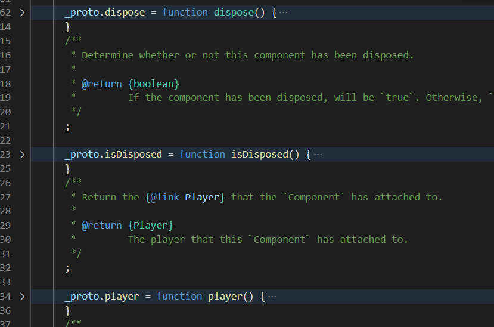

# video.js 劫持方式分析

:::danger
本文的诞生是源于某星的技术对抗，相对其他文章可能较为极限，并且在对抗的过程中不断升级方法，所以如果没有能力可以暂且先跳过
:::

## 正文

video.js 常见的劫持方式是对 window.videojs 进行 hook 来进行劫持,例如

```js
unsafeWindow.savevideojs = undefined;
Object.defineProperty(unsafeWindow, "videojs", {
  get() {
    let result = unsafeWindow.savevideojs;
    return result;
  },
  set(obj) {
    unsafeWindow.savevideojs = obj;
  },
});
```

但是很对网站为了对抗 videojs 劫持，会习惯性将 videojs 通过 Object.defineProperty 设置 writable 为 flase，从而导致无法赋值，所以我们的目标是不仅仅局限于 videojs 的入口劫持，而从源码的角度进行分析和处理。

## 通过 hook 绕过

针对 Object.defineProperty 设置 writable 的问题，我们可以通过对针对 Object.definproperty 也进行劫持来处理这个问题

```js
let defineHook = Object.defineProperty;
Object.defineProperty = function (...args) {
  if (args.length >= 2) {
    if (args[1] === "videojs" && args[2] !== undefined) {
      args[2].writable = true;
    }
  }
  return defineHook.call(this, ...args);
};
```

## 源码分析

我们也可以尝试阅读源码来解决，[video.js 源码](https://unpkg.com/video.js@7.17.0/dist/video.js)

查看源码

```js
 (function (global, factory) {
    typeof exports === 'object' && typeof module !== 'undefined' ? module.exports = factory() :
    typeof define === 'function' && define.amd ? define(factory) :
    (global = typeof globalThis !== 'undefined' ? globalThis : global || self, global.videojs = factory());
  }(this, (function () { 'use strict';
```

umd 格式，直接拖底部看一下找到了`return videojs;`，发现传出一个函数，我们查找 videojs，是一个

```js
  function videojs(id, options, ready)
```

大致阅读一下代码

```js
var player = videojs.getPlayer(id);

if (player) {
  if (options) {
    log$1.warn(
      'Player "' + id + '" is already initialised. Options will not be applied.'
    );
  }

  if (ready) {
    player.ready(ready);
  }

  return player;
}
```

首先获取 id，判断是否存在，如果存在则不初始化

这里我一开始试图对 Getplayer 进行劫持，后来发现少了一些参数，所以决定放弃

```js
var el = typeof id === "string" ? $("#" + normalizeId(id)) : id;

if (!isEl(el)) {
  throw new TypeError("The element or ID supplied is not valid. (videojs)");
} // document.body.contains(el) will only check if el is contained within that one document.
// This causes problems for elements in iframes.
// Instead, use the element's ownerDocument instead of the global document.
// This will make sure that the element is indeed in the dom of that document.
// Additionally, check that the document in question has a default view.
// If the document is no longer attached to the dom, the defaultView of the document will be null.

if (!el.ownerDocument.defaultView || !el.ownerDocument.body.contains(el)) {
  log$1.warn("The element supplied is not included in the DOM");
}

options = options || {};
hooks("beforesetup").forEach(function (hookFunction) {
  var opts = hookFunction(el, mergeOptions$3(options));

  if (!isObject$1(opts) || Array.isArray(opts)) {
    log$1.error("please return an object in beforesetup hooks");
    return;
  }

  options = mergeOptions$3(options, opts);
}); // We get the current "Player" component here in case an integration has
// replaced it with a custom player.
```

兼容化处理+options 合并，可以直接跳过，继续往下看

```js
var PlayerComponent = Component$1.getComponent("Player");
player = new PlayerComponent(el, options, ready);
hooks("setup").forEach(function (hookFunction) {
  return hookFunction(player);
});
return player;
```

这里发现通过了 Component.GetComponent 读了 Player 函数

然后对其构造，最后调用了 Hooks 回调钩子，传入了一个函数，然后循环遍历

等等，嗯？hooks 钩？往前翻再看看

```js
hooks("beforesetup").forEach(function (hookFunction) {
  var opts = hookFunction(el, mergeOptions$3(options));

  if (!isObject$1(opts) || Array.isArray(opts)) {
    log$1.error("please return an object in beforesetup hooks");
    return;
  }

  options = mergeOptions$3(options, opts);
});
hooks("setup").forEach(function (hookFunction) {
  return hookFunction(player);
});
```

经典的 beforeCreated 钩和 Created 钩，查阅一下[video.js 手册](https://docs.videojs.com/tutorial-hooks.html)

```js
videojs.hook("beforesetup", function (videoEl, options) {
  // videoEl will be the video element with id="some-id" since that
  // gets passed to videojs() below. On subsequent calls, it will be
  // different.

  videoEl.className += " some-super-class";

  // autoplay will be true here, since we passed it as such.
  if (options.autoplay) {
    options.autoplay = false;
  }

  // Options that are returned here will be merged with old options.
  //
  // In this example options will now be:
  //   {autoplay: false, controls: true}
  //
  // This has the practical effect of always disabling autoplay no matter
  // what options are passed to videojs().
  return options;
});
videojs.hook("setup", function (player) {
  // Initialize the foo plugin after any player is created.
  player.foo();
});
```

所以我们可以直接通过`videojs.hook`来曲线获得 video.js 创建出来的实例。例如：

```js
videojs.hook("beforesetup", function (videoEl, options) {
  //修改选项
  return options;
});
videojs.hook("setup", function (player) {
  //控制实例
});
```

:::tip
具体的 hook 使用方式大家可以参考实战篇的相关内容
:::

## hook 钩被屏蔽下的解决方案

由于某星屏蔽了 hook 钩，所以我们继续探索其他方案

:::tip
本质上学习观察源码的过程也是提升自我的一个过程

只要忍过第一个阵痛期，后面其实能看懂源码很爽的

很多时候你比只会看文档的程序员更了解执行原理！
:::

之前的 hooks 已经失效了，那我们在初始化阶段几乎没有什么可以插手的地方了

```js
hooks("beforesetup").forEach(function (hookFunction) {
  var opts = hookFunction(el, mergeOptions$3(options));

  if (!isObject$1(opts) || Array.isArray(opts)) {
    log$1.error("please return an object in beforesetup hooks");
    return;
  }

  options = mergeOptions$3(options, opts);
}); // We get the current "Player" component here in case an integration has
// replaced it with a custom player.

var PlayerComponent = Component$1.getComponent("Player");
player = new PlayerComponent(el, options, ready);
hooks("setup").forEach(function (hookFunction) {
  return hookFunction(player);
});
```

hooks 钩的地方可以全部排除了

那我们唯一能下手的地方就是更核心的地方

也就是 Component$1.getComponent 函数

我们先观察一下他的源码

```js
Component.getComponent = function getComponent(name) {
  if (!name || !Component.components_) {
    return;
  }

  return Component.components_[name];
};
```

这里判断是否为空，或者保存组件的位置是否为空，如果都不为空，则返回对应的名字

也就是说 Player 保存在`Component.components_['Player']`中

那我们需要设置的，就是对`components_`进行设置

全局搜索`Component.components_`以及查阅官方文档

可以找到这里


查阅官方文档可以发现，这里是注册组件的地方

那么思路来了，我们可不可以注册 Player 函数？

阅读源码开始！

```js
if (typeof name !== "string" || !name) {
  throw new Error(
    'Illegal component name, "' + name + '"; must be a non-empty string.'
  );
}
```

判断名字异常，可以跳过

```js
var Tech = Component.getComponent("Tech"); // We need to make sure this check is only done if Tech has been registered.

var isTech = Tech && Tech.isTech(ComponentToRegister);
var isComp =
  Component === ComponentToRegister ||
  Component.prototype.isPrototypeOf(ComponentToRegister.prototype);

if (isTech || !isComp) {
  var reason;

  if (isTech) {
    reason = "techs must be registered using Tech.registerTech()";
  } else {
    reason = "must be a Component subclass";
  }

  throw new Error('Illegal component, "' + name + '"; ' + reason + ".");
}
```

这里通过原型链判断是否继承与 Comp 组件或者继承于 Tech 组件

```js
name = toTitleCase$1(name);

if (!Component.components_) {
  Component.components_ = {};
}
```

name 函数经过某些处理，然后对 components\_进行判断，如果不存在则进行初始化

```js
var Player = Component.getComponent("Player");
```

获取 Player 组件

```js
if (name === "Player" && Player && Player.players) {
  var players = Player.players;
  var playerNames = Object.keys(players); // If we have players that were disposed, then their name will still be
  // in Players.players. So, we must loop through and verify that the value
  // for each item is not null. This allows registration of the Player component
  // after all players have been disposed or before any were created.

  if (
    players &&
    playerNames.length > 0 &&
    playerNames
      .map(function (pname) {
        return players[pname];
      })
      .every(Boolean)
  ) {
    throw new Error(
      "Can not register Player component after player has been created."
    );
  }
}
```

这里判断了 Player 地方进行了处理，可以看到首先判断名字是否是 Player

然后判断 Player 是否为空，如果不为空，则继续判断 players 是否存在

三者都存在的时候才禁止替换 Player 组件

也就是说我们可以在 players 不存在的时候对其进行组件替换

这里可以看出来 Vidoejs 的设计非常优秀，对大部分的功能做了一个组件化的抽离和替换。

```js
Component.components_[name] = ComponentToRegister;
Component.components_[toLowerCase(name)] = ComponentToRegister;
return ComponentToRegister;
```

知道原理就非常简单了，我们可以直接写出代码

```js
let originPlayer = videojs.getComponent("Player");
let registerPlayer = function (tag, options, ready) {
  //这里做原originPlayer的对象生成，返回，处理
};
registerPlayer.prototype = Object.create(originPlayer.prototype);
videojs.registerComponent("Player", registerPlayer);
```

这里因为是油猴脚本，所以我直接上了一个 prototype 替换，按道理其实官方更推荐用 class 类，但是那就要做语法转换了，所以 hook 偷了个懒

劫持完毕之后我们就可以完美的劫持 Player 初始化前后的操作了！

## 更加底层的劫持方法

以为已经到组件的注册级别我就无法止步不前了？

我们的目标是突破天际！

我们前部分利用的是 Component.registerComponent 来进行组件替换 Player 函数

进行构造前和构造后的劫持

但是某星新一次的更新过程中 registerComponent 进行了过滤

只要发现在替换 name 为 Player 即直接 return

我们可以总结 registerComponent 的核心代码其实就两句

```js
Component.components_[name] = ComponentToRegister;
Component.components_[toLowerCase(name)] = ComponentToRegister;
```

其他的代码都是在做校验

也就是说最后是往`Component.components_`进行赋值

那 Component 是什么？查阅源码可以找到


这里 Component 是一个函数，然后获取了他的原型链`_proto`，往原型链挂载了大量的函数



我们拖到最后发现发做完各种函数和原型函数处理，返回了 Component


那么我们看看返回给了谁


返回给了 Component$1，然后再下面两句做了一下兼容性处理

最后 registerComponent 自身，等等，自身？

那我们通过 GetComponent 岂不是就能拿到 Component$1

再直接找到`components`里修改`Player`

这样就绕过了`registerComponent`函数的过滤检测

理论建立完毕，实践开始

```js
let originPlayer = videojs.getComponent("Player");
let registerPlayer = function (tag, options, ready) {
  let player = originPlayer.call(this, tag, options, ready);
  return player;
};
registerPlayer.prototype = Object.create(originPlayer.prototype);
videojs.getComponent("Component").components_["Player"] = registerPlayer;
```

直接劫持成功！

:::tip 附注

你不仅仅可以修改 Player

也可以考虑对其他的一些你想劫持的函数进行劫持

这几篇的核心意义不是在教大家如何注入 video.js

而是在教大家如果通过阅读源码提升自我

以后碰到其他的问题，处理也会更加得心应手

:::
