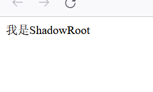
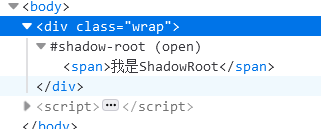
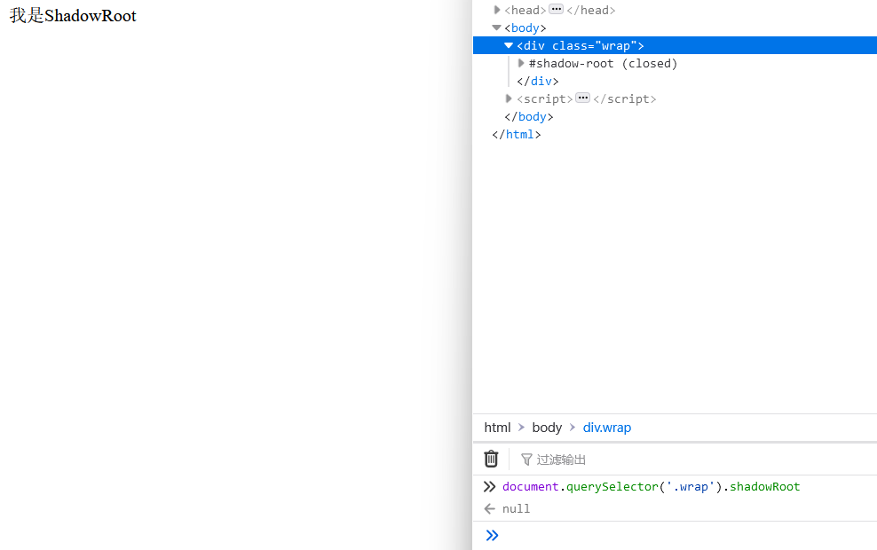

# shadowRoot 的基础介绍

我们可以参考(MDN)[https://developer.mozilla.org/zh-CN/docs/Web/API/ShadowRoot]

Shadow DOM API 的 ShadowRoot 接口是一个 DOM 子树的根节点, 它与文档的主 DOM 树分开渲染。

ShadowRoot 技术本质上就是在一个 dom 树下创建一个隔离的封闭的空间

用来隔绝网页的一些污染，让 html 实现一些模块化的思想，从而使 HTML 中以功能为划分的各个元素块相互独立。

:::tip
因为浏览器随着时代逐渐发展

会不断的拓展一些新功能

这时候普通用户可以使用 ShadowRoot 技术以及以前其他浏览器技术

用来创建一些基础的 html 标签等等

其一是方便用户开发和隔离污染

其二是一旦某种 ShadowRoot 元素在全世界受到广泛的欢迎

浏览器可以无缝过度实现该功能

并且即使浏览器没有实现，也可以利用 ShadowRoot 来实现进行发布和测试

其想法来源于

Shadow DOM removes the brittleness of building web apps. The brittleness comes from the global nature of HTML, CSS, and JS. Over the years we've invented an exorbitant number of tools to circumvent the issues. For example, when you use a new HTML id/class, there's no telling if it will conflict with an existing name used by the page. Subtle bugs creep up, CSS specificity becomes a huge issue (!important all the things!), style selectors grow out of control, and performance can suffer. The list goes on.

Shadow DOM fixes CSS and DOM. It introduces scoped styles to the web platform. Without tools or naming conventions, you can bundle CSS with markup, hide implementation details, and author self-contained components in vanilla JavaScript.

:::

## 实践

ShadowRoot 使用`Element.attachShadow()`函数进行创建

创建后的一些数据我们通常对`元素的shadowRoot属性`进行读取

那么我们实践一下

首先创建一个没有 shadow 的一个页面，大家应该都非常了解这部分了

```html
<div class="wrap">
  <span>我是内容文字</span>
</div>
```

我们将其改造成 ShadowRoot 模式

我们先查看一下 attachShadow 函数`var shadowroot = element.attachShadow(shadowRootInit);`

通过 attachShadow 创建后，返回一个 shadowroot 对象或 null

而 attachShadow 传入一个`shadowRootInit对象`，shadowRootInit 对象有两个参数，
分别是`delegatesFocus 焦点委托`以及`mode模式`

|      属性      |                                                                                                                                        含义                                                                                                                                        |
| :------------: | :--------------------------------------------------------------------------------------------------------------------------------------------------------------------------------------------------------------------------------------------------------------------------------: |
|      mode      |                                                                   有两个参数，一个是 open，一个是 closed。如果是为 open，则从可以外部获得字符串，如果是为 close，则从外部无法获得字符串，只能从返回的引用中获取                                                                    |
| delegatesFocus | 这个据说是提高焦点性能问题，以及点击不可点击的可以转移到第一个可以点击的焦点参数。该参数拓展了元素的焦点行为，除了点击不可点击的可以转移到第一个可以点击的焦点外，当 shadow dom 中的节点获取焦点时，除了焦点元素有 focus 外，附加 shadowdom 的宿主(host)元素将也会被应用上 focus。 |

:::tip
资料来源https://web.dev/shadowdom-v1/#focus
因为 delegatesFocus 在平时并不常用，所以这里就不尝试了（由于没有尝试，所以上述资料请自行辨别真假）
:::

我们可以实践一下代码

```html
<body>
  <div class="wrap"></div>
</body>
<script>
  window.shadow = document
    .querySelector(".wrap")
    .attachShadow({ mode: "open" });
  shadow.innerHTML = ` <span>我是ShadowRoot</span>`;
</script>
```



这里可以看到显示了 shadow-root



我们也可以根据 shadow 的宿主元素找到 shadowRoot 然后 innerHTML 读取

```js
conosole.log(document.querySelector(".wrap").ShadowRoot.innerHTML);
// 打印"<span>我是ShadowRoot</span>"
```

但是如果将其改为 closed

```html
<body>
  <div class="wrap"></div>
</body>
<script>
  window.shadow = document
    .querySelector(".wrap")
    .attachShadow({ mode: "closed" });
  shadow.innerHTML = ` <span>我是ShadowRoot</span>`;
</script>
```

那么在页面中根本拿不到了 shadowRoot 属性，而且控制器里也显示 closed



但是如果我们通过 shadow 获取时是可以拿到的

```js
conosole.log(window.shadow.innerHTML);
// 打印"<span>我是ShadowRoot</span>"
```

那么我们总结一下

1.如果是 open 状态可以直接根据宿主元素拿到 shadowroot 对象然后拿 innerHTML 等

2.如果是 closed 对象，只能拿到创建时返回的应用才可以进一步操作 shadow 内对象

## 解决方式

如果我们想要解决页面的 shadowroot 的问题，有两种方式

1.直接针对 attachShadow 函数进行劫持，将所有的创建的 shadow 都改成 open 模式

```js
let originShadow = Element.prototype.attachShadow;
Element.prototype.attachShadow = function (...args) {
  args[0].mode = "open";
  return originShadow.call(this, ...args);
};
```

更优秀的解决办法，来自 cxxjackie，我们可以调用 originShadow 后拿到了 shadowRoot 引用对象，然后赋值到元素的\_shadowRoot 属性上。

这样就可以在不破坏原有的参数以及 closed 的 mode 模式的情况下拿到引用

```js
let originShadow = Element.prototype.attachShadow;
Element.prototype.attachShadow = function (...args) {
  const shadowRoot = originShadow.call(this, ...args);
  this._shadowRoot = shadowRoot;
  return shadowRoot;
};
```

那么到这里shadowRoot相关的知识就介绍完毕啦！
