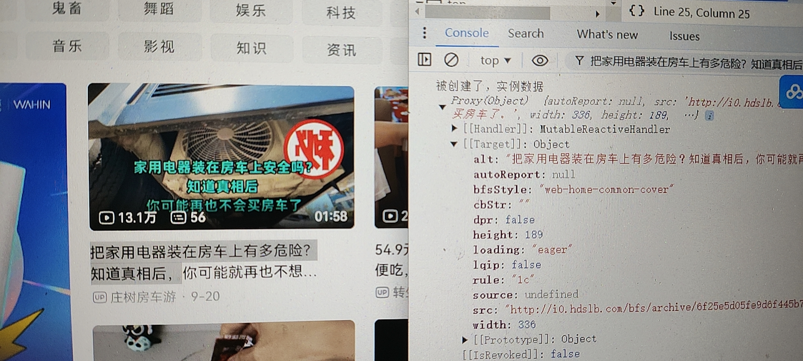
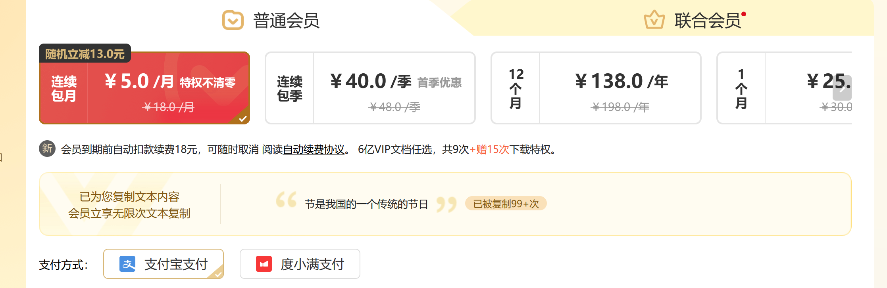
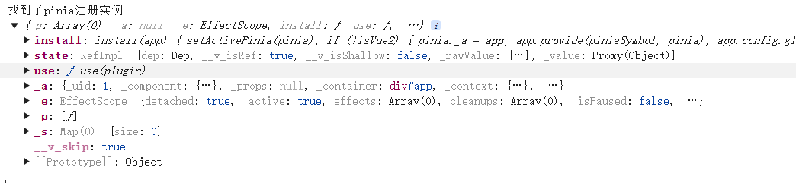

# Vue3 的初步处理方案

测试网站: [bilibli](https://www.bilibili.com/)

首先可以找到存在`__vue_app__`属性

查看源码可以知道在 mount 函数中的

```js
mount(rootContainer, isHydrate, namespace) {
    if (!isMounted) {
    //省略
    rootContainer.__vue_app__ = app;
    return getComponentPublicInstance(vnode.component);
    }
}
```

还有一个\_vnode 属性来自于`mountElement`函数的

```js
def(el, "__vnode", vnode, true);
```

但是我们想在想进行全局劫持，势必要混入自己的代码，Vue3 调用是`createApp(rootComponent).mount(dom)`

而`rootContainer.__vue_app__ = app;`是在挂接之后才能出现的

我们要劫持势必要在初始化时劫持，于是可以顺着 createApp 找找思路

```js
function createApp(rootComponent, rootProps = null) {
  if (!isFunction(rootComponent)) {
    rootComponent = extend({}, rootComponent);
  }
  //省略
  return app;
}
```

这里可以看到有判断`rootComponent`是否是函数，而在脚手架开发的时候，在开发完成编译的时候会通过 sfc 将 vue 的模板文件编译成组件对象，一般为 object 对象

所以大概率会走到下面的 extend 函数，那我们看看 extend 是怎么实现的`const extend = Object.assign;`

可以发现这部分有利用的机会！

```js
const assign = Object.assign;
let isRun = false;
Object.assign = function (...args) {
  if (args.length == 2 && args[1]?.render !== undefined && !isRun) {
    let b = args[1];
    const originRender = b.render;
    b.render = function (...args) {
      console.log("被执行了", args);
      return originRender.call(this, ...args);
    };
    isRun = true;
  }
  return assign.call(this, ...args);
};
```

这里我利用了劫持`assign`可以得到根组件的`render函数`，控制`render`是因为渲染模板相对其他的属性来说可能对数据的暴露拥有更多的访问机会

但是我们该怎么混入实例呢？根据逆向最后找到了`renderComponentRoot`函数的`vnode.shapeFlag & 4`分支，`render`模板上级调用如下

```js
render.call(
  thisProxy,
  proxyToUse,
  renderCache,
  true ? shallowReadonly(props) : props,
  setupState,
  data,
  ctx
);
```

可以看到最后一个就是 ctx！

那我们就可以通过 render 最后一个参数找到`appContext`，根据`appContext`再对全局混入数据！

理论建立完毕了！

```js
// ==UserScript==
// @name         Vue3 Mixin Inject
// @namespace    https://bbs.tampermonkey.net.cn/
// @version      0.1.0
// @description  try to take over the world!
// @author       You
// @match        https://www.bilibili.com/*
// @run-at       document-start
// @grant unsafeWindow
// ==/UserScript==

const assign = Object.assign;
let isRun = false;
Object.assign = function (...args) {
  if (args.length == 2 && args[1]?.render !== undefined && !isRun) {
    let b = args[1];
    const originRender = b.render;
    let isInject = false;
    b.render = function (...args) {
      if (!isInject) {
        args[5]["_"].appContext.mixins.push({
          mounted() {
            console.log("被创建了，实例数据", this.$props);
          },
        });
        isInject = true;
      }
      console.log("被执行了", args);
      return originRender.call(this, ...args);
    };
    isRun = true;
  }
  return assign.call(this, ...args);
};
```

测试一下



## 利用 use 进行注入

除了从`createApp`的`Object.assign`劫持外

通过观察还可以开发者常用的`use`函数也是一个可以利用的注入点

其源代码为

```js
use(plugin, ...options) {
    if (installedPlugins.has(plugin)) {
        warn$1(`Plugin has already been applied to target app.`);
    } else if (plugin && isFunction(plugin.install)) {
        installedPlugins.add(plugin);
        plugin.install(app, ...options);
    } else if (isFunction(plugin)) {
        installedPlugins.add(plugin);
        plugin(app, ...options);
    } else {
        warn$1(
        `A plugin must either be a function or an object with an "install" function.`
        );
    }
    return app;
}
```

可以看到使用了`installedPlugins`而该变量是一个`WeakSet`

```js
const installedPlugins = /* @__PURE__ */ new WeakSet();
```

可知针对`WeakSet`进行劫持得到`Plugin`，对`Plugin`进行一层包装依然可以实现夺取`appContext`对象

```js
const originWeakSet = WeakSet;
unsafeWindow.WeakSet = function () {
  const instance = new originWeakSet();
  const has = instance.has;
  instance.has = function (...args) {
    // 劫持位置
    return has.call(this, ...args);
  };
  return instance;
};
```

但是由于时间原因作者就不进行补足了，感兴趣大家可以对这方面进行补充并且更新过来~

## 常见数据位置与触发响应

Vue3 的开发方式不再使用 Vue2 的选项式，这个时候数据来源以及修改就成了问题

我们可以创建一个最简单的实例来作为分析例子

```js
const { createApp, ref } = Vue;
createApp({
  setup() {
    debugger;
    const message = ref("Hello vue!");
    return {
      message,
    };
  },
  created() {
    console.log("created");
  },
}).mount("#app");
```

针对 setup 函数打断电，通过堆栈回溯可以找到`setupStatefulComponent`函数进行调用

其中可以看到首先从`Component`组件的模板中获得了`Setup`，然后通过 c`allWithErrorHandling`函数来防止`setup`出错进行调用

```js
const { setup } = Component;
if (setup) {
  pauseTracking();
  const setupContext = (instance.setupContext =
    setup.length > 1 ? createSetupContext(instance) : null);
  const reset = setCurrentInstance(instance);
  const setupResult = callWithErrorHandling(setup, instance, 0, [
    shallowReadonly(instance.props),
    setupContext,
  ]);
}
```

其中最后一部分是`setup`传入的参数，我们可以发现

其中组件的`setup`函数的`props`数据来自于实例的`instance.props`通过一层`shallowReadonly`做浅包裹

而`contexnt`来自于`instance.setupContext`包含了`emit`,`expose`,`attrs`,`slots`四个参数，但是如果`setup`的参数没有进行使用不会进行创建

我们继续往下走可以走到`handleSetupResult`函数中
其中可以发现如果是函数则将作为`render`模板，而如果为对象则会设置到实例的`setupState`上

```js
function handleSetupResult(instance, setupResult, isSSR) {
  if (isFunction(setupResult)) {
    {
      instance.render = setupResult;
    }
  } else if (isObject(setupResult)) {
    instance.setupState = proxyRefs(setupResult);
  }
}
```

而我们混入的 this 属性，根据调试可以确定实例在 this 的\_属性上，由此可以推断出以下常见数据所在位置

|  属性  |         位置         |
| :----: | :------------------: |
| setup  | this['_'].setupState |
|  data  |   this['_'].$data    |
| render |   this['_'].render   |
| props  |   this['_'].props    |

关于修改数据，其中`setupState`最简单，他是通过`ref`函数创建的，而`ref`最后创建的是`RefImpl`的类实例对象，根据代码可知直接设置`value`属性即可

```js
class RefImpl {
  constructor(value, isShallow2) {
    this.dep = new Dep();
    this["__v_isRef"] = true;
    this["__v_isShallow"] = false;
    this._rawValue = isShallow2 ? value : toRaw(value);
    this._value = isShallow2 ? value : toReactive(value);
    this["__v_isShallow"] = isShallow2;
  }
  get value() {
    {
      this.dep.track({
        target: this,
        type: "get",
        key: "value",
      });
    }
    return this._value;
  }
  set value(newValue) {
    const oldValue = this._rawValue;
    const useDirectValue =
      this["__v_isShallow"] || isShallow(newValue) || isReadonly(newValue);
    newValue = useDirectValue ? newValue : toRaw(newValue);
    if (hasChanged(newValue, oldValue)) {
      this._rawValue = newValue;
      this._value = useDirectValue ? newValue : toReactive(newValue);
      {
        this.dep.trigger({
          target: this,
          type: "set",
          key: "value",
          newValue,
          oldValue,
        });
      }
    }
  }
}
```

需要注意的是，Vue3 中`data`属性是选项式`data`函数所返回的，而`setup`返回的是`setupState`属性，二者不能混为一谈，由于`data`其修改方式类似，暂且就不表了

除此之外还有一个`props`属性，`props`只有最顶层的数据触发才能进行修改，不能单纯的修改某个属性内容，例如

```js
instance.props.info = { ...instance.props.info, title: "123456" };
```

才可以成功触发数据响应

而 render 一般不推荐进行修改，暂且就不表了~

## 注入 Vue 路由实例

我们可以注入到 Vue3 的路由中，从而依赖于 Vue 的事件触发来更贴近框架的原生体验

首先查看 Vue 路由的使用方法

```js
import { createMemoryHistory, createRouter } from "vue-router";

import HomeView from "./HomeView.vue";
import AboutView from "./AboutView.vue";

const routes = [
  { path: "/", component: HomeView },
  { path: "/about", component: AboutView },
];

const router = createRouter({
  history: createMemoryHistory(),
  routes,
});
createApp(App).use(router).mount("#app");
```

可以看到创建了 router 对象然后调用 use 使用，我们恰好可以通过 use 进行注入

```js
// ==UserScript==
// @name         Vue3路由注入测试
// @namespace    https://bbs.tampermonkey.net.cn/
// @version      0.1.0
// @description  try to take over the world!
// @author       You
// @match       http://localhost:5173/
// @grant       unsafeWindow
// @run-at      document-start

// ==/UserScript==
const originWeakSet = WeakSet;
unsafeWindow.WeakSet = function () {
  const instance = new originWeakSet();
  const has = instance.has;
  instance.has = function (...args) {
    if (args[0].addRoute !== undefined) {
      console.log("找到了路由", args[0]);
      const router = args[0];
      router.afterEach((to, from, fail) => {
        console.log(to, from, fail);
      });
    }
    return has.call(this, ...args);
  };
  return instance;
};
```

这里我们挂了`afterEach`钩子进行测试，也可以使用`beforeEach`，`beforeResolve`等钩子

实测已经成功得到了路由实例并且进行操控



## 注入 Pinia 实例

同理我们也可以利用 use 对 pinia 等插件进行劫持

```js
// ==UserScript==
// @name         Vue3 Pinia注入测试
// @namespace    https://bbs.tampermonkey.net.cn/
// @version      0.1.0
// @description  try to take over the world!
// @author       You
// @match       http://localhost:5173/*
// @grant       unsafeWindow
// @run-at      document-start

// ==/UserScript==
const originWeakSet = WeakSet;
unsafeWindow.WeakSet = function () {
  const instance = new originWeakSet();
  const has = instance.has;
  instance.has = function (...args) {
    debugger;
    if (args[0].state !== undefined) {
      console.log("找到了pinia注册实例", args[0]);
    }
    return has.call(this, ...args);
  };
  return instance;
};
```

只需要找到找到关键的属性名进行判断即可



