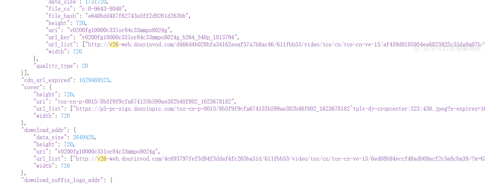

# 抖音短视频无水印下载

简要：通过 XmlhttpRequest 监听实现抖音无水印视频下载

知识学习：[XmlhttpRequest 返回内容监听](/油猴教程/入门篇/XHR提交劫持与内容监听/)

# 正文

之前我们已经学习了 xhr 劫持的方法

现在我们来实战一下，通过 xhr 劫持直接拿到返回的内容

通常通过 xhr 劫持可以达成两种效果，一个是在 xhr 发送数据之前对数据进行获取和篡改，一个则是在 xhr 返回数据之后进行获取

我们可以在[抖音作者主页](https://www.douyin.com/user/MS4wLjABAAAAeq80JKa1oaIFOCOFjkw8o5STIHIsAnBQxVPxVJ4C7RZ5Hn8f1d_zNsMKaa8EOlCw?enter_method=video_title&author_id=3395719513245832&group_id=6976849455186185505&log_pb=%7B%22impr_id%22%3A%22021629423215634fdbddc0100fff0030a1217e00000001a54c1a3%22%7D&enter_from=undefined)使用 f12 进行抓包，大概查看一下数据，发现在

```
https://www.douyin.com/aweme/v1/web/aweme/post/?device_platform=webapp&aid=6383&channel=channel_pc_web&sec_user_id=MS4wLjABAAAAeq80JKa1oaIFOCOFjkw8o5STIHIsAnBQxVPxVJ4C7RZ5Hn8f1d_zNsMKaa8EOlCw&max_cursor=1624424355000&count=10&publish_video_strategy_type=2&version_code=160100&version_name=16.1.0&cookie_enabled=true&screen_width=1536&screen_height=864&browser_language=zh-CN&browser_platform=Win32&browser_name=Mozilla&browser_version=5.0+(Windows+NT+10.0%3B+Win64%3B+x64)+AppleWebKit%2F537.36+(KHTML,+like+Gecko)+Chrome%2F92.0.4515.159+Safari%2F537.36&browser_online=true&_signature=_02B4Z6wo00d01gP1vzgAAIDCg.dFeeve9RYD9buAAOHw7d
```

中的 awemelist 疑似是获取到的链接，这种乱七八糟一堆东西，我们想要做到解密是极其麻烦的，所以我们在这里可以直接打出一个 xhr 劫持获取返回内容


在这个网页里我们通过获取 video 的视频链接可以得到是 v26 开头的前缀，所以我们找一个 json 在线格式化的工具，贴入数据并解析，搜索 v26

[json 在线格式化网站](https://www.sojson.com/)

发现很多地方都是存在 v26 链接的，挑几个进行测试，我最后找到了 video.play_addr.url_list 是无水印的链接



所以这里我们应该进行 xhr 劫持

```js
function addXMLRequestCallback(callback) {
  var oldSend, i;
  if (XMLHttpRequest.callbacks) {
    XMLHttpRequest.callbacks.push(callback);
  } else {
    XMLHttpRequest.callbacks = [callback];
    oldSend = XMLHttpRequest.prototype.send;
    XMLHttpRequest.prototype.send = function () {
      for (i = 0; i < XMLHttpRequest.callbacks.length; i++) {
        XMLHttpRequest.callbacks[i](this);
      }
      oldSend.apply(this, arguments);
    };
  }
}
addXMLRequestCallback(function (xhr) {
  xhr.addEventListener("load", function () {
    if (xhr.readyState == 4 && xhr.status == 200) {
      if (xhr.responseURL.indexOf("/web/aweme/post") !== -1) {
        let list = JSON.parse(xhr.response);
        if (list.aweme_list !== undefined) {
          for (let index = 0; index < list.aweme_list.length; index++) {
            let item = list.aweme_list[index].video.play_addr.url_list;
            //由于他是一个数组，所以这里判断了是否不为0再进行传入
            if (item.length !== 0) {
              //因为一些存在https前缀，一些存在http前缀，一些前缀是//，所以我这里直接全部过滤为空加入了https
              videoList.push(
                "https://" +
                  item[0]
                    .replace("https://", "")
                    .replace("http://", "")
                    .replace("//", "")
              );
            } else {
              alert("run error");
            }
          }
        }
      }
    }
  });
});
```

那这里我们的抖音视频解析就完成了一半了，大家如果测试会发现

刚进入页面是没有进行这个 post 的

这个是为什么呢？

因为很多网页在加载过程中，会把一些用户数据或者页面数据直接放入网页中，在加载的过程中直接渲染

所以推荐大家没思路，找不到数据的时候看看网页源代码进行分析

这里我们搜索 v26 看到了存在一个 script 标签，里面有一大坨乱七八糟的数据


看到`%22%3A%221579877069082637%22%2C%22hashtagName%22%3A%22%E4%B8%`这种乱七八糟的%字符串，通常带很多%的是 url 编码，我们需要进行解码

```js
let initRender = JSON.parse(
  decodeURIComponent(document.querySelector("#RENDER_DATA").innerText)
);
```

编码与解码的方式通常存在三种

escape 和 unescape

encodeURI 和 decodeURI

encodeURIComponent 和 decodeURIComponent

具体区别大家可以另行研究，通常我们使用`decodeURIComponent`就可以，如果不可以就挨个尝试一下。

在解码之后成了一个文本，我们通过`JSON.parse`进行解码，因为他是一个对象进行字符化的文本。

举例，假如声明了一个 a 的变量，是一个对象，调用`JSON.stringify`可以将一个对象文本化，在调用`JSON.parse`可以解码成对象，注意，一些无法变成文本的会丢失，如函数属性。


现在你理解了如何将文本解析成一个对象，我们继续研究抖音的数据，刚才解析成对象的 initRender 变量存在三个键值，其中只有一个是存在视频列表的，所以我们使用 Object.keys(initRender)获取他的所有键值，并且用 for 进行遍历

```js

let initRender = JSON.parse(
  decodeURIComponent(document.querySelector("#RENDER_DATA").innerText)
);

let keys = Object.keys(initRender);

for (let index = 0; index < keys.length; index++) {
  if (initRender[keys[index]].post !== undefined) {
    getRenderTextVideo(videoList, initRender[keys[index]].post.data);
  }
}
```

如果对应的对象的键值内存在 post 属性，就调用 getRenderTextVideo 函数

```js
function getRenderTextVideo(mergeArray, videoList) {
  for (let index = 0; index < videoList.length; index++) {
    let item = videoList[index].video.playAddr;
    if (item.length !== 0) {
      mergeArray.push("https://" + item[0].src.replace("//", ""));
    } else {
      alert("error");
    }
  }
}
```

这里的对象与我们通过 xhr 获取的对象不太一致，但是如何找到免水印的字符串的方法基本一致。
