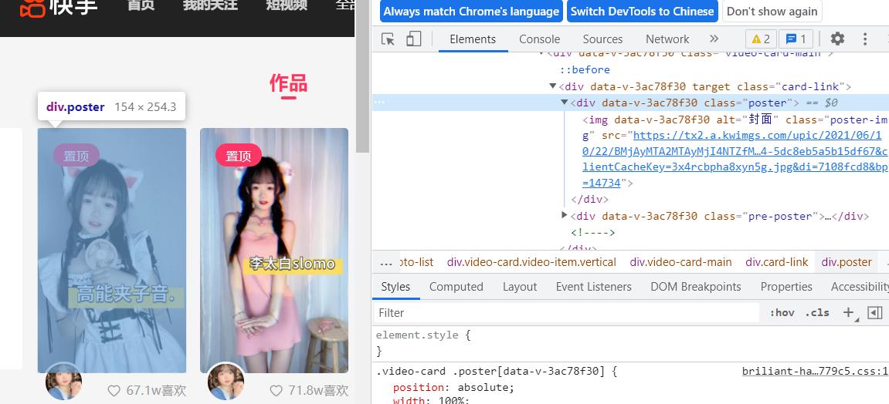
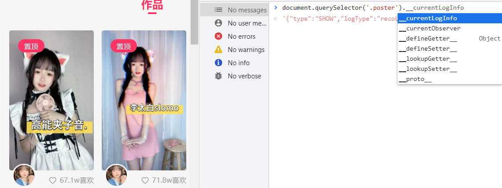
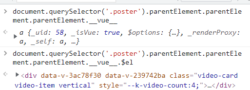
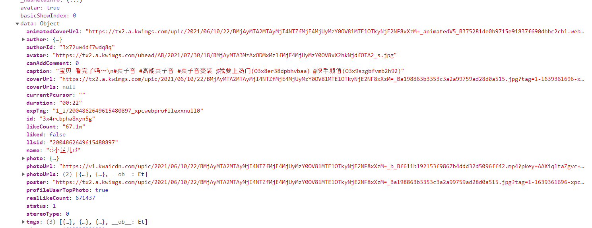
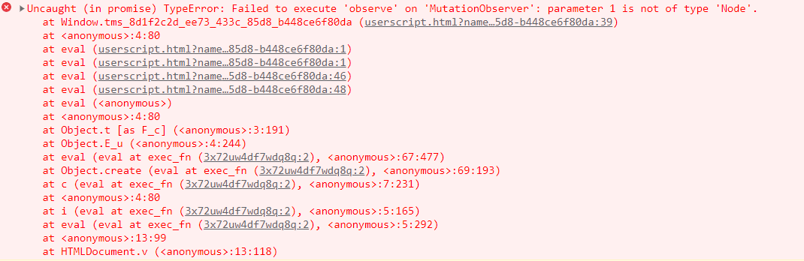
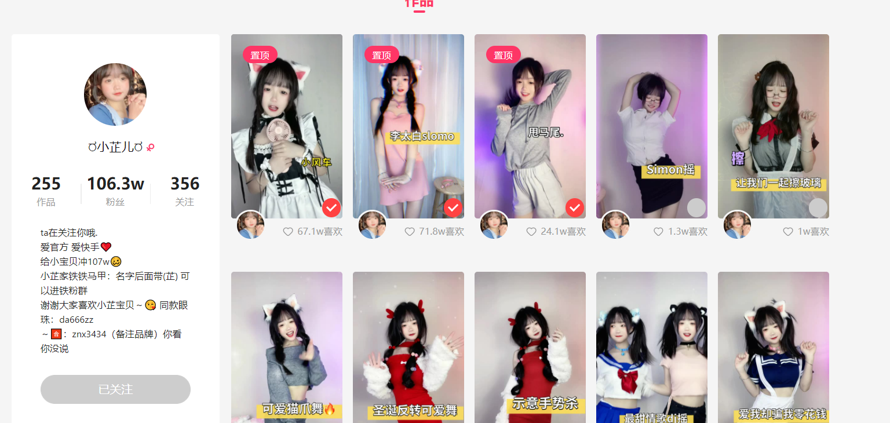
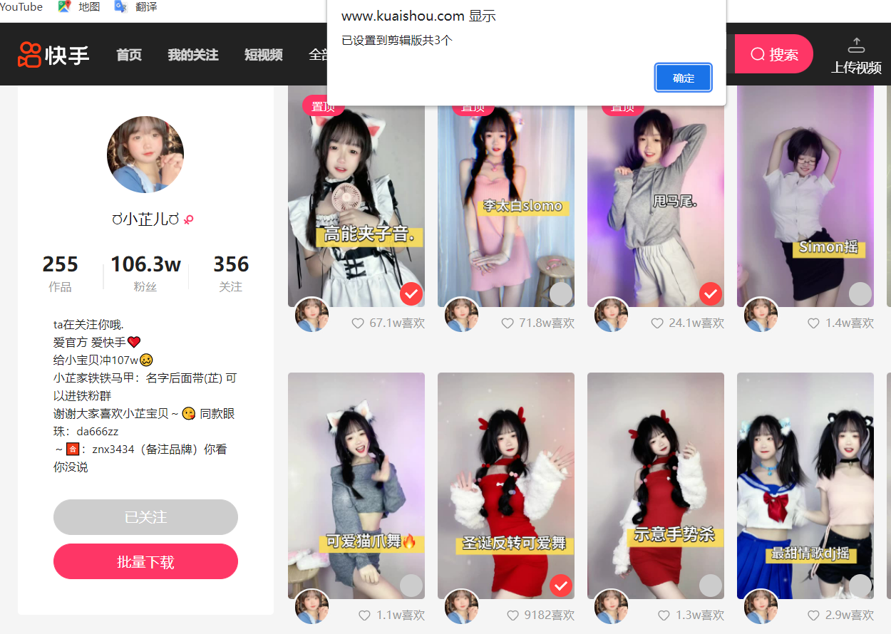

# 实战秒杀快手视频提取

:::tip 特别鸣谢

本文基于 cxxjackie 提供的理论，特此感谢

:::

:::danger

如果出现 undefined 多刷新即可恢复，快手网页端做的不怎么好(几乎已经停止维护了)

另强烈建议使用 chrome！

:::

## 页面分析

以快手的[ರ 小芷儿 ರ](https://www.kuaishou.com/profile/3x72uw4df7wdq8q)页面为例，发现快手是 vue 页面

我们先以一个视频为基础



这个时候打印 vue 属性，发现不存在



我们慢慢往上级找

再多层 parent 找到了属性，这时候打印$el 查看对应 dom 元素，发现 class 是 video-card 那个 class 类



我们看看数据怎么样



发现存在数据，看一下有没有视频地址，发现在 photo 的 photoUrl 是无水印视频地址

这个时候我们还是之前的思路

收集 dom 元素列表，然后开始 MutationObserver 监测元素改变状态，直接对抄之前的抖音脚本

```js
function handleVideoItem(target) {
  console.log("target", target);
}
let list = document.querySelectorAll(".video-card");
const targetNode = document.querySelector(".user-photo-list");
// 观察器的配置（需要观察什么变动）
const config = {
  childList: true, // 观察目标子节点的变化，添加或删除
  attributes: true, // 观察属性变动
  subtree: true, //默认是false，设置为true后可观察后代节点
};

// 当观察到变动时执行的回调函数
const callback = function (mutationsList, observer) {
  // Use traditional 'for loops' for IE 11
  console.log("mutationsList", mutationsList);
  for (let mutation of mutationsList) {
    if (mutation.type === "childList") {
      mutation.addedNodes.forEach((item) => {
        handleVideoItem(item);
      });
    }
  }
};
// 创建一个观察器实例并传入回调函数
const observer = new MutationObserver(callback);
// 以上述配置开始观察目标节点
observer.observe(targetNode, config);
unsafeWindow.onload = () => {
  //处理循环
  list.forEach((item) => {
    handleVideoItem(item);
  });
};
```

我们测试一下,发现报错了



根据 debugger 调试，可以确定是没找到元素的事情，存在一个延时加载的问题，上去直接一个`setInterval`，检测出来元素之后再执行我们的逻辑

```js
function handleVideoItem(target) {
  console.log("target", target);
}
function wrapRunCore() {
  let list = document.querySelectorAll(".video-card");
  const targetNode = document.querySelector(".user-photo-list");
  // 观察器的配置（需要观察什么变动）
  const config = {
    childList: true, // 观察目标子节点的变化，添加或删除
    attributes: true, // 观察属性变动
    subtree: true, //默认是false，设置为true后可观察后代节点
  };

  // 当观察到变动时执行的回调函数
  const callback = function (mutationsList, observer) {
    // Use traditional 'for loops' for IE 11
    console.log("mutationsList", mutationsList);
    for (let mutation of mutationsList) {
      if (mutation.type === "childList") {
        mutation.addedNodes.forEach((item) => {
          handleVideoItem(item);
        });
      }
    }
  };
  // 创建一个观察器实例并传入回调函数
  const observer = new MutationObserver(callback);
  // 以上述配置开始观察目标节点
  observer.observe(targetNode, config);
  unsafeWindow.onload = () => {
    //处理循环
    list.forEach((item) => {
      handleVideoItem(item);
    });
  };
}

let setint = setInterval(() => {
  let list = document.querySelectorAll(".video-card");
  if (list != null && list.length !== 0) {
    wrapRunCore();
    clearInterval(setint);
  }
}, 1000);
```

这时候根据测试，onload 回调没有执行，因为页面的图片没有加载完全，我们下拉滚动条才会开始加载视频图片，所以图片没加载完不属于 onload 状态，这里也没有什么特殊要求，我就直接去掉 onload 就好了。

然后我们开始实现 handleVideoItem 函数，直接对抄一下之前的抖音的

```js
let saveurl = {};
function handleVideoItem(target) {
  if (target.className.indexOf("injectVideoFlag") != -1) {
    return true;
  }
  if (target.className.indexOf("control-pos") != -1) {
    return true;
  }
  const prop = "__vue__";
  if (prop === undefined) {
    return;
  }
  let info = target[prop].data;
  if (info === undefined) {
    console.log("test");
  }
  let videoURL = info.photo.photoUrl;
  videoURL =
    "https://" +
    videoURL.replace("https://", "").replace("http://", "").replace("//", "");
  target.classList.add("injectVideoFlag");
  var select = document.createElement("label");
  select.className = "container control-pos";
  select.innerHTML = ` <input  type="checkbox"><div class="checkmark"></div>`;
  target.append(select);
  select.onclick = () => {
    console.log("选中变化了", select.children[0].checked);
    if (select.children[0].checked) {
      //选中
      saveurl[videoURL] = true;
    } else {
      //未选中
      if (saveurl[videoURL]) {
        delete saveurl[videoURL];
      }
    }
  };
}
```

这里几乎就是对抄之前的，简单修改了一下逻辑

之后我们之前用了样式，所以这里也要使用，简单修改一下 css 样式，贴进来

```js
let cssstyle = document.createElement("style");
cssstyle.innerHTML = `
篇幅太长省略
`;
document.body.appendChild(cssstyle);
```

测试一下发现可以看到这个了



接下来开始插入一个批量下载的按钮

因为页面是一个延迟加载的，我们想插入到已关注的下方，所以也要判断，这里我直接加在 setInterval 里了

两个条件都满足才执行

```js
let timer = setInterval(() => {
  let list = document.querySelectorAll(".video-card");
  if (list != null && list.length !== 0) {
    if (document.querySelector(".user-detail") !== null) {
      wrapRunCore();
      wrapDrawButton();
      clearInterval(timer);
    }
  }
}, 1000);
```

如果找到了 wrapRunCore 就开始监听页面插入，以及绘制目前的视频的单选框

并且 wrapDrawButton 函数开始绘制按钮

接下来我们开始写 wrapDrawButton 函数

```js
function wrapDrawButton() {
  let parenttagert = document.querySelector(".user-detail");
  let div = document.createElement("div");
  div.innerHTML = `<div class="follow-button user-info-follow" data-v-68cd9209="" style="margin-top: 10px;" data-v-58fa4879="">批量下载</div>`;
  div.onclick = function (event) {
    let size = Object.keys(saveurl);
    let text = size.join("\n");
    GM_setClipboard(text);
    alert("已设置到剪辑版共" + size.length + "个");
  };
  parenttagert.append(div);
}
```

直接复制一下抖音的，然后修改一下 div 内容。

跑一下，成功！

那我们这节课就已经讲解完毕了！


