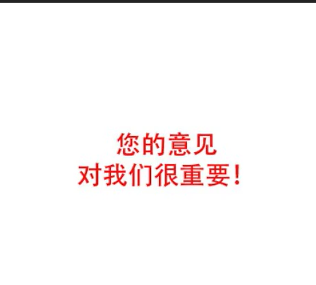
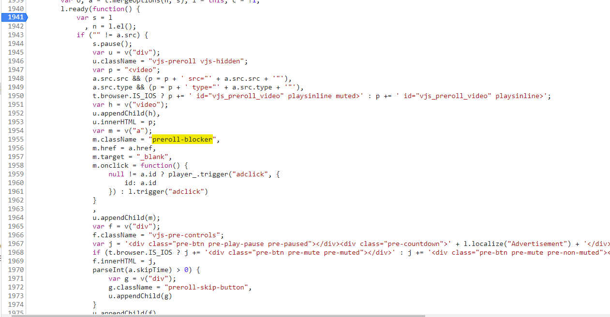
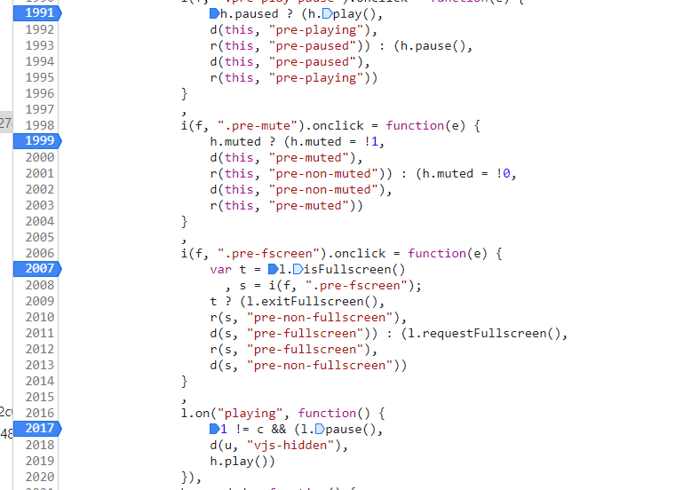
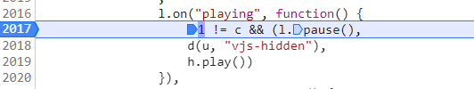

# 实战 91 学习网 videojs 去广告

首先我们应该判断什么时候设置了 videojs

打印一下 window.videojs

可以看到他是在 window 下挂在了一个 videojs 对象

那我们起手一个 run-at 提前注入外加 Object.defineproperty

```js
unsafeWindow._videojs = undefined;
Object.defineProperty(unsafeWindow, "videojs", {
  get() {
    let result = unsafeWindow._videojs;
    return result;
  },
  set(obj) {
    unsafeWindow._videojs = obj;
  },
});
```

这样就可以劫持到设置对象的过程了

然后可以尝试打印`_videojs`是否存在，如果存在代表劫持成功

然后我们可以直接使用 videojs 的 hooks 钩子，来在 videojs 初始化对象前对 config 配置进行处理，或者在 videojs 初始化后对一些函数或者对象进行处理

我们使用 beforesetup 钩子和 setup 钩子

使用方式很简单，官方的例子如下

```js
// 初始化之前会调用beforesetup钩子，传入el元素和config配置对象
videojs.hook("beforesetup", function (videoEl, options) {
  // videoEl will be the video element with id="some-id" since that
  // gets passed to videojs() below. On subsequent calls, it will be
  // different.

  videoEl.className += " some-super-class";

  // autoplay will be true here, since we passed it as such.
  if (options.autoplay) {
    options.autoplay = false;
  }

  // Options that are returned here will be merged with old options.
  //
  // In this example options will now be:
  //   {autoplay: false, controls: true}
  //
  // This has the practical effect of always disabling autoplay no matter
  // what options are passed to videojs().
  return options;
});

// 初始化之后会调用setup钩子，传入初始化好的player对象
videojs.hook("setup", function (player) {
  // Initialize the foo plugin after any player is created.
  player.foo();
});
```

我们接下来开分析流程


首先刚开始是没有广告的

点击之后才出现广告



证明是在点击播放器之后才进行触发的，根据 f12 找到了该广告的元素名是`preroll-blocker`

我们直接 js 搜寻对应元素，找到



这里可以看到是初始化一些数据，在视频 ready 过程中执行该函数

但是 ready 并没有弹广告呀？

我们继续往后看看



找到了各种绑定事件

我因为懒得思考了，直接对所有都打了一个断点



发现点击页面的时候回调了 playing 事件的函数

这里首先对播放器进行了暂停处理，然后调用了 d 函数，传入了 vjs-hidden，执行到 d 的时候开始了弹广告

所以我们大概可以判断出来是 playing 钩子时间内的回调函数控制了广告的触发

所以我们思路大概来了

首先我们用 videojs 的 hooks 钩子

在初始化 player 对象之后，我们在 hooks 钩子里对 on 函数进行劫持，找到 playing 事件就不让其进行绑定,更换为我们自己的函数

理论推理成功，开始实战

```js
unsafeWindow._videojs = undefined;
debugger;
Object.defineProperty(unsafeWindow, "videojs", {
  get() {
    let result = unsafeWindow._videojs;
    return result;
  },
  set(obj) {
    obj.hook("setup", function (player) {
      window.player = player;
      let originOn = player.on;
      debugger;
      player.on = function (...args) {
        if (args.length >= 1 && args[0] === "playing") {
          args[1] = function () {
            player.play();
          };
        }
        return originOn.call(this, ...args);
      };
    });
    unsafeWindow._videojs = obj;
  },
});
```

实测成功，成功实现了去广告！

:::tip
我们不仅可以对其初始化之后进行一些函数的劫持

也可以在初始化之前进行一些配置选项

具体可以参阅一些百度，谷歌的文章，也可以查询官方文档

这方面的资料还是比较多的
:::
