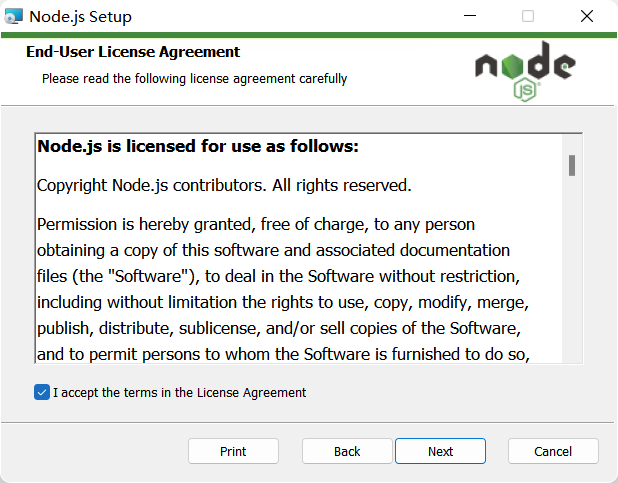
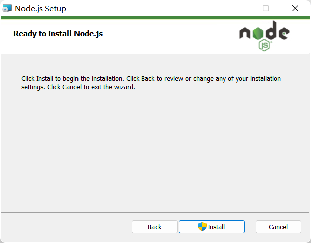

## 简介

我们摆脱了 tamerpmonkey 的编辑器，开始逐渐进入了真正的工程化项目编写

如果需要编写一个大型的项目，我们将代码全部聚在一个 js 文件中是极为不妥的，而且浏览器环境多种多样，同时 JavaScript 代码也未必所有浏览器都会兼容。

所以说我们还需要对代码进行兼容处理，但是这一切是否过于麻烦了？！

上古程序员早就对此感到愤怒！所以他们发明了一种方案：

就是我们先编写代码，分布在不同的文件当中。在我们需要部署到浏览器的时候，我们再去使用一个可以将代码进行编译的工具，在编译的时候进行兼容性的转换以及处理，让其兼容对应的浏览器环境以及让分散的文件形成一个整体代码文件等工作。

而浏览器无法做到文件的读写以及更新，同时为了更快速的编译，需要使用一门语言来开发这种前端的编译工具，社区经过探索最后盯上了[Node.js](https://nodejs.org/en/)

:::tip
Node.js 是一个基于 Chrome V8 引擎的 JavaScript 运行环境。Node.js 使用了一个事件驱动、非阻塞式 I/O 的模型，使其轻量又高效。
:::

Node.js 是一个 JavaScript 的运行环境。因为 js 是一门编程语言，既可以在浏览器运行，也可以在 Node 环境上运行，因为其 Node 与浏览器的代码除了少了 Dom 相关的操作，大部分的逻辑基本一致，极大的降低了开发者的心智负担，所以最终选择了 nodejs。

那么我们的思路整理一下就是这样的：

我们想编写一个工程化的油猴脚本

所以我们在本地编写 JavaScript 代码，然后让打包工具基于 Node.js 环境对我们的代码进行分析，整理，修改，最终生成可以在浏览器运行的代码。

这样不仅利于我们的维护，同时也可以使 JS 代码在打包的过程中进行兼容性处理，以及利用现有的前端工程链来极大的节省我们的开发成本。

## 安装

访问[Node.js 官网](https://nodejs.org/en/)这里可以看到有两个版本


其中 lts 代表长期稳定版，current 代表最新版

我们一般使用长期稳定版，下载后点击


同意协议



直接默认路径，不会占用特别大的空间，同时其他开发者的操作通常也都是使用的默认路径作为演示


配置一些东西，这里不同特别在意，直接默认下一步


这里是自动安装必要工具，我们需要勾上该选项然后下一步


准备安装 Node.js，然后我们直接 install 即可



安装完成后在 cmd 输入,显示版本号即可(需要重新打开cmd才可以正常输出)

```
node -v
v16.13.1 //这里是我的版本号，你的输出以你安装的版本为准
```
