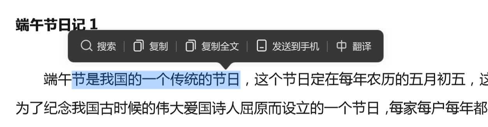
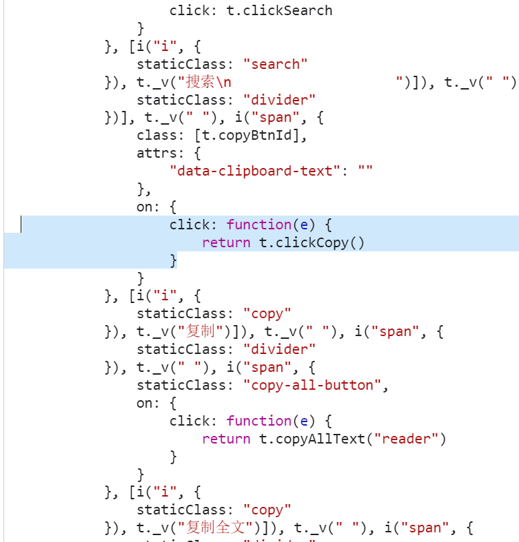
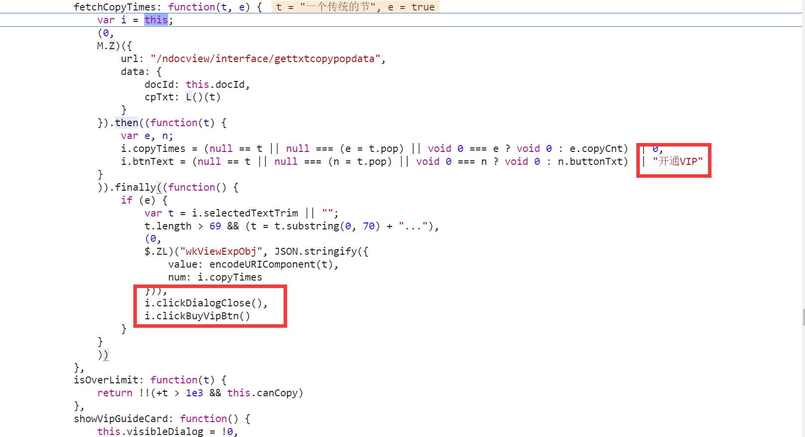

# 实战破解 Vue 百度文库复制

百度文库新版页面使用 Vue2 开发

本文意在领大家分析如何对 Vue 框架开发的页面进行分析

熟悉常用的框架分发代码等等

## 入口分析

这里我们以[端午节日记](https://wenku.baidu.com/view/5d102fd05322aaea998fcc22bcd126fff7055dfd.html?fr=hp_Database&_wkts_=1688832801754)为例

随便选中一段文字，然后点击复制



发现跳转到了百度文库会员购买


那么我们开始分析这个按钮

查看事件监听器，只有一个 click 事件，跳转进去

到了

```js
e = o._wrapper = function (t) {
  if (
    t.target === t.currentTarget ||
    t.timeStamp >= i ||
    t.timeStamp <= 0 ||
    t.target.ownerDocument !== document
  )
    return o.apply(this, arguments);
};
```

这里基本没什么分支，我们直接在`o.apply(this, arguments)`打断点

点击复制按钮后断下，往里走，到了

```js
function n() {
  var t = arguments,
    r = n.fns;
  if (!Array.isArray(r)) return Jt(r, null, arguments, e, "v-on handler");
  for (var i = r.slice(), o = 0; o < i.length; o++)
    Jt(i[o], null, t, e, "v-on handler");
}
```

这里我们就是 Vue 的分发代码了，如果是单个的就只调用一次，如果是多个同样的事件就循环
触发事件的回调函数代码

我们这里直接打印 n.fns，看到是一个函数，直接跳转进去

发现是一个明显的 render 模板



我们在`t.clickCopy()`部分打一个断点继续往里追，找到了

```js
clickCopy: function() {
    var t = arguments.length > 0 && void 0 !== arguments[0] ? arguments[0] : "reader";
    if (a.log.xsend(102222, {
        position: t
    }),
    a.log.xsend(dt, {
        behavior: ut.CLICK,
        module: [vt.ReaderPlugin, "copy", t].join("_")
    }),
    "remind" === t && !this.canCopy)
        return this.buyVip("remind");
    if (this.setVisible(!1),
    this.setReminderVisible(!1),
    this.setIsCopyActivated(!0),
    this.isTaskUser && 1 === this.taskStatus) {
        var e = this.taskStatus
            , i = ++e;
        (0,
        at.Q)(1, i)
    }
},
```

根据调试我们并走到了

```js
if (
  (this.setVisible(!1),
  this.setReminderVisible(!1),
  this.setIsCopyActivated(!0),
  this.isTaskUser && 1 === this.taskStatus)
) {
  var e = this.taskStatus,
    i = ++e;
  (0, at.Q)(1, i);
}
```

所以这里一定有跳转到购买会员页面的代码，我们先从`setVisible`跟一下看看

走进去到了

```js
n[r] = function () {
  for (var e = [], n = arguments.length; n--; ) e[n] = arguments[n];
  var r = this.$store.commit;
  if (t) {
    var o = S(this.$store, "mapMutations", t);
    if (!o) return;
    r = o.context.commit;
  }
  return "function" == typeof i
    ? i.apply(this, [r].concat(e))
    : r.apply(this.$store, [i].concat(e));
};
```

有 store 字样，疑似是 Vuex 或者 pinia，是 vue 的全局状态存储

根据调试前边作用不是特别大，所以可以直接在最后一行打断点

走到了

```js
function(n, r, i) {
    var o = _(n, r, i)
        , a = o.payload
        , s = o.options
        , c = o.type;
    s && s.root || (c = e + c),
    t.commit(c, a, s)
}
```

还是在最后一行跟

```js
this.commit = function (t, e, n) {
  return s.call(o, t, e, n);
};
```

找到了

```js
p.prototype.commit = function (t, e, n) {
  var r = this,
    i = _(t, e, n),
    o = i.type,
    a = i.payload,
    s =
      (i.options,
      {
        type: o,
        payload: a,
      }),
    c = this._mutations[o];
  c &&
    (this._withCommit(function () {
      c.forEach(function (t) {
        t(a);
      });
    }),
    this._subscribers.slice().forEach(function (t) {
      return t(s, r.state);
    }));
};
```

这里 c = this.\_mutations[o];就是对应的 store 的分发函数了

我们打印一下 c 跳转进去

发现是

```js
function(e) {
    n.call(t, r.state, e)
}
```

是一层包裹代码，我们直接打断点，然后进 n 里

就找到了用户写的分发函数啦！

```js
setVisible: function(e, t) {
    e.visible = t
},
```

用同样的方法可以找到全部设置状态的函数，这里我们分别找到了三个，发现没什么特殊的地方，那一定还有其他原因！

我们把目光挪到 this.isTaskUser && 1 === this.taskStatus

因为代码是

```js
if (
  (this.setVisible(!1),
  this.setReminderVisible(!1),
  this.setIsCopyActivated(!0),
  this.isTaskUser && 1 === this.taskStatus)
) {
}
```

表达式前面的都对 if 没有任何意义，那么缩减代码就是` if (this.isTaskUser && 1 === this.taskStatus)`

我们应该去看 isTaskUser 和 taskStatus

因为这个是 vue 的 sfc 文件生成的代码

我们直接在同文件搜索，就找到了

```js
(0, s.mapState)("visitUserInfo", ["isTaskUser", "taskStatus"]);
```

这是一个 mapState 函数，即将全局状态的数据映射到文件中，从而缩减代码的长度

如正常我们获取状态数的数据需要`store.visitUserInfo.isTaskUser`，而使用 mapState 缩减了代码长度，只需要使用`isTaskUser`即可等价于`store.visitUserInfo.isTaskUser`

那我们的目标就是触发`this.isTaskUser && 1 === this.taskStatus`的逻辑

我们可以在`(0,s.mapState)("visitUserInfo", ["isTaskUser", "taskStatus"])`上打一个断点，因为这个是组件初始化的时候执行，所以我们需要刷新页面

可以发现正常断下了，然后往里走


走到了

```js
return function (e, n) {
  return (
    "string" != typeof e
      ? ((n = e), (e = ""))
      : "/" !== e.charAt(e.length - 1) && (e += "/"),
    t(e, n)
  );
};
```

可以看到是兼容性判断，继续看 t 函数

根据调试，t 里面是将 e 进行兼容性处理，然后遍历，挂载到对象 n 上


我们在`var e = this.$store.state`打一个断点等待断下

然后输入

```js
this.$store.state.visitUserInfo.isTaskUser = true;
this.$store.state.visitUserInfo.taskStatus = 1;
```

解除这部分的断点，再次触发复制尝试一下

发现流程进去了


走进去后`at.Q`中唯一比较有意义的代码就是

```
a.ZP.commit("visitUserInfo/setTaskStatus", e
```

我们按之前的流程走就可以走到函数里，但是也有一个比较方便的办法，就是直接搜索`setTaskStatus`，找到了

```js
setTaskStatus: function(e, t) {
    e.taskStatus = t
},
```

上面的代码可以看到修改了 taskStatus，因为全局状态如果被修改是会在其他地方响应的，所以我们尝试搜索 taskStatus，除了我们的代码只有另外一处

```js
H.Z({
  url: "/user/interface/setuserbackground",
  data: c,
  method: "POST",
}).then(function () {
  if (
    (n.setThemeDefaultVal(n.viewTheme),
    (n.showBttomTheme = !1),
    n.isTaskUser && 2 === n.taskStatus)
  ) {
    var t = n.taskStatus,
      e = ++t;
    (0, it.Q)(1, e);
  }
});
```

其代码是在 api 请求/`user/interface/setuserbackground`后调用该属性判断，所以我们可以确定该属性几乎没有作用

那我们的目光只能放在`this.setVisible(!1)`,`this.setReminderVisible(!1)`,`this.setIsCopyActivated(!0)`这三个里了，根据之前的经验，我们再进行搜索

:::tip
严谨的说应该按刚才的方式找函数，但你有经验了可以直接搜索
:::

他们分别修改了`visible`,`remindVisible`,`isCopyActivated`

所以我们依次再分别搜索这三个遍历看看谁依赖了他们三个，这个时候优先排查搜索结果最少的，我们细致排查后找到了

```js
watch: {
     isCopyActivated: function(t) {
        t && !this.canCopy && (a.log.xsend(H, {
            behavior: U.SHOW,
            module: [G.ReaderPlugin, "Copy", "copybtn"].join("_"),
            content: this.selectedTextTrim
        }),
        this.fetchCopyTimes(this.selectedTextTrim, !0))
     },
},
```

这个函数专门监听了`isCopyActivated`变量，还检测了`this.canCopy`是否可以复制，如果不可以复制调用`this.fetchCopyTimes(this.selectedTextTrim, !0))`，我们进这个函数看看



发现明显的 clickBuyVipBtn 字样和开通 vip，很有可能就是这个函数跳转到百度 Vip 付费页面的！

我们在

```js
isCopyActivated: function(t) {
    ...
    this.fetchCopyTimes(this.selectedTextTrim, !0)
}
```

这个函数中还没执行到 `this.fetchCopyTimes`之前下断点，设置 `this.fetchCopyTimes=()=>{}`，发现没有跳转到付费购买 vip 页面，说明我们找对了！

那问题就变成了 canCopy 设置为 true 了

在该 js 文件搜索 canCopy 找到了

```js
s.mapGetters("readerPlugin", ["canCopy", "selectedTextTrim", "formatedText"])
```

```js
canCopy: function(e, t, n) {
    var r = n.vipInfo
        , o = n.docInfo;
    return !!(null != r && r.isVip || (null == o ? void 0 : o.docBizType) === c.RV.SECRET || (null == o ? void 0 : o.docBizCategory) === c.ll.FREE || null != o && o.hasGot)
},
```

获取的是`n.vipInfo.isVip`，我们在这里打印`n`，发现`n`就是 vuex 的状态树

往上堆栈回溯一层可以看到

```js
t._wrappedGetters[e] = function (t) {
  return n(r.state, r.getters, t.state, t.getters);
};
```

根据对比发现 r 是局部状态树，t 是根状态树，那我们的问题就变成了如何得到根状态树并且设置`vipInfo.isVip`

目前已知该变量在`vuex`中的`vipInfo.isVip`属性上，我们只需要拿到 vuex 实例就可以了，但是怎么拿到 Vuex 实例呢？

查阅 vuex 源码可知会挂载到 vue 实例上的`$store`属性中，具体分析就不表明了

所以可以写出代码

```js
document.querySelector(
  ".header-wrapper"
).__vue__.$store.state.vipInfo.isVip = true;
```

根据测试可以正常复制

我们成功破解了百度文库复制！