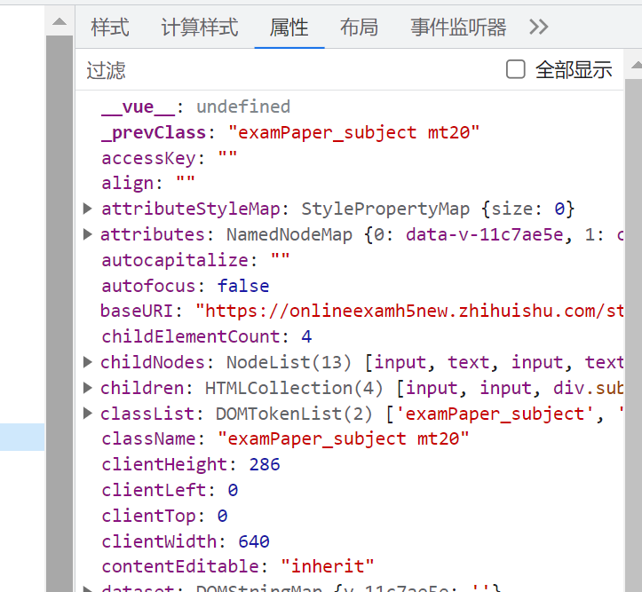
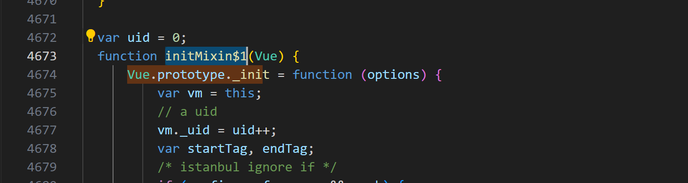

# 实战 Webpack 劫持 Vue 实例

:::tip

该文章仅适用于 webpack 4 版本

:::

## 问题

某平台新版更新屏蔽了`__vue__`

我们就研究 webpack 劫持来重新赋予`__vue__`



某平台目前的研发路线完全走歪了

不应该执着 ob 混淆+劫持

应该找我去做安全防护，理由如下

1.我常年关注某平台的技术栈更新进展，比新来的更懂业务

2.我曾经当过保安，没有项目需求的时候可以楼下站岗，双份活一分钱

3.我与多名脚本作者都有私下来往，如果招我，我立刻线下一人一顿小钢棍，保证打到他们不敢更新脚本

4.我的名字三个字，某平台名字也是三个字，简直天作之合

## 正文

因为首先需要确定 vue 实例

我们直接 xhr 堆栈回溯


一直往下翻，一般来说 Promise.then 上一层可能是 Vue 函数调用的几率很大

所以我直接翻到最顶层，果然找到了 getUserMessage 函数


进去之后打个断点看 this

标准的 vue 实例，所以我们接下来的目标就变成了找 Vue 的全局初始化函数


:::tip
这种代码格式很明显进行了 obfuscator 混淆

通常需要通过 babel 经过 ast 处理得到可读性良好的代码

但是我们的目标仅是针对赋予`__vue__`属性

加上我个人还算对 Vue 源码有简单的了解

所以可以不解混淆直接分析，一般不解混淆直接分析会通过控制台反复打印各种输出来了解部分属性的方式来进行分析，但对于算法的逆向等就不合适了，仅适用于简单需求的情况

如果大家对解混淆感兴趣后续会开一部分科普性质的文章告诉大家如何解决

:::

这个时候可以利用 data 变量的初始化，直接找到组件的 data 函数打断点，然后堆栈回溯


参考 vue 源码这时候走到的是

```js
function getData(data, vm) {
  // #7573 disable dep collection when invoking data getters
  pushTarget();
  try {
    return data.call(vm, vm);
  } catch (e) {
    handleError(e, vm, "data()");
    return {};
  } finally {
    popTarget();
  }
}
```

再往上一层是`initData`，然后是`initState`

`initState`的调用出处是`Vue.prototype._init`，而`Vue.prototype._init`属于`initMixin$1`的闭包函数



所以我们按照 Vue 源码的堆栈规律，直接就可以定位到`initMixin`函数上

打个断点再运行


断下来后输出参数的`_0x1b23e0`就可以拿到 vue 的初始化函数，打印出来之后点击查看函数位置


可以看到是`_0x31c23d`的函数名，我们可以利用 webpack 导出的规律，直接搜索= \_0x31c23d 找到末尾的导出打一个断点


通过堆栈回溯就能找到了 Vue 的第一次导出点


那接下来的问题就是如何注入 webpack 劫持拿到 Vue 实例

我们可以看一下`webpackRequire`源码，也就是我们日常写 import 编译成浏览器上的导入代码

```js
function __webpack_require__(moduleId) {
  if (installedModules[moduleId]) {
    return installedModules[moduleId].exports;
  }
  var module = (installedModules[moduleId] = {
    i: moduleId,
    l: false,
    exports: {},
  });
  modules[moduleId].call(
    module.exports,
    module,
    module.exports,
    __webpack_require__
  );
  module.l = true;
  return module.exports;
}
```

可以看到了调用了 call 函数，所以我们可以针对 call 劫持，然后返回了 module.exports 的变量

而我们的 vue 在`_0xaba272(5).default`上，也就是应该`module.exports.default`，我们可以先判断版本，当版本符合的时候就调用 mixin 混入我们的 mouted 钩子来实现重现某平台的`__vue__`变量，理论建立完毕，实战开始

```js
function enableWebpackHook() {
  let originCall = Function.prototype.call;
  Function.prototype.call = function (...args) {
    const result = originCall.apply(this, args);
    return result;
  };
}
enableWebpackHook();
```

args 的参数分别有`module.exports`, `module`, `module.exports`, `__webpack_require__`，我们直接判断`args的参数2`有没有`default`,并且`version为"2.5.2"`

如果找到了就 mixin 一个 mounted 函数，并且挂在实例到 this 上

```js
function enableWebpackHook() {
  let originCall = Function.prototype.call;
  Function.prototype.call = function (...args) {
    const result = originCall.apply(this, args);
    if (args[2]?.default?.version === "2.5.2") {
      args[2]?.default?.mixin({
        mounted: function () {
          this.$el["__Ivue__"] = this;
        },
      });
    }
    return result;
  };
}
enableWebpackHook();
```

运行一下看看，成功！

