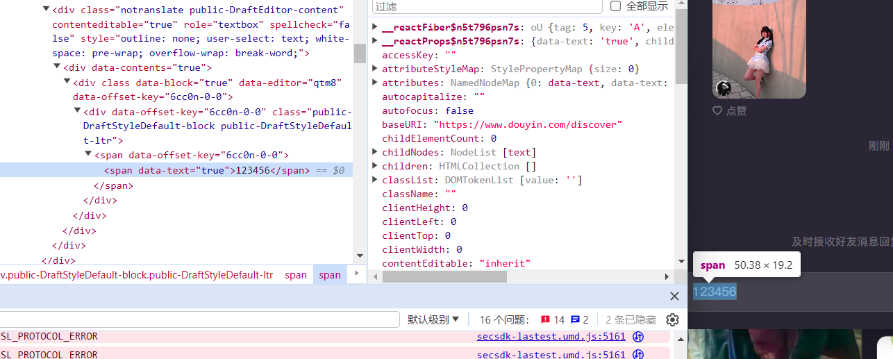
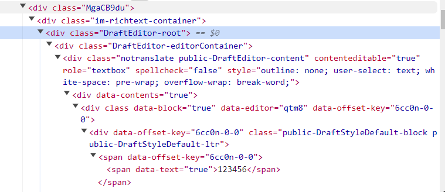
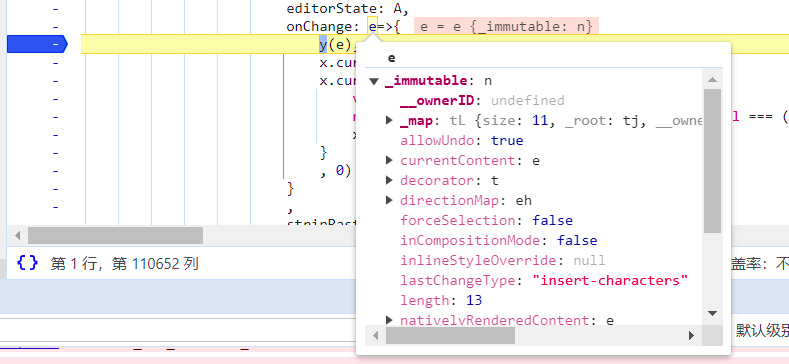

# 实战抖音 React 富文本输入框

我们的目标是触发输入框的消息


查看 DOM 结构发现没有任何输入框

应该是通过监听输入事件后读取数据自己合成出来文字



我们网上逐层找看看会不会有什么思路

可以看到有一个叫做`DraftEditor-root`的 Dom 节点，这个大概率是一个 React 组件的根



我们在`DraftEditor-root`和`im-richtext-container`两个之间找找有没有什么有用的信息

发现在`im-richtext-container`的`__reactFiber$n5t796psn7s.memoizedProps.children.props.children.props中有一个onChange`的回调函数


感觉有戏？我们在控制台打印出来然后追过去下一个断点


再次尝试触发输入，但是没有显示任何的数据，而是一个`{_immutable:n}`的对象



那我们目前就走投无路了，难道真的就就此停止了？

我们从`DraftEditor-root`找找思路，发现根据搜索有一个`Draft.js`的库

同样也有 react 版本，我就找了一份在线例子看看

https://codesandbox.io/p/sandbox/draftjs-ytf7q

发现对比抖音的结构几乎一致


那我们就去看看`Draft.js`

可以发现其中我们刚才找到的应该是`editorState`对象，`onChange`则是通过一些其他逻辑然后设置`editorState`

```js
import React from "react";
import ReactDOM from "react-dom";
import { Editor, EditorState } from "draft-js";
import "draft-js/dist/Draft.css";

class MyEditor extends React.Component {
  constructor(props) {
    super(props);
    this.state = { editorState: EditorState.createEmpty() };
    this.onChange = (editorState) => this.setState({ editorState });
  }

  render() {
    return (
      <Editor editorState={this.state.editorState} onChange={this.onChange} />
    );
  }
}

ReactDOM.render(<MyEditor />, document.getElementById("container"));
```

那我们的目标就是如何生成 editorState 并且丢给 onChange 呢？

我们查阅各种提问找到了一个设置初始值为自定义类型的 demo

https://stackoverflow.com/questions/71496940/how-can-i-set-defaultvalue-on-react-draft-wysiwyg

```js
import { Editor } from "react-draft-wysiwyg";
import { EditorState, ContentState } from "draft-js";

export const TestComponent = () => {
  const [editorState, setEditorState] = useState(() => {
    const content = ContentState.createFromText(
      "This is your default content."
    );
    return EditorState.createWithContent(content);
  });

  return (
    <Editor
      editorState={editorState}
      wrapperClassName="wrapper-class"
      editorClassName="editor-class"
      toolbarClassName="toolbar-class"
      onEditorStateChange={onEditorChange}
    />
  );
};
export default TestComponent;
```

到这里我们就知道了需要调用`ContentState.createFromText`以及`EditorState.createWithContent`生成，我们可以选择 Webpack 核心注入方式拿到`Draft.js`的函数，但是由于 Tree-Shark 的原因难以保证没有被调用的函数依然能正确运行，同时由于这种初始化数据的函数极有可能是有一个无状态函数，所以我们尝试直接引入一个`Draft.js`生成 editorState 内容试试。

直接引入`// @require      https://cdn.bootcdn.net/ajax/libs/draft-js/0.11.7/Draft.js`会报错，根据查阅发现还需要 react 以及 react-dom，过于复杂了，所以感觉建立一个项目通过 webpack 打包到一起暴露出去吧。

安装 webpack 依赖`npm i webpack webpack-cli -D`，安装 draft 依赖`npm i draft-js`，然后编写代码

```js
import { EditorState, ContentState, convertFromHTML } from "draft-js";

export function init() {
  return {
    EditorState,
    ContentState,
    convertFromHTML,
  };
}
```

然后编写一个简易的 webpack 模板

```js
//webpack.config.js

const path = require("path");
module.exports = {
  entry: "./index.js",
  output: {
    filename: "bundle.js",
    path: path.resolve(__dirname, "dist"),
    library: "draftUtils",
  },
  mode: "production",
  optimization: {
    usedExports: true,
  },
};
```

通过 `npx webpack` 即可打包

然后引入我们的 js 并且写一个生成函数

```js
// ==UserScript==
// @name         Inject Rich Text
// @namespace    https://bbs.tampermonkey.net.cn/
// @version      0.1.0
// @description  try to take over the world!
// @author       You
// @match        https://www.douyin.com/*
// @require      https://scriptcat.org/lib/1612/1.0.0/draftUtils.js
// @grant        unsafeWindow
// ==/UserScript==

const { ContentState, EditorState } = draftUtils.init();
function generateRichText(text) {
  const content = ContentState.createFromText(text);
  return EditorState.createWithContent(content);
}
unsafeWindow.generateRichText = generateRichText;
```

根据测试可以正确生成富文本的数据对象了


接下来我们把刚才的`im-richtext-container`的`__reactFiber$wwgviaigfbb.memoizedProps.children.props.children.props.onChange`投递进去这个对象即可实现draft.js的数据触发