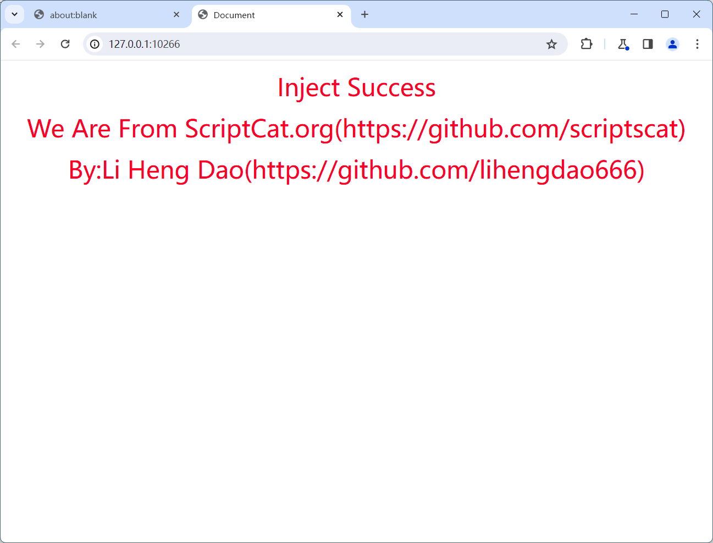

# 抹平 Tampermonkey 的 VSCode 开发体验

:::tip

本文复杂度相对其他文章较高，并该文章仅用于介绍插件的魔改思路

以及相关的分析过程，同时以一种其他方向的视角来实现抹平开发体验的问题

除个人学习练习以外不建议重复开发！
:::

## 前置分析

首先确定了 Tampermonkey 的脚本存储数据在`C:\Users\用户\AppData\Local\Google\Chrome\User Data\Default\Local Extension Settings\dhdgffkkebhmkfjojejmpbldmpobfkfo`

使用的是 levelDB 数据库，但是这种数据库有系统级的进程锁

在谷歌浏览器运行期间我们无法写入，同时可能存在其他的缓存等问题

经过研究这条路是走不通了，转而研究插件

插件的源码路径在`C:\Users\用户\AppData\Local\Google\Chrome\User Data\Default\Extensions\dhdgffkkebhmkfjojejmpbldmpobfkfo\5.1.0_0`

经过尝试一旦尝试修改代码就会破坏完整性从而导致重新下载，那么这条路也走不通了

在确定 levelDB 存在锁，那唯一的途径就是魔改插件代码了，但是 Chrome 又有完整性校验，所以我们只能考虑通过开发者模式手动加载我们自己的修改版代码，同时又不想污染用户原本的数据

再三选择最后想通过 puppeteer 来进行开发

```js
const puppeteer = require("puppeteer");
const crxBase = path.join(__dirname, "./tampermonkey_crx");
const path = require("path");
async function openBroswer() {
  const pathToExtension = crxBase;
  const browser = await puppeteer.launch({
    headless: false,
    args: [
      `--disable-extensions-except=${pathToExtension}`,
      `--load-extension=${pathToExtension}`,
    ],
  });
}
```

然后尝试在 background.jd 中加一个 alert，尝试启动发现可以正常执行我们的修改版代码

## 正式开发

在能加载插件并且自动唤起浏览器后

我们的下一个目标就是可以实现插件与本地进行通信并且传输数据

并且在加载后会提示一个插件已被篡改，其提示的页面地址是

https://www.tampermonkey.net/index.php?version=5.1.0&updated=true#installed

我们可以在本地起一个 express 的服务器，并且篡改掉显示的主页来表明我们注入成功

```js
const express = require("express");
const path = require("path");
const http = require("http");
const { Server } = require("socket.io");

function initLocalServer() {
  return new Promise((resolve) => {
    const app = express();
    app.use(express.static(path.join(__dirname, "/public")));

    let server = http.createServer(app);
    const io = new Server(server);
    io.on("connection", (socket) => {
      console.log("a user connected");
      socket.on("disconnect", () => {
        console.log("user disconnected");
      });
    });
    server.listen(0, () => {
      resolve(server.address().port);
    });
  });
}

exports.initLocalServer = initLocalServer;
```

这里我们写了一个 express 服务器，并且监听了 socket 用于双向传输数据，同时为了解决篡改错误页面的显示，我们可以在 public 目录写一个自己的页面，然后通过调试找到了在插件的

```js
let e,
  t = "version=" + ti.newV + "&ext=" + qe.short_id + "&updated=true";
if (
  (ti.first_run
    ? ((e = "https://www.tampermonkey.net/installed.php?" + t),
      (ti.active = !0))
    : ((t += "&old=" + ti.oldV),
      (e = "https://www.tampermonkey.net/changelog.php?" + t)),
  "off" == un.values.notification_showUpdate)
);
```

我们可以直接替换一下

```js
let e,
  t = "version=" + ti.newV + "&ext=" + qe.short_id + "&updated=true";
if (
  (ti.first_run
    ? ((e = window.openPage), (ti.active = !0))
    : ((t += "&old=" + ti.oldV), (e = window.openPage)),
  "off" == un.values.notification_showUpdate)
);
```

然后提前在该 js 前引入另外一个 js 隔离引入变量即可

但是由于 express 的 port 是动态的，所以我们需要动态修改，这里我引入了 ejs 模板

```js
const path = require("path");
const ejs = require("ejs");
const puppeteer = require("puppeteer");
const fs = require("fs");

const templateBase = path.join(__dirname, "./template");
const crxBase = path.join(__dirname, "./tampermonkey_crx");

async function injectCode({ port }) {
  const result = await ejs.renderFile(templateBase + "/backgroundInject.js", {
    openPage: "127.0.0.1:" + port,
    socketURL: "127.0.0.1:" + port,
  });
  fs.writeFileSync(path.join(crxBase, "/backgroundInject.js"), result);
}
async function openBroswer() {
  const pathToExtension = crxBase;
  const browser = await puppeteer.launch({
    headless: false,
    args: [
      `--disable-extensions-except=${pathToExtension}`,
      `--load-extension=${pathToExtension}`,
    ],
  });
}

async function init(options) {
  await injectCode(options);
  await openBroswer();
}
```

然后编写一个 ejs 模板

```js
window.openPage = `http://<%= openPage %>`;
var socket = io("http://<%= socketURL %>");
```

这样本地的 express 建立成功并且得到了端口，传给客户端，客户端通过 ejs 合成一个`backgroundInject.js`的文件，然后写入到插件目录中，

那我们需要提前在`background.html`声明一下 socket 文件以及`backgroundInject.js`文件

```html
<!DOCTYPE html>
<html>
  <head>
    <meta charset="utf-8" />
    <script src="socket.io.min.js"></script>
    <script src="backgroundInject.js"></script>
    <script src="test.js"></script>
    <script src="background.js"></script>
  </head>
  <body></body>
</html>
```

再通过 puppteer 来唤起浏览器，那我们编制一下 client 和 server 的粘合代码

```js
const server = require("./server/index.js");
const client = require("./client/index.js");

async function init() {
  const port = await server.initLocalServer();
  client.init({ port });
  console.log("port", port);
}
init();
exports.init = init;
```

然后测试一下



## 自动更新

在保证了浏览器和本地进行沟通的前提下，接下来我们要考虑传输脚本自动更新了

我们已知每次创建脚本都会有一个 uuid，这个 uuid 是唯一标识脚本的

为了不破坏原有的流程，造成更大的污染，我们尽量模拟原系统

但是我们又怎么对应呢？我们可以新建一个 chrome 的存储数据用于存储额外的这些信息

用一个 name 和一个 uuid 来进行一一对应

如果出现新的 name 则是出现新的脚本，自动创建脚本并且进行设置，并存储下 uuid

如果是旧的 name 则是已经创建过的脚本，寻找到 uuid 并进行更新即可

所以可以在`backgroundInject.js`中编写出初步的代码

```js
window.openPage = `http://<%= openPage %>`;

const scriptSaveName = "scriptSaveName";

function getScriptData() {
  return new Promise((resolve) => {
    chrome.storage.local.get([scriptSaveName], function (result) {
      if (result[scriptSaveName] === undefined) {
        resolve({});
      } else {
        resolve(JSON.parse(result[scriptSaveName]));
      }
    });
  });
}

async function init() {
  const scriptData = await getScriptData();
  var socket = io("http://<%= socketURL %>");
  socket.on("saveScript", (name, scriptContent) => {
    if (scriptData[name] !== undefined) {
      //更新脚本
    } else {
      //创建脚本
    }
  });
}
init();
```

根据调试我们找到了 tampermonkey 的新建脚本保存的代码

```js
Y(e.uuid, i, {
  clean: !1,
  new_script: e.nnew,
  auto_save: t && t.auto_save,
  reload: !0,
  lastModTime: A[e.uuid].saveEm_lastModTime,
}).done((n) => {
  n.installed
    ? e.nnew
      ? b(0, !0, !1)
      : (k(!1), n.lastModified && (e.lastModTime = n.lastModified))
    : n.aborted ||
      (t && t.auto_save) ||
      (n.messages && n.messages.errors && n.messages.errors.length
        ? de(n.messages.errors.join("\n"))
        : de(ot("Unable_to_parse_this_")));
});
```

往里一路跟发现找到了

```js
sendMessage(
  {
    ...e,
    method: "saveScript",
    code: t,
    clean: n.clean,
    force: n.force,
    new_script: n.new_script,
    auto_save: n.auto_save,
    restore: n.restore,
    lastModTime: n.lastModTime,
    reload: n.reload,
  },
  (e) => {
    n.auto_save || ((r || T)(), G()),
      (e = e || {}).items ? Q(e.items, !0) : _t.hide(),
      !t && n.reload && _t.hide(),
      i.resolve(e);
  }
);
```

下断点得到了保存数据为

```js
{
  auto_save: undefined;
  clean: false;
  code: "脚本代码";
  force: undefined;
  lastModTime: undefined;
  method: "saveScript";
  new_script: true;
  reload: true;
  restore: undefined;
  uuid: "new-user-script";
}
```

那我们可以直接编写 sendMessage 尝试一下

```js
chrome.runtime.sendMessage(
  {
    auto_save: undefined,
    clean: false,
    code: scriptContent,
    force: undefined,
    lastModTime: undefined,
    method: "saveScript",
    new_script: true,
    reload: true,
    restore: undefined,
    uuid: "new-user-script",
  },
  function (response) {
    console.log("获取到的设置信息为：", response);
  }
);
```

理想很丰满，显示很骨感，根据测试 sendMessage 无法在 chrome 插件的 background 中使用
查阅了很多资料都没解决这个方法

最后本来想走 hook 了，但是意料之外找到了一个 chrome.runtime.onMessage.dispatch 函数，直接传入三个参数即是 onMessage 监听器接收的三个参，原理不明兼容性也没查到，总是很神奇...

那么我们确定了如何直接通过 dispatch 触发更新脚本

所以可以直接编写上传和更新的代码

```js
async function setTMScript(uuid = "new-user-script", scriptContent) {
  return new Promise((resolve, reject) => {
    const isCreated = uuid === "new-user-script";
    const sender = JSON.parse(fakeMessageSender);
    if (!isCreated) {
      sender.tab.url =
        "chrome-extension://ppigooooicocpkikgggonplalbnnpkfj/options.html#nav=" +
        uuid +
        "+editor";
    }
    chrome.runtime.onMessage.dispatch(
      {
        auto_save: undefined,
        clean: false,
        code: scriptContent,
        force: undefined,
        lastModTime: isCreated ? undefined : new Date().getTime(),
        method: "saveScript",
        new_script: isCreated ? true : false,
        reload: true,
        restore: undefined,
        uuid: uuid,
      },
      sender,
      (response) => {
        if (response.uuid !== undefined) {
          //成功
          resolve({ uuid: response.uuid });
        } else {
          //失败
          reject();
        }
      }
    );
  });
}
```

然后在插件中声明一个 socket 监听发送脚本的数据，如果接收到了脚本就设置到油猴管理器中

```js
var socket = io("http://<%= socketURL %>");
async function init() {
  const scriptData = {};
  socket.on("saveScript", (name, scriptContent) => {
    console.log("saveScript", name, scriptContent);
    setTMScript(scriptData[name], scriptContent)
      .then(({ uuid }) => {
        scriptData[name] = uuid;
        socket.emit("saveScriptResult", "success", name);
      })
      .catch(() => {
        socket.emit("saveScriptResult", "failed", name);
      });
  });
}
init();
```

目前新建脚本已经搞定了，但是修改脚本会触发 tampermonkey 的冲突提示


这个经过调试我没有找到太好的解决办法

但是可以利用 dispatch 投递消息解除掉这个弹窗

```js
function allowAskCom(uuid) {
  const form = {
    method: "askCom",
    data: {
      aid: uuid,
      message: undefined,
      method: "install",
    },
  };
  const sender = JSON.parse(fakeMessageSender);
  chrome.runtime.onMessage.dispatch(form, sender, (response) => {
    console.log("response", response);
  });
}
```

根据测试必须在 tabs 开启后才可以，所以可以对 tabs.create 做劫持，如果检测到`ask.html`启动就自动跳过

这里传入-1 是因为根据调试必须给一个返回才能继续流程，而我们传入伪造的 id，就会导致 remove 无法正常运行，所以必须也将 remove 劫持掉

```js
const tabsCreate = chrome.tabs.create;
const tabsRemovce = chrome.tabs.remove;
chrome.tabs.remove = function (id, callback, ...args) {
  if (id === -1) {
    return;
  }
  const result = tabsCreate.call(this, id, callback, ...args);
  return result;
};
chrome.tabs.create = function (obj, callback, ...args) {
  const url = obj.url;
  if (url.indexOf("ask.html?") !== -1) {
    const uuid = url.split("aid=")[1];
    allowAskCom(uuid);
    //pass hook
    callback({
      id: -1,
    });
    return undefined;
  }
  const result = tabsCreate.call(this, obj, callback, ...args);
  return result;
};
```

那我们在插件端的工作就大功搞成了，接下来只需要在本地发送脚本数据即可

```js
function sendScriptContent(unionName, scriptContent) {
  if (unionName === undefined) {
    console.warn(unionName + "script unionName is not define");
    return;
  }
  io.emit("saveScript", unionName, scriptContent);
}
```

其余的文件监听等等可以视为进一步的封装，我们就不继续谈了

## 关于 cli 的开发设置说明

我们一般开发这类工具，通常都喜欢通过命令行来进行启动

这个时候需要在`package.json`中声明 bin 字段，如我们声明一个`tampermonkey_vscode_helper_cli`的命令

```json
{
  "bin": {
    "tampermonkey_vscode_helper_cli": "index.js"
  }
}
```

然后为了表示通过 node 运行

需要在`index.js`的头设置`#!/usr/bin/env node`来声明

这样当发布到 npm 后

其他用户通过`npx tampermonkey_vscode_helper_cli`就可以调用我们的库啦！
