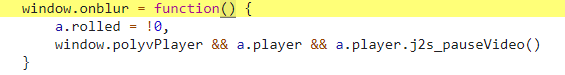

# 实战破解鼠标移出限制

简要：通过 addEventListener 劫持实现取消鼠标移出的限制

知识学习：[addEventListener 劫持](/油猴教程/入门篇/addEventListener劫持/)

## 事件监听器

网页想要检测鼠标是否离开了网页离不开各种事件的监听，所以我们先查看事件监听器

:::tip

提示：本文使用的是 Chrome 浏览器，

不同浏览器所显示的可能不一致，

因此也建议你使用 Chrome 浏览器查看事件监听

:::


根据测试，当点击其他页面的时候触发播放视频

查阅各个消息的含义，我将其注意力放在了 `visibilitychange` 上

:::info `visibilitychange` 文档

当其选项卡的内容变得可见或被隐藏时，

会在文档上触发 `visibilitychange` (能见度更改)事件。

:::

我们尝试直接取消掉该事件

```js
let oldAdd = EventTarget.prototype.addEventListener;
EventTarget.prototype.addEventListener = function (...args) {
  console.log("addEventListener", ...args);
  oldAdd.call(this, ...args);
};
```

然后刷新一下页面看输出，因为输出了一大堆 `addEventListener` 的消息，

这里我们过滤一下


这里可以看到只有一个，所以我们直接写代码过滤掉`visibilitychange`事件的监听

```js
let oldAdd = EventTarget.prototype.addEventListener;
EventTarget.prototype.addEventListener = function (...args) {
  if (args.length !== 0 && args[0] === "visibilitychange") {
    console.log("劫持visibilitychange成功！");
    return;
  }
  return oldAdd.call(this, ...args);
};
```

跑一下测试看看

```
输出结果:
劫持visibilitychange成功！
```

然后我们再尝试进行页面切换，发现依然无法离开页面。

这里我们可以直接暴力测试，对所有监听器进行逐个移除。

最后确定了 `blur` 监听器起到了检测屏幕移出的功能。

点击右边代码



这里看到进行事件监听的是 `window.onblur`

在你浏览其他窗口页面、或是浏览器最小化、又或是点击了其他程序等等，都算是浏览器窗口失去焦点，那么 `window.onblur` 事件就会触发

所以解决方法也非常简单

直接设置 `window.onblur=null` 即可

完整代码如下

```js
let oldAdd = EventTarget.prototype.addEventListener;
EventTarget.prototype.addEventListener = function (...args) {
  if (window.onblur !== null) {
    window.onblur = null;
  }
  if (args.length !== 0 && args[0] === "visibilitychange") {
    console.log("劫持visibilitychange成功！");
    return;
  }
  return oldAdd.call(this, ...args);
};
```

这里将 `window.onblur` 放到了 `addEventListener` 函数中是因为网页初始化的时候还没有挂载 `onblur` 函数。

如果为了代码的干净需要写出更多的监听代码，而范例的代码量较小，不会占用过多的性能，

这里以学习为主，就不再引出更多的代码。可以作为课后练习，尝试写出更干净高效的代码。

:::tip 可能有帮助的例子

<details>
<summary>
涛之雨的：摸鱼派：进化-Evolve
</summary>
代码链接：[摸鱼派：进化-Evolve](https://scriptcat.org/s/1408)

代码（0.1.2版本）：从112行到119行

```js
Object.prototype.hasOwnProperty = function (...a) {
    if (this && this.seed && this.resource) {
        // highlight-next-line
        Object.prototype.hasOwnProperty = k; //恢复拦截
        dataList = this;
        return k.apply(deepProxy(this), a);
    }
    return k.apply(this, a);
};
```
高亮行在劫持完毕后，恢复了原本的 `hasOwnProperty` 函数，这样就不会影响到其他部分的代码了，优雅高效。

</details>

:::

再经过测试发现没有任何问题，我们已经成功破解鼠标移出限制，可以随意切出页面了。
