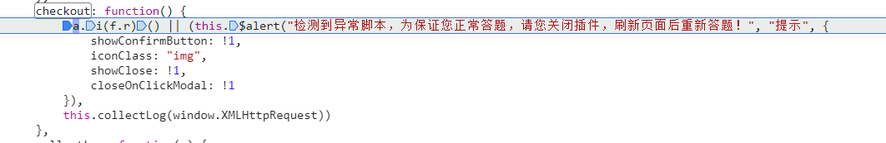
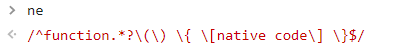
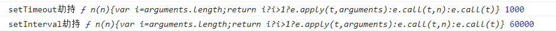
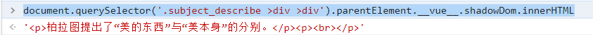

# 实战智慧树 shadowRoot

:::note 联合作者：cxxjackie/李恒道/涛之雨

感谢二位作者在 shadowRoot 问题上做出的贡献！
:::

## 正文

我们的目标就是获取题目，但是使用了 shadowRoot 技术并且是 closed


那根据对 shadowRoot 的了解，我们主要的 hook 点集中在 attachShadow，
所以可以修改`Element.prototype.attachShadow`函数进行 hook，就能得到

```js
let originAttach = Element.prototype.attachShadow;
Element.prototype.attachShadow = function (...args) {
  console.log("attach劫持", ...args);
  return originAttach.call(this, ...args);
};
```

但是这时候智慧树提示了异常脚本

搜索一下文字找到了



先打印一下 f.r 是什么

```js
function l() {
  return (
    a(window.XMLHttpRequest) &&
    a(window.XMLHttpRequest.prototype.open) &&
    (!S.a.state.globalProperty.supportShadom ||
      a(document.body.attachShadow)) &&
    !window.OCS
  );
}
```

然后看 a.i 是啥

```js
function i(e) {
  return e;
}
```

单纯的变量返回，那么核心问题在 f.r 上，我们观察代码

发现每一个都调用了 a 函数，我们继续往 a 函数里走

```js
function a(e) {
  var t = void 0 === e ? "undefined" : _()(e);
  return "function" == t
    ? ne.test(ee.call(e))
    : (e && "object" == t && Y.test(toString.call(e))) || !1;
}
```

根据调试来看 t 是一个函数，在三元表达式中我们走到了`ne.test(ee.call(e))`

其中 ne 是一个正则表达式



而 ee 则是获取函数源代码


那我们的逻辑基本就通了，主要 a 函数用于获取函数源代码并且判断是否有`native code`字样，我们首先思路是劫持 toString 来控制检测的结果。

继续往 ee 里面追找到了


这行打印了代码的字符串


但是根据调试在启动的时候 a 就已经获取了 Function.toString。所以我们很难对其进行函数字符化的劫持。但是因为上层使用了正则，我们可以对正则劫持：

```js
RegExp.prototype._test = RegExp.prototype.test;
RegExp.prototype.test = function (s) {
  if (this.source.includes("function") || this.source.includes("native code")) {
    return true;
  }
  return this._test(s);
};
```

从而实现对 attachShadow 劫持后绕过异常检测

## 堆栈回溯法

我们也可以利用基础 API 的异常堆栈回溯来绕过检测

之前看到异常代码在


理论只有这一处校验，搜索 f.r 也只有这一处


我们搜索哪里对这个函数进行了调用，找到了`checkoutNotTrustScript`函数

发现内部调用了 setinterval 和 settimeout 做检测，那我们可以针对这两个 API 做劫持


写好 hook 函数输出可以看到，他故意传入了一个特定参数包裹原函数，从而让我们无法对基础 API 进行劫持来绕过



那我们的目标就是如何分辨不同函数？可以利用 throw 错误拿报错堆栈信息回溯堆栈

```js
window.setInterval = function (...args) {
  let err = new Error("大赦天下");
  console.log("setInterval大赦天下", err);
  return originInterval.call(this, ...args);
};
window.setTimeout = function (...args) {
  let err = new Error("大赦天下");
  console.log("setTimeout大赦天下", err);
  return originTimeout.call(this, ...args);
};
```


那么我们直接写代码

```js
let originInterval = window.setInterval;
let originTimeout = window.setTimeout;
window.setInterval = function (...args) {
  let err = new Error("大赦天下");
  if (err.stack.indexOf("checkoutNotTrustScript") !== -1) {
    return;
  }
  return originInterval.call(this, ...args);
};
window.setTimeout = function (...args) {
  let err = new Error("大赦天下");
  if (err.stack.indexOf("checkoutNotTrustScript") !== -1) {
    return;
  }
  return originTimeout.call(this, ...args);
};
```

秒杀异常检测报告


接下来我们将 shadowRoot 的 closed 改为 open

```js
let old = Element.prototype.attachShadow;
Element.prototype.attachShadow = function (...args) {
  console.log("attach劫持", ...args);
  args[0].mode = "open";
  return old.call(this, ...args);
};
```

测试一下，已经可以成功读取


## 利用框架特性解决闭包问题

我们全局搜索attachShadow，只找到了一个closed


可以知道this.shadowDom是attachShadow的引用，因为之前根据特征可以知道是Vue页面，直接提取框架数据

```js
document.querySelector('.subject_describe >div >div').parentElement.__vue__.shadowDom.innerHTML
```

测试一下发现可以成功读取




