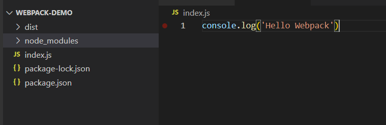
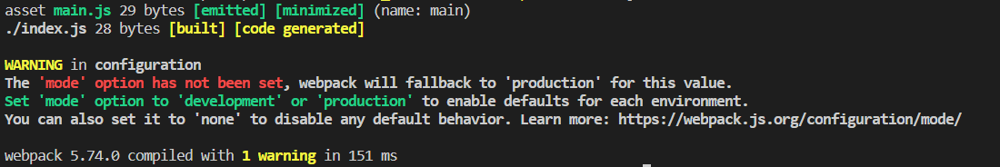
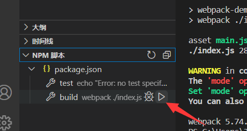

# webpack 初体验

首先我们需要初始化出一个项目

## 项目初始化

我们新建一个文件夹(建议是英文的)，输入`npm init -y`默认初始化一个项目

然后输入`npm install webpack webpack-cli --save-dev`，同时安装 webpack webpack-cli 两个依赖

webpack-cli 是为了让我们使用命令行来调用相关的 webpack 代码，该依赖是必须安装的，否则无法使用命令行进行编译

但你也可以写自己的程序来调用 webpack 进行编译代码，不过我们这里就不多做介绍了

## 创建文件

我们创建一个 index.js 文件
在内部随便输入一些代码，(目前你的文件夹是没有 dist 的，因为还没有编译)

然后我们需要调用 webpack 命令行，输入`.\node_modules\.bin\webpack ./index.js`

其中`.\node_modules\.bin\webpack`是找到对应的命令文件 然后传入对应参数`./index.js`

可以看到

同时有了 dist 文件夹，但是里面的内容还没有任何改变

不要担心，这是正常情况，我们会在后续逐步了解

那么这节课的内容就大功告成啦！

但是还有一个问题，`.\node_modules\.bin\webpack ./index.js`实在太长了

有没有什么好办法？

我们可以输入`npx webpack ./index.js`

npx 就会自动搜寻项目下的对应 webpack 命令

当项目内不存在 webpack，npx 命令调用模块也会自动下载到一个临时目录并进行调用

但是在油猴开发中我们并不常见该方法。

关于 npx 更具体的内容你可以去参考 [npx 相关知识](https://www.ruanyifeng.com/blog/2019/02/npx.html)

我们也可以编写npm脚本来省掉大段的命令编写

我们在package.json中的scripts属性

直接以键值方式输入对应的命令即可（其中键是我们自定义的名字）

然后我们可以输入`npm run build`来调用编译

:::tip VsCode中的调用npm脚本方法

左下角自带npm脚本调用，特别方便

:::

