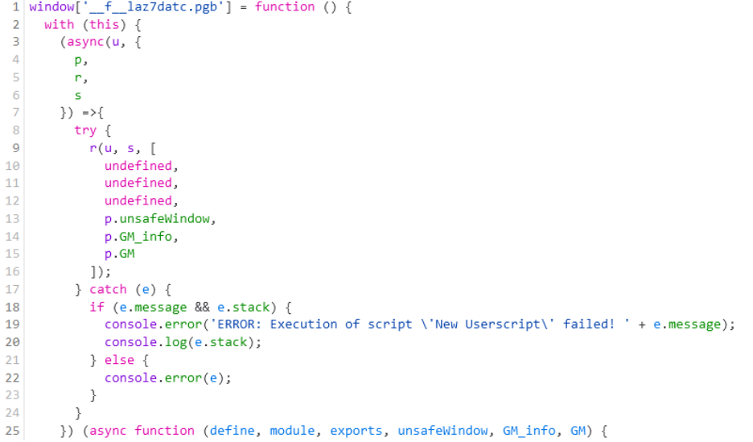

# 脚本与网页作用域的引申

首先我们踏足的网页上了解一下变量的作用域范围

如果我们使用 var 来声明变量，这个时候会挂载到 window

输入变量名或者 window.变量名都是没问题的

```js
var testA = 8;
console.log(testA); //输出8
console.log(window.testA); //输出8
```

但是如果声明 let 或者 const，变量并不在 window 作用域上，只能使用 water 进行引用

```js
let testB = 8;
console.log(testB); //输出8
console.log(window.testB); //输出undefined
```

那我们在油猴脚本里如果是沙盒模式，我们该怎么获得网页的 let 变量呢？

我的第一反应是在 unsafeWindow 下写一个函数并且执行

```js
//在油猴脚本中
unsafeWindow.printLet = function () {
  console.log(testB); //正确输出
};
```

但是很快这种猜想就被推翻了，这是一个错误的代码，testB的作用域并不取决于`printLet`函数

因为即使输入`console.log(water)`，依然可以打印出来内容

这是为什么呢？

我们在油猴脚本里打个debugger

然后格式化看上层的管理器代码



大概就是往window赋值一个函数，然后再去调用这个函数

函数内部通过with设置一下this，this内会包含一个window

所以产生了一个`proxy window`

最后才执行到我们的油猴脚本函数

也就是理一下作用域

可以得出结论是

```
window
  proxy window(我们with中的this所产生的代理window的属性)
    我们的代码
```

如果我们试图`console.log(water)`

那就会先找到`proxy window`，`proxy window`不存在这个属性

然后就找到了网页内的`window`上的这个属性了

所以说我们脚本可以直接通过`console.log(water)`找到网页中定义的let或者const变量

## 引申

如果我们直接在油猴内书写`globalTest=888`，也会直接被设置到网页中

因为严格意义上来讲`proxy window`只是油猴创造的一个作用域

并不属于网页的最初设计

这时候globalTest没有声明变量操作符`let`，`const`，`var`等。

根据js设计会直接逃逸到最顶层也就是网页的window上

该情况的名称叫做`Global variable leak`,即全局变量泄露

这个时候就出现了不安全因素！因为我们脚本的变量跟网页出现了共享读写！

所以大家要避免这种操作来保护脚本的执行安全。

