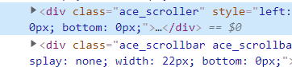
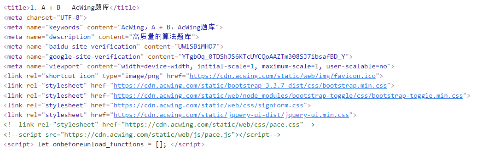
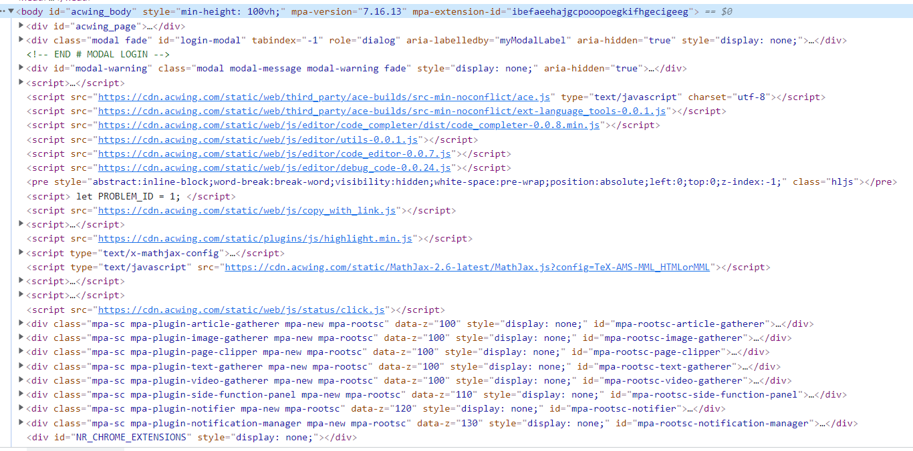

# Script 标签初始化对象劫持

在我们写脚本的时候，经常碰到一种情况，就是网页调用了外部的库，而我们想要去修改内容或者使用一些功能，这时候通常会束手无策，所以我在这里简单的提供一些我自己的想法，可能存在一些问题，可以评论下写出。

通常分为两种情况，一种情况是网页的功能数据暴露在了 windows 的内部，这时候我们可以考虑直接对其进行劫持。另外一种是在封闭作用域内，这种情况我们可以考虑对其内部的一些函数进行劫持。

这里我们以[acwing](https://www.acwing.com/problem/content/1/)为例，我想修改这个编辑器的内容



通过这里的 class 类可以知道，这个是一个 ace 编辑器，我们可以查阅[手册](https://ace.c9.io/#nav=embedding)

:::tip

顺便一提，目前常见的有两种编辑器，一种是 ace 编辑器，一种是 codemirror 编辑器，两种并无优劣，但 ace 个人认为开发更舒服一点

:::

并且查看 windows 下挂载了 ace，我们可以直接使用 `ace.edit("code_editor").setValue('content')` 来设置内容，因为 ace 编辑器允许反复初始化，并返回相同的内容，这里可以用相等来进行判断。

```js
// ace初始化编辑器通常使用ace.edit函数进行初始化
console.log(ace.edit("code_editor") === ace.edit("code_editor")); //true
```

但是这么简单就没有挑战了！所以我们搞的可以更复杂一点。

我们现在 document-start 的时候对脚本注入，然后 debugger



可以看到这时候 body 里的 script 函数很少的

这时候我们查看一下 ace 对象是否有初始化

```js
console.log(window.ace); //undefined
```

证明我们注入的时候 ace 还没初始化。我们再看一下加载完毕的 body 内的内容，可以看到差距非常大



那这时候我们就可以考虑一个想法，在监控 body 内的 dom 变化的时候，检测是否有 ace，如果存在就开始劫持 ace.edit，直接把对象挂载到 window 上，这样就把编辑器的对象直接暴露到了外部出去，这里我直接提供一下代码

:::danger 警告

本代码只是为了引出后续内容，不建议实际使用

:::

```js
window.originAce = null;
document
  .querySelector("head")
  .addEventListener("DOMNodeInserted", function (event) {
    if (
      window.ace !== undefined &&
      window.originAce === null &&
      window.ace.edit !== undefined
    ) {
      window.originAce = window.ace.edit;
      window.ace.edit = function (...args) {
        let ret = window.originAce.call(this, ...args);
        window.aceTarget = ret;
        return ret;
      };
    }
  });
```

这时候我们直接控制 window 下的 oldace 就可以操作编辑器了！

# 对象劫持

我们也可以使用数据响应来对其进行劫持完成目的，这时候可以对 edit 再进行一下处理

```js
let _ace;
Object.defineProperty(unsafeWindow, "ace", {
  configurable: true,
  get: () => _ace,
  set: (value) => {
    console.log("ace被赋值了");
    _ace = value;
  },
});
```

如果将劫持对象属性进一步完善，就得到了 cxxjackie 大佬的监控初始化属性分析代码，我们可以通过`await waitForProperty(unsafeWindow, 'a', 'b', 'c')`进行调用

:::danger 警告

该范例仅供学习使用，可能存在错误及没有覆盖到所有情况，具体效果以网页为准。

:::

```js
function waitForProperty(obj, ...props) {
  // 创建了一个_obj作为obj的引用，为接下来做铺垫
  let _obj = obj;
  // prop根据名字和下文可以知道是单个属性的变量，为当前查询的属性名
  let prop;
  // 保存defineProperty的引用。为接下来劫持做铺垫
  const realDP = Object.defineProperty;
  // waitForValue是一个箭头函数，返回一个promise，方便我们进行阻塞并等待
  const waitForValue = () => {
    return new Promise((resolve) => {
      Object.defineProperty = function () {
        // 第一个参数判断对象是否相等，第二个参数判断属性
        // 如果都相等证明正在赋值这个属性的操作
        if (arguments[0] === _obj && arguments[1] === prop) {
          // 然后判断value这个属性是否存在于第三个对象中
          // defineProperty是需要传入三个对象的，并且存在两种
          // 一种是{value:data}
          // 另外一种是{get:function,set:function}
          // 这里通过判断value属性存在
          // 如果存在则返回参数的value属性返回给const value
          // 如果不存在则调用第二个参数内的get函数，并将其this指向到__obj上
          // 来获取函数返回的value内容
          // 然后恢复劫持，并通过resolve结束这个函数
          const value =
            "value" in arguments[2]
              ? arguments[2].value
              : arguments[2].get.call(_obj);
          Object.defineProperty = realDP;
          resolve(value);
        }
        return realDP.apply(Object, arguments);
      };
      // 刚才是为了防止调用defineProperty来进行属性的设置
      // 如果直接设置属性如window.a=666,则不会触发defineProperty的劫持函数
      // 为了实现赋值监控，我们调用defineProperty设置set函数
      realDP.call(Object, _obj, prop, {
        configurable: true, // 可删除
        enumerable: false, //可枚举
        get: () => undefined, // 因为属性没有被初始化，所以一旦读取这个属性要返回undefined。
        set: (value) => {
          // 如果属性被set触发了，说明某个地方在设置这个属性的值
          // 这时候我们设置上值，并且还恢复劫持
          realDP.call(Object, _obj, prop, {
            configurable: true, // 可删除
            enumerable: true, //可枚举
            writable: true, //可修改
            value: value,
          });
          Object.defineProperty = realDP;
          resolve(value);
        },
      });
    });
  };
  // 函数最后返回了一个promise，这个promise内是一个async函数
  // 是async函数是因为其内部有await阻塞promise
  return new Promise(async (resolve, reject) => {
    // 通过while进行循环，判断props.length是否大于0，如果大于0则一直循环
    // 为了循环判断所有的props最后都成功找到
    while (props.length > 0) {
      // prop接收props弹出的一个参数
      // 每次shift函数调用都会弹出一个
      // 并且props中少一个参数
      prop = props.shift();
      // 判断prop是否存在于_obj中
      if (prop in _obj) {
        // 如果存在，则将_obj变为_obj[属性]
        // 这里是为了逐步往下递归，比如我之前传入了a，b，c和unsafewindow
        // 是为了找到unsafewindow.a.b.c
        // 这里我们把unsafewindow.a变为了_obj
        // 接下来继续判断b存不存在_obj上就可以了
        _obj = _obj[prop];
      } else {
        // 不存在则调用waitForValue等待
        _obj = await waitForValue();
      }
      // 判断参数是否大于0，并且_obj不为函数以及对象，则直接返回一个错误
      // 因为function和object都是对象，并且function函数也可以存储属性
      // 这里只对这两种进行处理，以外的属性会出现报错的情况

      if (
        props.length > 0 &&
        typeof _obj !== "function" &&
        typeof _obj !== "object"
      ) {
        return reject(`The property '${prop}' is not a function or object.`);
      }
    }
    resolve(_obj);
  });
}
```
