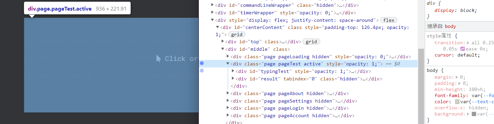
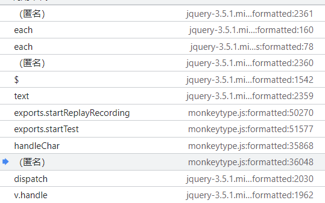
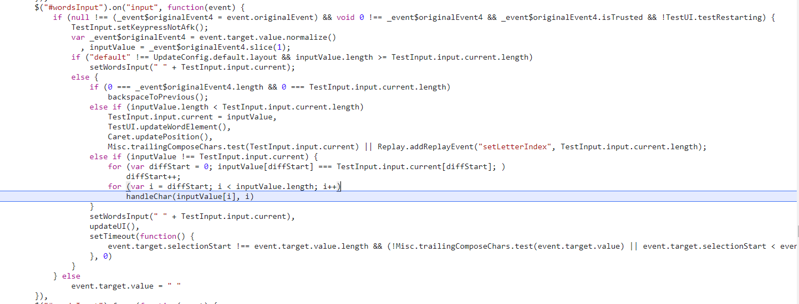
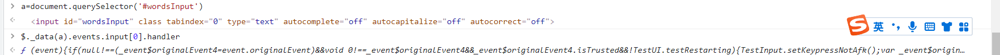
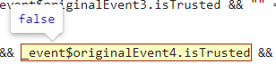
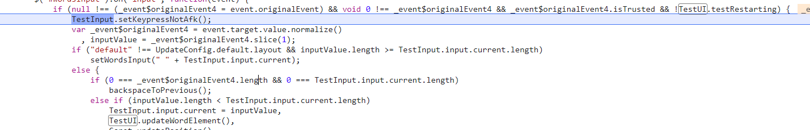
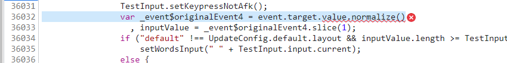
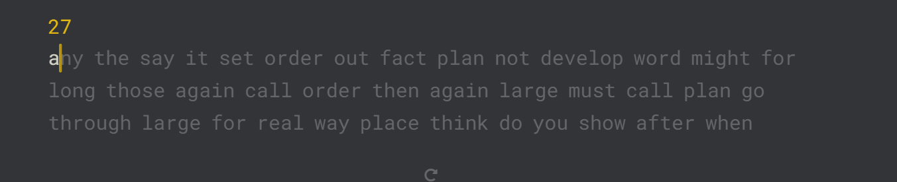

# 实战秒杀 isTrust 验证

目前通过 isTrust 没有什么比较直接的好办法

但是我们可以获取框架监听的函数，同时利用 Proxy 投递进去，来曲线实现过 isTrust 校验的目的

网址是https://monkeytype.com/ ，我们的目标是成功输入内容

# 正文

首先找到对应元素，打字会插入相应元素，所以我们打一个子树修改断点



输入一个按钮之后看触发

这里可以看到是一个 jq 的文件，进行了事件的分发，我们直接跳过最上层的 jq，来到匿名的 monkeytype 的第一个函数，也就是倒数第三个



我们可以读到下方的函数

我们看到最后走进了 handleChar，参数像是一个字符+一个位置，因为如果进入调用的内部，首先需要过 if



if 的判断条件是

```js
null !== (_event$originalEvent4 = event.originalEvent) &&
  void 0 !== _event$originalEvent4 &&
  _event$originalEvent4.isTrusted &&
  !TestUI.testRestarting;
```

首先` null !== (_event$originalEvent4 = event.originalEvent)``的含义是event ` 的 `orginalEvent` 赋值给`_event$originalEvent4`，然后判断是否是 null 值

接下来判断`&& void 0 !== _event$originalEvent4 && _event$originalEvent4.isTrusted && !TestUI.testRestarting`也就是说我们要伪造 orginalEvent 的 isTrusted 值

这里的 originalEvent 就是原生 Event，因为 addeventlistener 是由 jq 进行接受的，接受之后进行了一部分的修改和封装然后才传递给 monkeytype

我们根据[元素规则校验和检测的触发](/油猴教程/中级篇/元素规则校验和检测的触发)拿到 jq 的绑定 on 函数



我们先写一个大概的版本

```js
window.dom = document.querySelector("#wordsInput");
window.func = $._data(dom).events.input[0].handler;
window.inputEvent = {
  originalEvent: new InputEvent("input", {
    inputType: "insertText",
    data: "i",
  }),
};
```

创建一个 inputEvent 对象，然后传递给监听器

因为我们模仿原程序的执行流程和属性赋值，所以要设置给`originalEvent`属性



这时候发现 isTrust 没过，我们利用 Proxy 伪造一下



我们成功进来了，一开始我以为还需要处理`testRestarting`，结果并不需要，还是比较顺利的

然后这里执行出错了，设置下 event.target.value 属性



同时因为`inputValue = _event$originalEvent4.slice(1);`是读取第二位字符，抛弃第 0，所以我们要加一个字符

所以我们在 nomalize 函数需要返回一个字符串，并且第一个字符是废弃字符

我们现在的代码是

```js
let dom = document.querySelector("#wordsInput");
let func = $._data(dom).events.input[0].handler;
window.injectChar = function (c) {
  let event = new InputEvent("input", {
    inputType: "insertText",
    data: c,
  });
  const wrapEvent = new Proxy(event, {
    get: function (target, property) {
      if (property === "isTrusted") {
        return true;
      } else {
        return Reflect.get(target, property);
      }
    },
  });
  let inputEvent = {
    originalEvent: wrapEvent,
    target: {
      value: {
        normalize: function () {
          return "-" + c;
        },
      },
    },
  };
  func(inputEvent);
};
```

测试一下
```js
injectChar('a')
```
可以发现成功了


