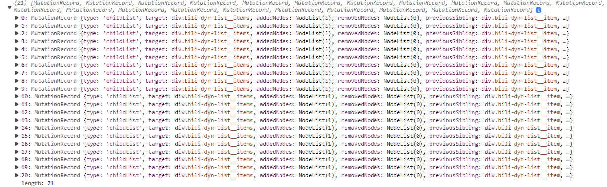

# 监听 B 站动态的加载的模块

:::tip 作者：Yiero

本文由 Yiero 撰写，主要涉及 MutationObserve 相关知识

:::

## 目录

本文将涉及:

- 简单使用 `MutationObserver` .
- 在使用 `MutationObserver` 之前, 如何判断加载页面元素的加载逻辑?
- 自定义事件的派发, 并携带自定义数据
- 工具类: `DynamicLoad`

> 为了方便读者理解, 本文中的代码统一使用 JavaScript, 除了最后的工具类有一个 TypeScript 版本.

> 本文不介绍 `MutationObserver` 的理论, 如果这个 API 感到陌生的读者,可以查阅 [[油猴开发指南-MutationObserver]](https://learn.scriptcat.org/docs/category/mutationobserve-%E7%9F%A5%E8%AF%86/), [[MDN-MutationObserver]](https://developer.mozilla.org/zh-CN/docs/Web/API/MutationObserver).

## 思路

监听 B 站动态加载其实很简单,
直接在动态列表的容器上绑定一个[[MutationObserver]](https://developer.mozilla.org/zh-CN/docs/Web/API/MutationObserver)就可以,
不过有一个问题, `MutationObserver` 返回的 `Array<MutationRecord>` 中的信息太多了, 如果只是单次处理还好, 多次处理就会非常麻烦.

基于这一点, 我们可以自己写一个工具类, 用来将`MutationObserver`返回的信息先进行统一处理, 直接再返回处理后的数据.

> 动态列表容器的类: `.bili-dyn-list__items`
>
> 每一条动态容器的类: `.bili-dyn-list__items`

---

### 如何使用`MutationObserver`观察页面的加载逻辑

由于每个网站的加载逻辑是不同的, 我们需要先观察 B 站动态的加载逻辑.

首先打开开发者工具(F12), 进入[B 站动态首页](https://t.bilibili.com/), 选中任意一个动态,
可以找到其父元素`.bili-dyn-list__item`, 这是动态容器.

还可以找到`.bili-dyn-list__item`的父元素`.bili-dyn-list__items`, 这是动态列表容器.


然后我们一直滚动页面, 直到页面加载新的动态, 可以发现 B 站的动态是直接在`.bili-dyn-list__items`动态列表容器的基础上新增 Node 节点,
这是最简单的元素加载, 可以直接监听`.bili-dyn-list__items`容器的 Node 节点加载即可.


于是我们绑定页面的动态列表容器, 观察其节点增删:

```js
new MutationObserver((recordList) => {
  console.log(recordList);
}).observe(document.querySelector(".bili-dyn-list__items"), {
  childList: true,
});
```

返回的`recordList`如下:



经过分析可以发现, 当新的动态加载时, 触发的 `MutationObserver` 回调中的每条 `MutationRecord` 中的 `addedNodes[0]` 就是一条新加载的动态.

所以, 我们可以通过以下代码获取新加载的动态:

```js
const dynamicUpdateObserver = new MutationObserver((recordList) => {
  recordList.forEach((record) => {
    record.addedNodes.forEach((addedNode) => {
      // 新加载的动态
      const dynamicItem = addedNode;

      /* 对新加载的动态进行操作 */
      console.log(dynamicItem);
    });
  });
});

dynamicUpdateObserver.observe(document.querySelector(".bili-dyn-list__items"), {
  childList: true,
});
```

---

### 整合加载动态

但是前文也说到, 这种方式处理起来很麻烦, 因为我们无法将新加载的动态节点和 `MutationObserver` 分离.

比如我们要处理每一条动态, 当页面初始化的时候,
使用 `const dynamicList = document.querySelectorAll('.bili-dyn-list__item')` 获取到了初始化加载的动态 `dynamicList ` (
以 `NodeList` 的类型进行处理), 然后新加载的动态(比如上一小节的获取到的 `dynamicItem` )我们又要用 `Node` 的类型处理新加载的动态.

虽然可以分离出一个函数处理 Node, 比如写了一个函数`parse()`,
可以通过 `dynamicList.forEach( ( dynamicItem ) => { parse( dynamicItem ) } )` / `parse( dynamicItem )` 的形式去处理,
但是毕竟类型不统一还是麻烦, 而且中间隔着一个 `MutationObserver` , 不好做模块化.

#### 模块化

为什么我要强调模块化? 因为本身 `MutationObserver` 就是一个比较乱的东西, 这不是说这个 API 不好, 而是他的内容太多太全了,
像是上面的代码, 为了获取一条新加载的动态, 在回调函数中需要经过两次遍历才能拿到, 后期维护起来就会很麻烦.

我们应该希望的是, 我们有一个函数( `parseController` )可以对动态进行解析, 然后当有新动态加载时,
直接将新的动态列表传给 `parseController` , 而不是需要通过 `MutationObserver` 解析出动态之后, 在 `MutationObserver` **内部**
对动态进行解析.

简单来说就是, 数据一个层, 逻辑处理一个层:

```js
/* 逻辑处理层 */
// 假如有一个函数parse(node), 用于处理动态

// 动态处理控制函数, 用于进行动态的逻辑处理.
function parseController() {
  // 初始化的动态
  const dynamicList = document.querySelectorAll(".bili-dyn-list__item");
  dynamicList.forEach((dynamicItem) => {
    parse(dynamicItem);
  });

  // 新加载的动态, 监听动态更新事件
  window.addEventListener("dynamicUpdate", (e) => {
    // 返回的事件e中, e.detail就是所有新加载动态的列表.
    const dynamicList = e.detail;
    dynamicList.forEach((dynamicItem) => {
      parse(dynamicItem);
    });
  });
}
```

---

#### 自定义事件

基于事件模型系统, 我们可以通过监听某些事件, 异步地在某个时机触发事件. 比如`click`事件会在用户点击页面时触发一个对应的回调函数,
再比如上文中的 `dynamicUpdate` 事件.

[[dispatchEvent]](https://developer.mozilla.org/zh-CN/docs/Web/API/EventTarget/dispatchEvent) 函数支持我们手动派发一个事件,
比如: `dispatchEvent( new Event('input') )` 可以手动触发一个 input 事件,
在 [元素规则校验和检测的触发](/油猴教程/中级篇/元素规则校验和检测的触发) 一文中可以看到其使用场景.

但是我们需要的 `dynamicUpdate` 事件并不是 js 原生的事件, 所以我们需要自定义一个事件:
通过 [[CustomEvent]](https://developer.mozilla.org/zh-CN/docs/Web/API/CustomEvent/CustomEvent) API 可以创建一个带有自定义数据的自定义事件;
使用 [[Event]](https://developer.mozilla.org/zh-CN/docs/Web/API/Event/Event) API 只能派发一个可以被监听的事件, 无法携带数据:

```js
// 自定义数据
const appendDynamicList = "CustomData";

// 派发事件`dynamicUpdate`, 第二个参数传入一个对象, 其中的detail键用于传入自定义数据
window.dispatchEvent(
  new CustomEvent("dynamicUpdate", {
    detail: appendDynamicList,
  })
);

// 监听事件`dynamicUpdate`, 并接受传入的数据
window.addEventListener("dynamicUpdate", (e) => {
  const appendDynamicList = e.detail;
  console.log(appendDynamicList); // -> 'CustomData'
});
```

> 自定义事件参考资料: [[创建和触发 events]](https://developer.mozilla.org/zh-CN/docs/Web/Events/Creating_and_triggering_events)

---

#### 数据处理层

基于自定义事件, 我们就能够在 `MutationObserver` 事件触发的时候, 再次派发一个事件, 将数据传给逻辑处理层:

```js
/* 数据处理层 */
const dynamicUpdateObserver = new MutationObserver((recordList) => {
  // 声明一个数组用于储存新加载的动态, 统一类型为Node[], 并且一次性将新增动态分发而不是每条动态分发一个事件
  const appendDynamicList = []; // add

  // 将新加载的动态转化成Array<Node>的形式
  recordList.forEach((record) => {
    // 将新加载的动态放到appendDynamicList上
    appendDynamicList.push(...Array.from(record.addedNodes)); // change
  });

  // 分发事件`dynamicUpdate`, 返回新动态列表
  window.dispatchEvent(
    new CustomEvent("dynamicUpdate", {
      // add
      detail: appendDynamicList,
    })
  );
});

dynamicUpdateObserver.observe(document.querySelector(".bili-dyn-list__items"), {
  childList: true,
});
```

## 具体代码实现

### TypeScript版本

#### 代码

```ts
/** 动态加载类 */
class DynamicLoad {
  constructor() {
    // 绑定动态更新监听
    this.updateObserver();
  }

  /**
   * 获取当前所有动态
   * @Return { Node[] }
   * */
  get items(): Node[] {
    // 为了返回的动态列表风格统一, 将NodeList转成Array<Node>
    return Array.from(document.querySelectorAll(".bili-dyn-list__item"));
  }

  /**
   * 动态加载监听器, 当动态更新时(加载), 分发一个事件(dynamicUpdate)提示动态更新, 并返回新加载的动态Node[]
   * */
  private updateObserver(): void {
    const dynamicUpdateObserver = new MutationObserver((recordList) => {
      // 新加载的动态
      const appendDynamicList: Node[] = [];

      // 将新加载的动态转化成Array<Node>的形式
      recordList.forEach((record) => {
        appendDynamicList.push(...Array.from(record.addedNodes));
      });

      // 分发事件`dynamicUpdate`, 返回新动态
      window.dispatchEvent(
        new CustomEvent("dynamicUpdate", {
          detail: appendDynamicList,
        })
      );
    });

    dynamicUpdateObserver.observe(
      <HTMLElement>document.querySelector(".bili-dyn-list__items"),
      {
        childList: true,
      }
    );
  }
}
```

#### 使用

```ts
// 声明DynamicLoad类, 并绑定上页面监听器
const dynamicLoad = new DynamicLoad();

// 获取已加载的动态
const loadedDynamicList: Node[] = dynamicLoad.items;
console.log(loadedDynamicList);

// 监听动态更新事件, 获取新加载的动态
window.addEventListener("dynamicUpdate", (e) => {
  const result = e as CustomEvent;

  const appendDynamicList: Node[] = result.detail;
  console.log(appendDynamicList);
});
```

---

### JavaScript版本

#### 代码

```js
/** 动态加载类 */
class DynamicLoad {
  constructor() {
    this.#updateObserver();
  }

  /**
   * 获取当前所有动态
   * @return { Node[] }
   * */
  get items() {
    return Array.from(document.querySelectorAll(".bili-dyn-list__item"));
  }

  /**
   * 动态加载监听器, 当动态更新时(加载), 分发一个事件(dynamicUpdate)提示动态更新, 并返回新加载的动态NodeList
   * */
  #updateObserver() {
    const dynamicUpdateObserver = new MutationObserver((recordList) => {
      const appendDynamicList = [];
      recordList.forEach((record) => {
        appendDynamicList.push(...Array.from(record.addedNodes));
      });
      window.dispatchEvent(
        new CustomEvent("dynamicUpdate", {
          detail: appendDynamicList,
        })
      );
    });
    dynamicUpdateObserver.observe(
      document.querySelector(".bili-dyn-list__items"),
      {
        childList: true,
      }
    );
  }
}
```

#### 使用

```js
// 声明DynamicLoad类, 并绑定上页面监听器
const dynamic = new DynamicLoad();

// 获取目前已加载的所有动态
const loadedDynamicList = dynamic.items;
console.log(loadedDynamicList);

// 监听动态加载
window.addEventListener("dynamicUpdate", (e) => {
  // 获取新加载的动态
  const appendDynamicList = e.detail;
  console.log(appendDynamicList);
});
```
