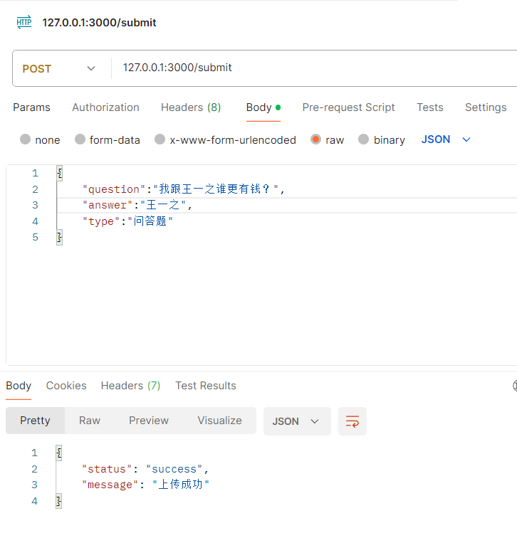
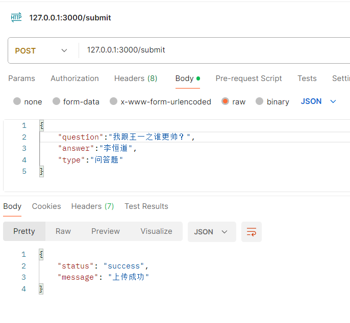
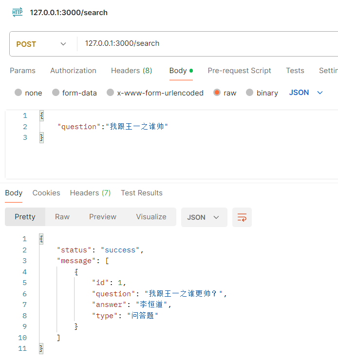
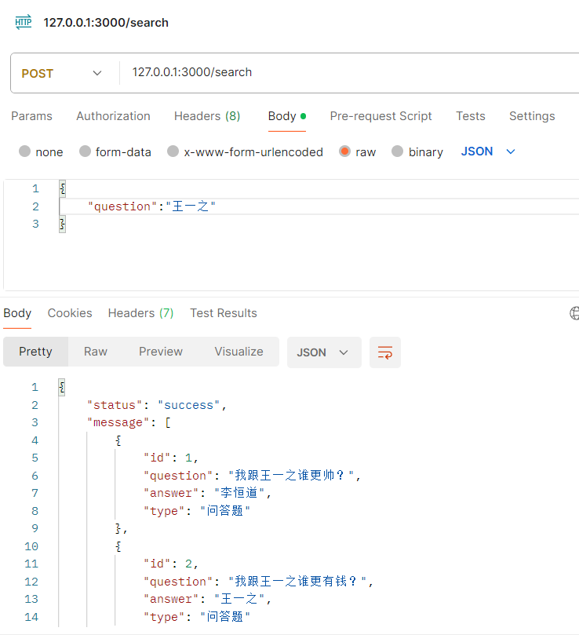
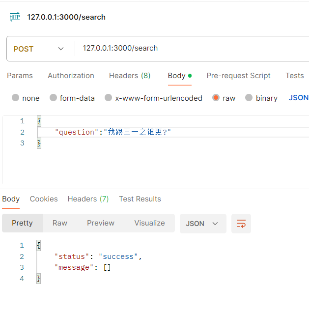
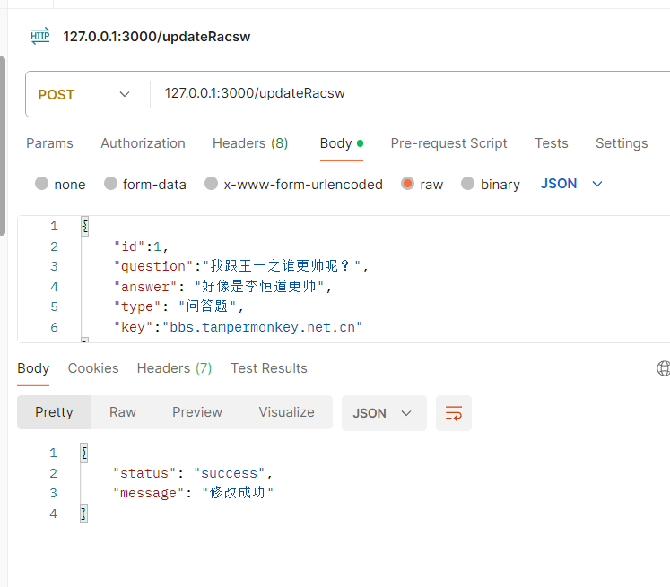
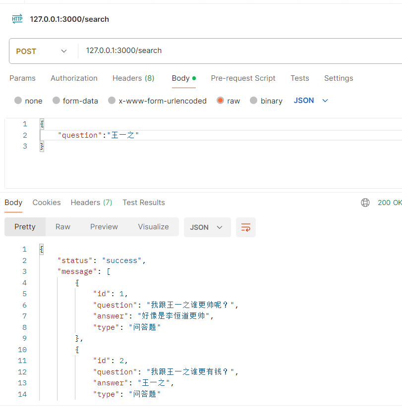
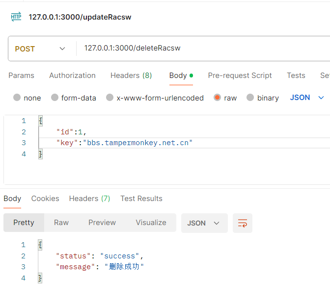
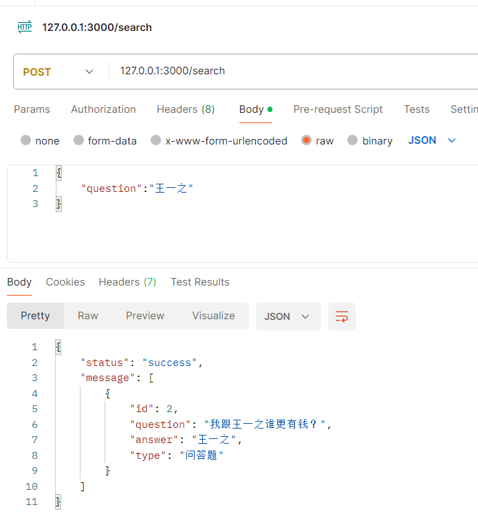

# 实现 Node.js 的轻量级模糊搜索

本节跟油猴其实关系并不大，但是问的人实在太多了

于是决定提供一个实现简易的模糊搜索的 Node.js 例子

但是并没有进行权限控制，感兴趣可以基于这之前继续实现

参考项目的地址为 [sqlite-fuzzy-search-demo](https://github.com/lihengdao666/sqlite-fuzzy-search-demo)

## 项目搭建

首先输入`npm init`填一些项目信息起手

然后因为我们需要提供题目的收录和查询，轻量一点我选择了`express`作为 HTTP 服务器的库

输入`npm install express --save`安装一下

直接上官网抄一下例子`https://expressjs.com/en/guide/routing.html`

创建一个`index.js`文件

```js
const express = require("express");
const app = express();

app.use(express.json());
app.post("/submit", (req, res) => {
  res.send("POST request to the homepage");
});

app.post("/search", (req, res) => {
  res.send("POST request to the homepage");
});

app.listen(3000, () => {
  console.log(`fuzzySearch app listening on port !`);
});
```

就得到了一个基本的 http 服务器，然后我们需要进行字段过滤，数据库选型

我们先进行最简单的字段过滤吧

## 字段过滤

经过两分钟的深思熟虑，最后选择了`express-validator`库

先输入`npm install express-validator`安装一下

参考一下官方文档，可以改造一下进行参数校验

这样就可以自动校验不合法的提交请求，我们写的是默认`POST`

提交题目数据为`question`，`answer`，`type`三个字段，搜寻数据的时候仅提交`question`字段

```js
app.post(
  "/submit",
  [
    check("question").notEmpty(),
    check("answer").notEmpty(),
    check("type").notEmpty(),
  ],
  (req, res) => {
    const result = validationResult(req);
    if (!result.isEmpty()) {
      return res.send(`filed is not valid!`);
    }
    res.send("POST request to the homepage");
  }
);

app.post("/search", [check("question").notEmpty()], (req, res) => {
  const result = validationResult(req);
  if (!result.isEmpty()) {
    return res.send(`filed is not valid!`);
  }
  res.send("POST request to the homepage");
});
```

那我们就完成了 HTTP 服务器的搭建，正式开始分词问题了

## 分词选型

由于 ES 和其他数据库的分词的配置较为复杂，需要从头进行搭建

而我们作为例子追求的并不是供几十万人的同时使用，而是一个小型的，可以随地大小建的 Demo

方便大家可以为了解决一些临时的需求快速上手

所以最终选择了 Sqlite + 分词插件作为技术选型

由于默认的 Sqlite 的中文分词存在些许问题，所以经过搜索，最终选择了 wangfenjin 大佬的分词插件

具体文档可以参考[wangfenjin/simple](https://github.com/wangfenjin/simple)

我们首先去 [Release](https://github.com/wangfenjin/simple/releases) 下载好对应的文件

放到项目目录中，然后输入 npm i sqlite3 安装 sqlite 依赖包

需要注意的是 sqlite3 依赖于 python，而 python 目前 3.12+会导致 sqlite3 的依赖安装失败

所以建议降级 python 到 3.11 版本，教程使用的版本是 3.11.7

## 分词初始化

参考 Github 的例子我们可以很轻易的写出 Sqlite 分词的初始化代码

```js
function startSqlite() {
  db.serialize(function () {
    db.loadExtension(path.resolve("./", "simple"));
    db.run("select jieba_dict(?)", path.resolve("./", "dict"));
    db.run(
      "CREATE VIRTUAL TABLE if not exists fuzzySearch USING fts5(question,answer,type UNINDEXED, tokenize = 'simple')"
    );
  });
}
```

那么接下来我们可以很轻易的写出简易的分词搜索的 API

首先是提交的

```js
app.post(
  "/submit",
  [
    check("question").notEmpty(),
    check("answer").notEmpty(),
    check("type").notEmpty(),
  ],
  (req, res) => {
    const result = validationResult(req);
    if (!result.isEmpty()) {
      return res.json({ status: "error", message: "参数不合法" });
    }
    const { question, answer, type } = req.body;
    db.run(
      "insert into fuzzySearch(question,answer,type) values (?,?,?)",
      [question, answer, type],
      (err) => {
        if (err == null) {
          res.json({ status: "success", message: "上传成功" });
        } else {
          console.log("submit insert error :", err);
          res.json({ status: "error", message: "上传失败" });
        }
      }
    );
  }
);
```

然后是查询的

```js
app.post("/search", [check("question").notEmpty()], (req, res) => {
  const result = validationResult(req);
  if (!result.isEmpty()) {
    return res.send(`filed is not valid!`);
  }
  const { question } = req.body;
  db.all(
    "select rowid as id,question,answer,type from fuzzySearch where question match jieba_query(?) LIMIT 0,10",
    [question],
    (err, rows) => {
      if (err == null) {
        console.log(rows);
        res.json({ status: "success", message: rows });
      } else {
        console.log("submit insert error :", err);
        res.json({ status: "error", message: "查询失败" });
      }
    }
  );
});
```

我们可以简单实验两条





然后查询一下数据





这里需要注意的是 Sqlite 分词的能力并不如其他的分词强大，仅在于轻便

虽然对于关键词方面的搜寻能力不错，但是在一些情况下尽管相差不大但是会搜索不到，例如下面的例子

这里我删除了帅和有钱，留下一个相似但是语义又不是特别连贯的，相对搜索能力就较差了



接下来我们做略微的补足`valieKey`用于做 api 的鉴权，而`suffix`用于增加修改和删除的 API 的入口复杂度

```js
const valieKey = `bbs.tampermonkey.net.cn`;
const suffix = `Racsw`;
app.post(
  "/update" + suffix,
  [
    check("id").notEmpty(),
    check("question").notEmpty(),
    check("type").notEmpty(),
    check("answer").notEmpty(),
    check("key").notEmpty(),
  ],
  (req, res) => {
    const result = validationResult(req);
    if (!result.isEmpty()) {
      return res.json({ status: "error", message: "参数不合法" });
    }
    const { id, question, type, answer, key } = req.body;
    if (key !== valieKey) {
      return res.json({ status: "error", message: "key无效" });
    }
    db.run(
      "UPDATE fuzzySearch SET question = ?,answer = ?,type = ? WHERE rowid = ?",
      [question, answer, type, id],
      (err) => {
        if (err == null) {
          res.json({ status: "success", message: "修改成功" });
        } else {
          console.log("submit update error :", err);
          res.json({ status: "error", message: "修改失败" });
        }
      }
    );
  }
);
```

然后尝试修改一下



再次进行查询测试



同理补足删除函数

```js
const valieKey = `bbs.tampermonkey.net.cn`;
const suffix = `Racsw`;
app.post(
  "/delete" + suffix,
  [check("id").notEmpty(), check("key").notEmpty()],
  (req, res) => {
    const result = validationResult(req);
    if (!result.isEmpty()) {
      return res.json({ status: "error", message: "参数不合法" });
    }
    const { id, key } = req.body;
    if (key !== valieKey) {
      return res.json({ status: "error", message: "key无效" });
    }
    db.run("DELETE FROM fuzzySearch WHERE rowid = ?", [id], (err) => {
      if (err == null) {
        res.json({ status: "success", message: "删除成功" });
      } else {
        console.log("submit update error :", err);
        res.json({ status: "error", message: "删除失败" });
      }
    });
  }
);
```

测试一下



再次进行查询



那么至此我们的增删改查就全部结束了

关于参考项目的地址为 [sqlite-fuzzy-search-demo](https://github.com/lihengdao666/sqlite-fuzzy-search-demo)

## 参考文章

https://blog.xulihang.me/sqlite-full-text-search/

https://www.misterma.com/archives/892/

https://www.cnblogs.com/wangfenjin/p/14425659.html
