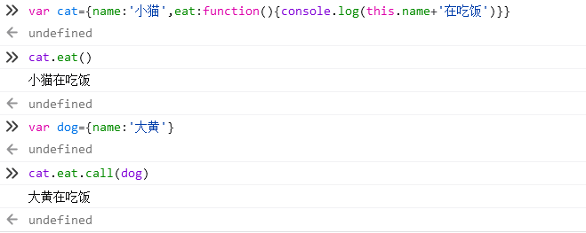

# this 的作用

提要：在本章中你将会学到 Js 中 this 的基础特性。

# 什么是 this

this 就是函数在执行的时候所在的作用域，一般默认的 this 指针指向 window，(作用域一个盒子，我们一般声明的函数以及变量都在这个(window 指针)里。并且 js 对象也存在作用域(相当于盒子里又有一个盒子))

举个例子
假设我们声明了一个对象 Person

```js
window.Person = {
  say: function () {
    console.log("hello", this);
  },
};
Person.say();
```

此时 window 相当于一个作用域的盒子，而我们声明的 Person 也具有作用域，Person 挂载到了 window 中，所以相当于在一个大盒子里有了 Person 这个小盒子。

# 为什么需要 this

当 js 引入了 this 这个特性之后可以更好的控制了数据结构，使写代码的过程中更具有条理性，同时在某些情况下可以将代码反复利用，节省了造轮子的时间，可以用更多的时间写更多的代码，如果学会相信大家在以后可以逐渐感受到 this 到底是什么。

# 函数中的 this

如果是我们直接写 function 函数以及变量的时候，这个函数内的 this 作用域一般是 Windows

```js
function getThis() {
  console.log(this); //此时打印的是window
}
getThis();
```

# 对象中的 this

当我们声明一个对象的时候，输出 this 就会发现 this 从 Window 变成了对象，也就是说函数的调用作用域不再是 window，变成了对象。

举个例子

```js
var testThis = {
  showThis: function () {
    console.log("我的this是对象", this); //此时的this是testThis
  },
};
testThis.showThis();
```

# Call 和 Apply

假如两个对象同时具有几乎相同的函数功能，如猫和狗是两个对象，但都会走，这个时候就需要都实现一遍，虽然我们可以使用复制粘贴大法来直接解决，但是有没有更方便的方法呢？这时候就出现了 call 和 apply 两个函数，他可以改变某个函数的 this 指向，来让一个对象调用其他对象的函数。

这里举一个简单的例子

```js
var cat = {
  name: "小猫",
  eat: function () {
    console.log(this.name + "在吃饭");
  },
};
```

小猫对象拥有 name 变量代表名字以及 eat 的吃饭函数

如果我们调用 cat.eat()会执行对应的函数，this 作用域拿到 cat 对象，并获取了 cat.name 跟在吃饭拼接，变成了`小猫在吃饭`

但是如果这时候我们再创建一个小狗

```js
var dog = { name: "大黄" };
```

想让小狗也吃饭，其实并不需要再声明一次函数，直接使用`cat.eat.call(dog)`就可以了

cat.eat 获取了 cat 对象里的 eat 函数

call 可以改变函数内部的 this 作用域的指向，call 的括号内部就是指向哪个对象，这里我们指向了 dog，所以在执行这句代码的过程中 cat.eat 函数的 this 作用域 由于使用了 call(dog)而变成了 dog

并且 call 与 apply 的功能一致，唯一的区别就是 apply 是数组传入参数而已。



# 本质上的 this

如果你了解了 call 和 apply，那么我们再回过头来看看函数的调用。

```js
function getThis() {
  console.log(this);
}

getThis();
```

本质上其实就是`getThis.call(window)`

当 call 内部没有对象的时候，会默认把传入的当成 window，所以这时候 getThis 函数内部的 this 变成了 window。

```js
var testThis = {
  showThis: function () {
    console.log("我的this是对象", this);
  },
};

testThis.showThis();
```

本质上就是`showThis.call(testThis)`，testThis.showThis()这条语句的.后边的showThis函数会自动设置点的前方对象作为this的指向

# 总结

到这里你已经基本理解到了this的构成，但是js中的this还存在许多其他奇奇怪怪的问题以及特性，这点建议大家以实际写代码的情况为准，并不推荐死记硬背，用到哪里记下来即可。
