# 原型与原型链

在本章节你将从头对原型与原型链的概念进行推导来得出 `JavaScript` 原型链的概念图。

## `new` 与函数 `this`

在之前我们已经学习了 `this`，在这节课我们研究 `JS` 中极其复杂的概念，原型与原型链

首先我们提出一个问题，假如我想创建上百个对象，我们该怎么做？

```js
function createObeject(name) {
  var retobk = {};
  retobk.name = name;
  retobk.eat = function () {
    console.log(this.name + "吃东西");
  };
  return retobk;
}
var a = createObeject("多来C梦");
var b = createObeject("多来D梦");
a.eat();
b.eat();
```

我们可以考虑搞一个函数，这个函数负责返回一个对象内容，但是这样很麻烦，而且并不直观，不够简洁漂亮，让我们来看看更简洁的写法！

```js
function createObeject(name) {
  this.name = name;
  this.eat = function () {
    console.log(this.name + "吃东西");
  };
}
var a = new createObeject("多来C梦");
var b = new createObeject("多来D梦");
a.eat();
b.eat();
```

我们把函数内的变量取消了，所有的数据都存到了 `this` 上。

这个时候大家可能有疑问，这个 `this` 是什么？

这个函数里的 `this` 需要与 `new` 进行联合使用，当我们调用 `new createObeject` 的时候，`new` 会自动创建一个对象，并且将 `this` 绑定到对象身上来完成接下来的赋值。

## 简化对象函数

其实尽管上面的函数我们可以使用，但是依然存在一个巨大的问题：

这个函数是属于对象自身的，创建一个两个还好，但是如果我们重复创建上万个同样的对象，这同样的对象里包含了同样的一个重复的函数，这样实在太占用空间了。

那我们有什么解决的措施？我们可以对所有函数 `new` 出来的对象分配出一个相同的空间，让这个空间来存放一些相同的函数以及数据，用来节省空间。

这个空间的名字就是 `__proto__`(原型)

<div className="center">
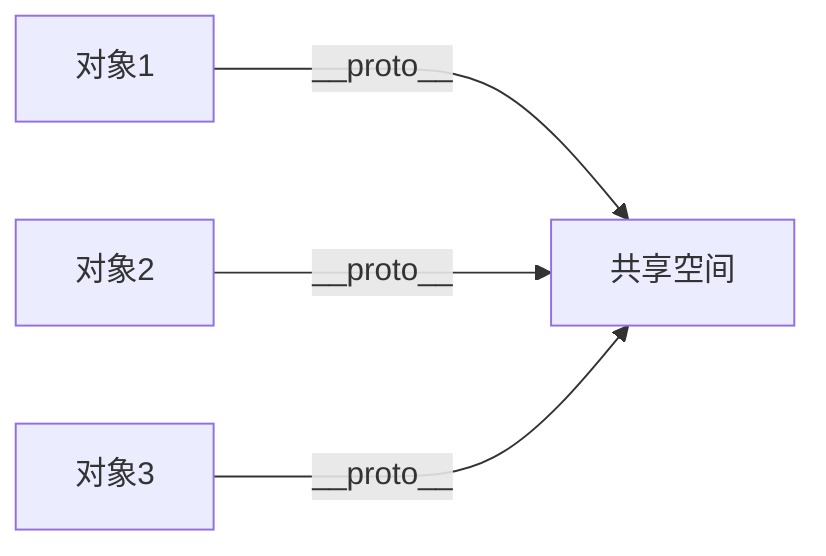
</div>

<!--  -->

那做到这里我们的问题已经解决一大步了，接下来我们继续推演。

现在对象有共享的空间了，那我们在创建函数的时候，也要可以触及到共享的空间，这样才能使我们在写创建对象的函数代码的时候，把我们的一些函数放到共享的空间里。

所以函数里存在一个 `prototype`，用来指向共享空间。

<div className="center">
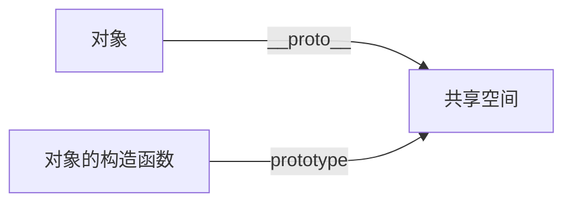
</div>
<!--  -->

那还有一个问题就是，我们该怎么知道哪个对象是由哪个函数构造出来的？

我们可以给对象包含一个数据，这个数据指向函数，但是如果构造成千上万个对象，又包含成千上万个数据！

太麻烦了，所以我们把这个引用也放到共享空间上。

<div className="center">

</div>
<!-- 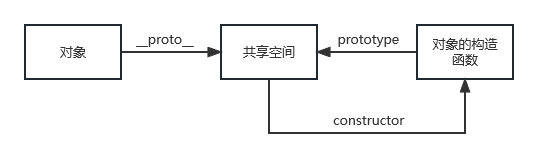 -->

那么到这里，你大概理解了一个函数的原型，让我们来继续进一步推导。

JS 有一个很有趣的地方就是，万物皆对象，就是一切都是一个对象类型，我们的共享空间以及函数也不例外。

那让我们分别来观察共享空间以及函数吧。

首先让我们看看共享空间，共享空间也是一个 `Object` 类型的对象，所以根据我们上述的

共享空间也具有 `__proto__`，`constructor` 以及`prototype` 不过分吧

<div className="center zoom.5">
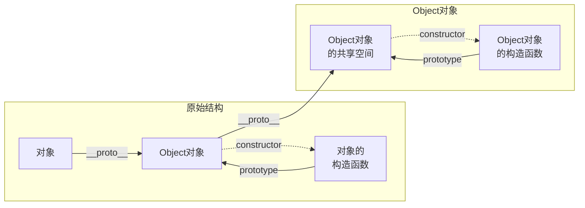
</div>
<!--  -->

现在的图就变成了这样，共享空间作为一个对象也具有一个共享空间，也具有构造函数。

因为共享空间是一个 `Object` 对象，所以他的构造函数就是 `Object` 的构造函数，而他的共享空间也自然是 `Object` 对象的共享空间了。

并且因为这里的 `Object` 对象的共享空间依然是一个 `Object` 对象，如果继续往上就形成了无限套娃

所以 `JavaScript` 在这方面的处理是将 `Object` 对象的共享空间再往上一层的共享空间直接设为 `null`。

<div className="center zoom.5">
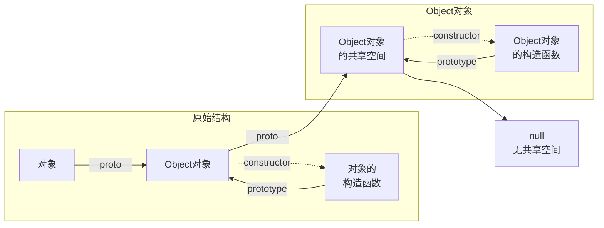
</div>
<!--  -->

这里共享空间对象的这部分就算讲述完毕了，接下来我们再回头看看函数的脉络

由于 JS 万物皆对象的概念，函数也是一个对象，那他也应该具备共享空间，

那他也应该具有构造函数，他的构造函数是什么呢？构造他的是一个 `function Function` 函数，这里我们将其称为 `“函数的构造函数”` 吧

<div className="center zoom2">

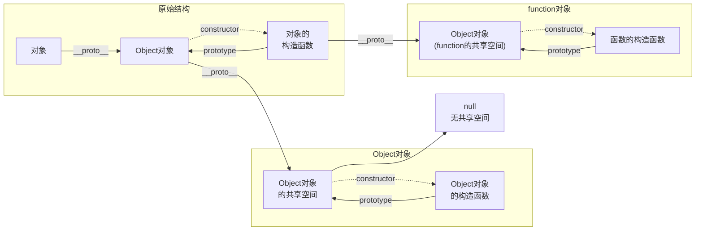
</div>
<!-- 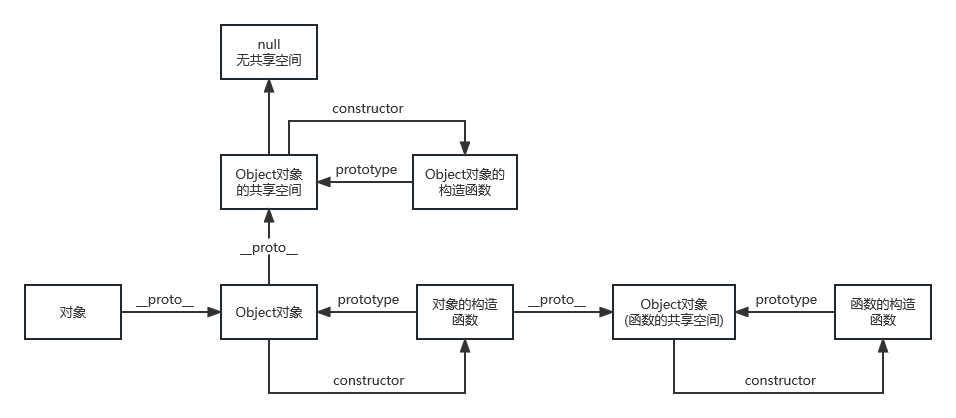 -->

因为函数的共享空间是一个 `Object` 对象，所以依然应该跟对象的共享空间(也就是一个 `Object` 对象)共享一个 `Object对象的共享空间`

<div className="center zoom2">

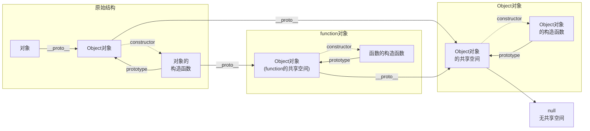
</div>

<!--  -->

函数的构造函数是一个 `function Function`，所有的函数都指向一个函数的共享空间，所以这里`函数的构造函数`的共享空间又指回了函数的共享空间

<div className="center zoom2">

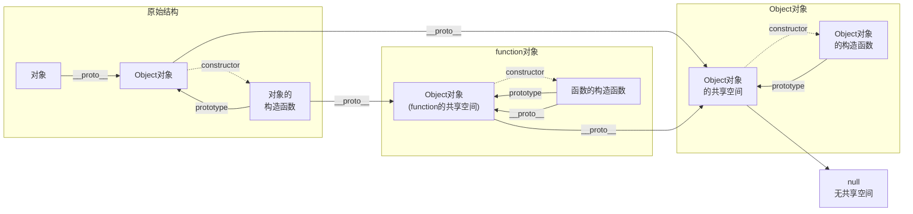
</div>
<!-- 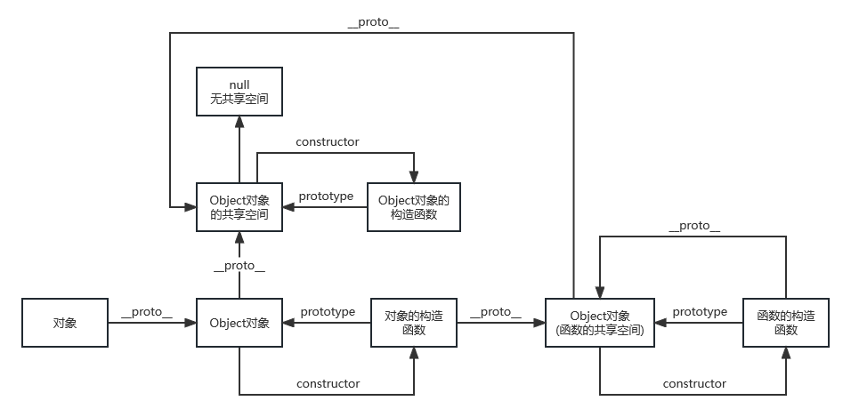 -->

而之前构造共享空间的函数 `function Object` 也是一个函数，所有的函数都指向一个函数的共享空间，所以也要指向函数的共享空间

<div className="center zoom2">

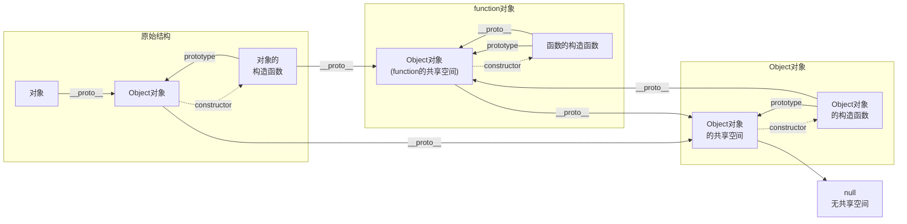
</div>
<!-- 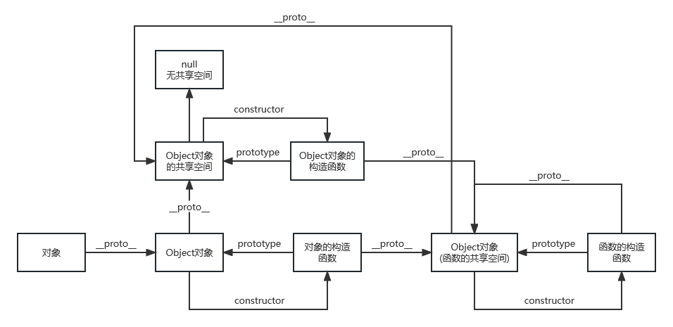 -->

这里可以基本看到，不管从任何一个路径走，最后都会走到`Object对象的共享空间上`，而它也是一个对象，这也是 `JavaScript万物皆对象` 的由来。

这里原型和原型链的概念就推导完毕了，最后我们可以看一下网络上一张较为清晰的图


> 图片来自 https://clarkdo.js.org/javascript/2014/08/21/17/
