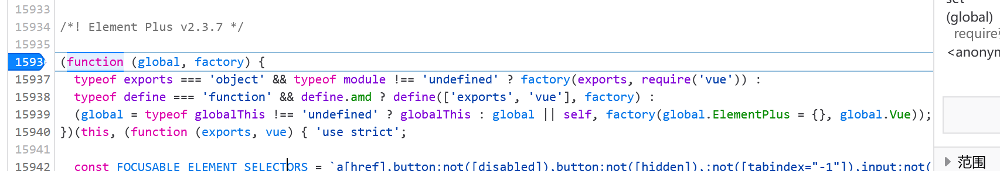

# Element Plus 的引用

这里我们列举两种常用的方法

:::info 联合作者
cxxjackie/steven026/李恒道/andywang425
:::

## 创建标签式引用

按照官方文档，引入 vue 依赖，element-plus 的 js 文件以及对应的 CSS 样式文件。

因为比较简单，我们就直接标出成品代码了

```js
// ==UserScript==
// @name         组合使用Vue+Element plus
// @namespace    http://tampermonkey.net/
// @version      0.1
// @author       You
// @match        https://bbs.tampermonkey.net.cn/*
// @grant        none
// @run-at       document-start
// ==/UserScript==

//引入Vue
let script = document.createElement("script");
script.setAttribute("type", "text/javascript");
script.src = "https://cdn.jsdelivr.net/npm/vue@next";
document.documentElement.appendChild(script);
//引入element-plus的CSS样式文件
let link = document.createElement("link");
link.setAttribute("rel", "stylesheet");
link.href = "https://unpkg.com/element-plus/dist/index.css";
document.documentElement.appendChild(link);
//引入element-plus的JS文件
let elscript = document.createElement("script");
elscript.setAttribute("type", "text/javascript");
elscript.src = "https://unpkg.com/element-plus";
document.documentElement.appendChild(elscript);
window.onload = () => {
  let text = `<div id="app" style="position: absolute;top: 50vh;left: 50vw;background: #fb7d7d;width: 100px;height: 100px;">
           <el-button>{{ message }}</el-button>
    </div>`;

  var el = document.createElement("div");
  el.innerHTML = text;
  document.body.append(el);
  const App = {
    data() {
      return {
        message: "Hello Element Plus",
      };
    },
  };
  const app = Vue.createApp(App);
  app.use(ElementPlus);
  app.mount("#app");
};
```

## 通过 `Require` 进行引用

### 错误尝试

我们先尝试引入一下

:::danger 警告

下方代码是错误代码，正确代码请参阅文章最后的[最终完整代码](#最终完整代码)

:::

```js
// ==UserScript==
// @name         require引入Element-Plus
// @namespace    http://tampermonkey.net/
// @version      0.1
// @author       LHD
// @require      https://unpkg.com/vue@next
// @require     https://unpkg.com/element-plus
// @resource     ELEMENT_CSS https://cdn.jsdelivr.net/npm/element-plus/dist/index.css
// @match        https://bbs.tampermonkey.net.cn/*
// @grant        unsafeWindow
// @grant        GM_getResourceText
// @grant        GM_addStyle
// ==/UserScript==
unsafeWindow.Vue = Vue;
const elementPlusCss = GM_getResourceText("ELEMENT_CSS");
eval(elementPlusJS);
let text = `<div id="app" style="position: absolute;top: 50vh;left: 50vw;background: #fb7d7d;width: 100px;height: 100px;">
           <el-button>{{ message }}</el-button>
    </div>`;

var el = document.createElement("div");
el.innerHTML = text;
document.body.append(el);
const App = {
  data() {
    return {
      message: "Hello Element Plus",
    };
  },
};

const app = Vue.createApp(App);
app.use(ElementPlus);
app.mount("#app");
```

发现仍然触发了报错

```
Uncaught TypeError: vue is undefined
    EhfdebfZHHnAXnSE user.js:23659
    EhfdebfZHHnAXnSE user.js:159396

```

### 报错分析

点击堆栈的最上方一行，发现报错在

```js
var _hoisted_26 = /* @__PURE__ */ vue.createElementVNode(
  "path",
  {
    fill: "currentColor",
    d: "M831.872 340.864 512 652.672 192.128 340.864a30.592 30.592 0 0 0-42.752 0 29.12 29.12 0 0 0 0 41.6L489.664 714.24a32 32 0 0 0 44.672 0l340.288-331.712a29.12 29.12 0 0 0 0-41.728 30.592 30.592 0 0 0-42.752 0z",
  },
  null,
  -1
);
```

依然是找不到 `vue` 的问题，因为我们之前已经解决过 `vue` 的引入了，所以这个错误一定是在 `Element-Plus` 的代码中发生的

`Element-Plus` 代码头部为

```js
(function (global, factory) {
  typeof exports === "object" && typeof module !== "undefined"
    ? factory(exports, require("vue"))
    : typeof define === "function" && define.amd
    ? define(["exports", "vue"], factory)
    : ((global =
        typeof globalThis !== "undefined" ? globalThis : global || self),
      factory((global.ElementPlus = {}), global.Vue));
})(this, function (exports, vue) {});
```

这部分代码是一个自执行函数，`global` 传入了 `this`，`factory` 是 `Element-Plus` 的初始化函数

所以我们可以在 `Element-Plus` 的代码头部打个断点调试一下看看



发现最后执行到了 `factory(global.ElementPlus = {}, global.Vue)`，可是 `global.Vue` 却是一个 `undefined`

因为自执行函数传入的 `global` 是 `this`，所以 `global.Vue` 也等价于 `this.Vue`

而油猴中的 `this` 与网页的并不一致，是油猴环境的 `this`，所以我们找到问题了！

我们要把 `Vue` 同样挂载到油猴环境的 `this` 下

但是这个时候又出现一个问题

我们在 `require` 的时候是无法执行用户代码的

所以我们需要换一种方式，首先通过 `resource` 获取到代码内容，然后再使用 `eval` 函数执行

### 最终完整代码

代码如下

```js
// ==UserScript==
// @name         require引入Element-Plus
// @namespace    http://tampermonkey.net/
// @version      0.1
// @author       LHD
// @require      https://unpkg.com/vue@next
// @resource     ELEMENT_JS  https://unpkg.com/element-plus
// @resource     ELEMENT_CSS https://cdn.jsdelivr.net/npm/element-plus/dist/index.css
// @match        https://bbs.tampermonkey.net.cn/*
// @grant        unsafeWindow
// @grant        GM_getResourceText
// @grant        GM_addStyle
// ==/UserScript==
this.Vue = unsafeWindow.Vue = Vue;
const elementPlusCss = GM_getResourceText("ELEMENT_CSS");
GM_addStyle(elementPlusCss);
const elementPlusJS = GM_getResourceText("ELEMENT_JS");
eval(elementPlusJS);
let text = `<div id="app" style="position: absolute;top: 50vh;left: 50vw;background: #fb7d7d;width: 100px;height: 100px;">
           <el-button>{{ message }}</el-button>
    </div>`;

var el = document.createElement("div");
el.innerHTML = text;
document.body.append(el);
const App = {
  data() {
    return {
      message: "Hello Element Plus",
    };
  },
};

const app = Vue.createApp(App);
app.use(ElementPlus);
app.mount("#app");
```

另一种更简洁的办法是使用 require 和`data:application/javascript`协议来引入一些代码。

我们可以在引入 Vue 和 Element Plus 的 require 之间加一个 require，用来把 Vue 添加到 unsafeWindow 和 this 下。

引入的代码是 `unsafeWindow.Vue=Vue,this.Vue=Vue;`。

完整代码如下：

```js
// ==UserScript==
// @name         require引入Element-Plus
// @namespace    http://tampermonkey.net/
// @version      0.1
// @author       LHD
// @require      https://unpkg.com/vue@next
// highline-next-line
// @require      data:application/javascript,unsafeWindow.Vue%3DVue%2Cthis.Vue%3DVue%3B
// @require      https://unpkg.com/element-plus
// @resource     ELEMENT_CSS https://unpkg.com/element-plus@2.3.12/dist/index.css
// @match        https://bbs.tampermonkey.net.cn/*
// @grant        unsafeWindow
// @grant        GM_getResourceText
// @grant        GM_addStyle
// ==/UserScript==

const elementPlusCss = GM_getResourceText("ELEMENT_CSS");
GM_addStyle(elementPlusCss);

let text = `<div id="app" style="position: absolute;top: 50vh;left: 50vw;background: #fb7d7d;width: 100px;height: 100px;">
           <el-button>{{ message }}</el-button>
    </div>`;

var el = document.createElement("div");
el.innerHTML = text;
document.body.append(el);
const App = {
  data() {
    return {
      message: "Hello Element Plus",
    };
  },
};

const app = Vue.createApp(App);
app.use(ElementPlus);
app.mount("#app");
```
