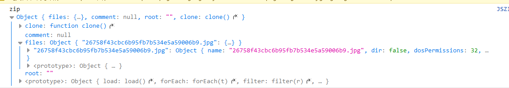

# JSZip 压缩解压文件

JSZip 是一个非常优秀的库的，我们可以在前端实现文件的压缩，以及解压功能。

# 如何使用

JSZip 的一个新建的实例代表一组文件，可以添加、删除、修改。

我们可以导入现有的 zip 文件，或生成一个新的

# 获取对象

在引入 js 文件后

创建一个 JSZip 实例

```js
var zip = new JSZip();
```

然后我们可以添加或更新文件以及文件夹

file 函数以及 folder 函数处理后依然会返回 zip 实例，以供我们进行链式调用。

```js
// 创建一个文件
zip.file("hello.txt", "Hello[p my)6cxsw2q");
// 支持换行符
zip.file("hello.txt", "Hello World\n");
// 创建一个文件以及目录
zip.file("nested/hello.txt", "Hello World\n");
// 创建一个目录然后创建一个文件
zip.folder("nested").file("hello.txt", "Hello World\n");
```

使用 folder 函数后，返回的对象为创建目录的根，如果在此对象上进行添加文件的操作

则将他们放入了创建创建的子文件夹目录之中，这只是一个相对路径的对象，添加的文件

也同样会存在于我们的 zip 实例对象中

```js
var photoZip = zip.folder("photos");
// 相当于创建了photos/README
photoZip.file("README", "a folder with photos");
```

您可以使用 file 访问文件的内容

```js
zip
  .file("hello.txt")
  .async("string")
  .then(function (data) {
    // data is "Hello World\n"
  });

//字符作为一个无符号八位整形的数组
if (JSZip.support.uint8array) {
  zip
    .file("hello.txt")
    .async("uint8array")
    .then(function (data) {
      // data is Uint8Array { 0=72, 1=101, 2=108, more...}
    });
}
```

您可以使用如下命令删除文件或文件夹

```js
zip.remove("photos/README");
zip.remove("photos");
// same as
zip.remove("photos"); // by removing the folder, you also remove its content.
```

# 生成一个 zip 文件

使用`generateAsync(options)`，您可以生成一个 zip 文件

注意，不是一个真正的文件，他仅在内存中表示

```js
var promise = null;
if (JSZip.support.uint8array) {
  promise = zip.generateAsync({ type: "uint8array" });
} else {
  promise = zip.generateAsync({ type: "string" });
}
```

# 读取 Zip 文件

通过 loadAsync(data)您可以加载一个 zip 文件

注意，必须使用二进制下载文件然后进行解压

```js
var new_zip = new JSZip();
// more files !
new_zip.loadAsync(content).then(function (zip) {
  // you now have every files contained in the loaded zip
  zip.file("hello.txt").async("string"); // a promise of "Hello World\n"
});
```

# JSZip 的局限性

不支持加密 zip，分卷 zip 等

可以加载 zip64 文件但不能较大

JSZip 仅支持 UTF8 编码

读取再生成 zip 不会生成相同的文件

# 实战练习

首先我们引入 jszip 库

```js
// @require      https://cdn.staticfile.org/jszip/3.5.0/jszip.min.js
```

这里我想读取一个 zip 压缩文件，然后再输出一个 zip 压缩文件，所以我们声明两个 zip

```js
var inZip = new JSZip();
var outZip = new JSZip();
```

因为文件目标不太好找，所以我在 github 挂了一个美女图片

地址是 `https://raw.githubusercontent.com/lihengdao666/Modify-Tampermonkey-Libs/master/testfile/1.zip`

首先我们下载文件

```js
GM_xmlhttpRequest({
  url: "https://raw.githubusercontent.com/lihengdao666/Modify-Tampermonkey-Libs/master/testfile/1.zip",
  responseType: "arraybuffer",
  method: "GET",
  headers: {},
  onload: function (xhr) {
    console.log("我下载了");
  },
});
```

这里注意 reponseType 是 arraybuffer 类型，也就是二进制下载，否则会解压错误

然后我们写解压代码

```js
inZip
  .loadAsync(xhr.response)
  .then(function (zip) {
    console.log("zip", zip);
  })
  .catch((val) => {
    alert("文件下载或解压错误");
  });
```

使用 zip.loadAsync 读取文件，传入一个二进制数据，返回一个 promise

我们对其挂载 then 和 catch，如果异常就提示文件下载或解压过程错误。

如果解压成功了，就输出 zip 对象，看看到底是什么。



这里看到 files 里有一个 2675xxx.jpg 文件，我们试着读取这个文件。

```js
inZip
  .file("26758f43cbc6b95fb7b534e5a59006b9.jpg")
  .async("blob") // 将其读取为blob类型，返回一个promise，挂上一个then获取写出的blob数据
  .then(function (data) {
    console.log("data", data);
    // 我们创建了一个img的dom对象
    // 然后将URL.createObjectURL将一个blob对象转化出来一个地址
    // 然后设置给img的src属性
    // 并添加到了body上
    let img = document.createElement("img");
    img.src = URL.createObjectURL(data);
    window.document.body.append(img);
    // 最后也将其写入到outZip里
    outZip.file("test/blob.img", data);
  });
```

可以看到页尾已经显示了图片


我们解压文件的时候使用了 `zip.file("26758f43cbc6b95fb7b534e5a59006b9.jpg").async("blob")`

那 async 内到底有几种类型？关于这个我们可以查阅[文档](https://stuk.github.io/jszip/documentation/api_zipobject/async.html#type-option)

看到

```
base64 : the result will be a string, the binary in a base64 form. // 将二进制转化为base64字符串
text (or string): the result will be an unicode string. // 返回一个解码的字符串
binarystring: the result will be a string in “binary” form, using 1 byte per char (2 bytes). // 返回一个结果为二进制数据的字符串
array: the result will be an Array of bytes (numbers between 0 and 255). // 结果将是bytes的数组形式
uint8array : the result will be a Uint8Array. This requires a compatible browser. // 结果将是无符号8位整数的数组形式，需要浏览器兼容
arraybuffer : the result will be a ArrayBuffer. This requires a compatible browser. // 结果将是一个二进制类型，需要浏览器兼容
blob : the result will be a Blob. This requires a compatible browser. // 结果将是一个blob类型，即一个js的文件对象
nodebuffer : the result will be a nodejs Buffer. This requires nodejs. // 结果是一个nodejs的buffer类型，需要nodejs，这里我们是浏览器环境，无需在意
```

通常我们需要的可能也就是 blob，text 以及 arraybuffer，所以我们着重这几个就可以了

我们刚才已经 `outZip.file("test/blob.jpg", data);` 了一下，我们已经写出了一个文件，所以这里我们可以尝试一下，多写出一些文件看看。

这里我图方便直接来回嵌套了

```js
inZip
  .file("26758f43cbc6b95fb7b534e5a59006b9.jpg")
  .async("arraybuffer")
  .then(function (data) {
    console.log("arraybuffer", data);
    outZip.file("test/arraybuffer.jpg", data);
    inZip
      .file("26758f43cbc6b95fb7b534e5a59006b9.jpg")
      .async("uint8array")
      .then(function (data) {
        console.log("uint8array", data);
        outZip.file("test/uint8array.jpg", data);
        outZip.generateAsync({ type: "blob" }).then((res) => {
          console.log("out", res);
          saveAs(res, "美女.zip");
        });
      });
  });
```

我们读取图片成 arraybuffer 写出了一个 arraybuffer 的文件以及读取图片为 unit8array 的格式的并写出一个 unit8array 的文件

最后通过 generteAsync，写出一个文件，并通过 FileSaver 的 saveAs 写出

因为 FileSaver 支持的是 blob，所以我们也要用 generateAsync 函数生成 blob 对象的输出

我们再尝试一下，可以看到下载了文件


这三个文件都是可以照常打开的

# 类型问题

为什么 jszip 支持了这么多类型？

因为有时可能不仅仅是图片，文字，还可能是一些自己构建的格式，或者我们想将一些本地客户端无痛切到网页上做某些特定的操作。

这时候我们可能需要将压缩包的数据解读成不同的格式，实际压缩包的文件只是一堆 0 和 1

我们一厢情愿的将其解析成不同的格式，变成文本，图片，二进制，数组，base64 编码等

当我们操作之后

可以将其还原为原先的一堆 0 和 1

我们要做的就是根据我们想要读取的文件选择相应的格式并且完成我们的需求即可

# 官方帮助文档

地址 : `https://stuk.github.io/jszip/documentation/api_jszip.html`


