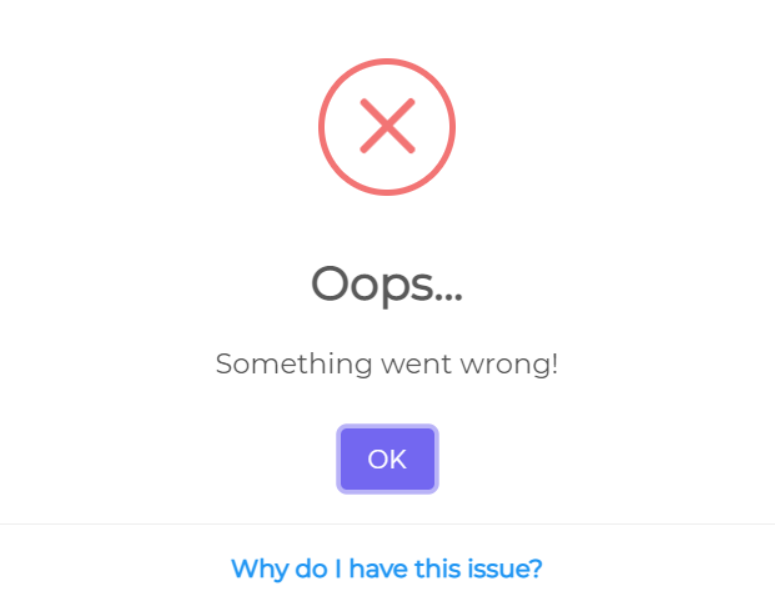
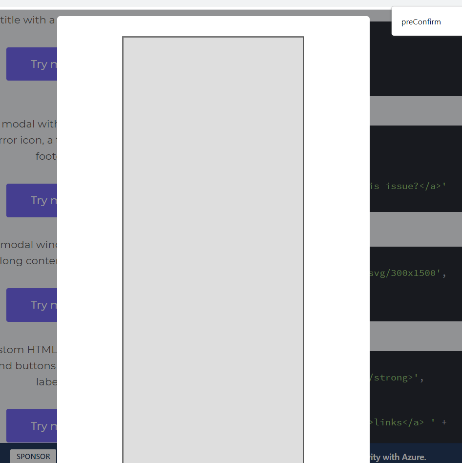
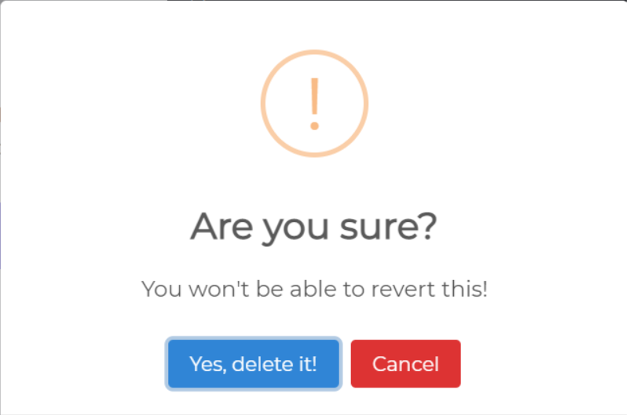
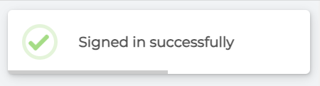
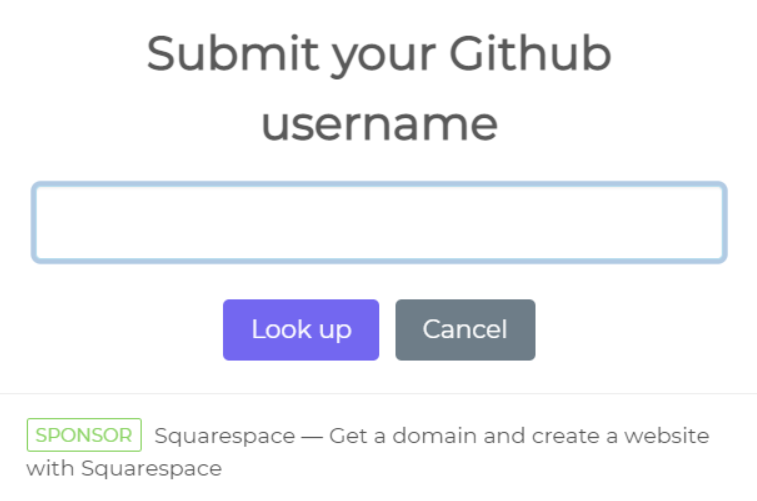

# SweetAlert2 实现对话框

这节课我们学习 SweetAlert2 来制作更漂亮的对话框

因为 alert 还是丑丑的，所以我们来看看 SweetAlert2 吧~

# 引入

直接通过 require 引入地址https://cdn.jsdelivr.net/npm/sweetalert2@11即可

# 使用

关于文档我们可以查看官方文档https://sweetalert2.github.io/recipe-gallery/

# 例子

一个基础对话框

```js
Swal.fire("Any fool can use a computer");
```


设置标题下文字以及 icon

```js
Swal.fire("The Internet?", "That thing is still around?", "question");
```


带一个页脚

```js
Swal.fire({
  icon: "error",
  title: "Oops...",
  text: "Something went wrong!",
  footer: '<a href="">Why do I have this issue?</a>',
});
```



内部包含一个很长的图片的对话框

```js
Swal.fire({
  imageUrl: "https://placeholder.pics/svg/300x1500",
  imageHeight: 1500,
  imageAlt: "A tall image",
});
```



一个带有自定义 html 和 aria 标签按钮的对话框

```js
Swal.fire({
  title: "<strong>HTML <u>example</u></strong>", // 标题
  icon: "info", // 图标
  html:
    "You can use <b>bold text</b>, " +
    '<a href="//sweetalert2.github.io">links</a> ' +
    "and other HTML tags", // 下标题样式，html格式
  showCloseButton: true, // 显示关闭按钮
  showCancelButton: true, // 显示取消按钮
  focusConfirm: false, // 聚焦元素，如果为false则不默认聚焦确定按钮
  confirmButtonText: '<i class="fa fa-thumbs-up"></i> Great!', // 使用该参数设置确认按钮的文本
  confirmButtonAriaLabel: "Thumbs up, great!", // 用于设置标签描述
  cancelButtonText: '<i class="fa fa-thumbs-down"></i>', // 使用该参数设置取消按钮的文本
  cancelButtonAriaLabel: "Thumbs down", // 用于设置取消标签的描述
});
```


一个带有三个按钮的对话框

```js
Swal.fire({
  title: "Do you want to save the changes?",
  showDenyButton: true,
  showCancelButton: true,
  confirmButtonText: "Save",
  denyButtonText: `Don't save`,
}).then((result) => {
  /* Read more about isConfirmed, isDenied below */
  if (result.isConfirmed) {
    Swal.fire("Saved!", "", "success");
  } else if (result.isDenied) {
    Swal.fire("Changes are not saved", "", "info");
  }
});
```

showDenyButton 显示拒绝按钮，如果为了显示三个按钮这将非常有用


一个定位对话框

```js
Swal.fire({
  position: "top-end", // 属性 'top' , 'top-start' , 'top-end' , 'center' , 'center-start' , 'center-end' , 'bottom' , 'bottom-start' , 'bottom-end' .
  icon: "success",
  title: "Your work has been saved",
  showConfirmButton: false,
  timer: 1500, // 消失时间
});
```


一个使用 animate.css 动画效果的对话框

```js
Swal.fire({
  title: "Custom animation with Animate.css",
  showClass: {
    popup: "animate__animated animate__fadeInDown",
  },
  hideClass: {
    popup: "animate__animated animate__fadeOutUp",
  },
});
```


一个确认后执行附加功能的对话框

```js
Swal.fire({
  title: "Are you sure?",
  text: "You won't be able to revert this!",
  icon: "warning",
  showCancelButton: true,
  confirmButtonColor: "#3085d6", // 设置确认按钮颜色
  cancelButtonColor: "#d33", // 设置取消按钮颜色
  confirmButtonText: "Yes, delete it!", // 设置确认按钮文本
}).then((result) => {
  if (result.isConfirmed) {
    Swal.fire("Deleted!", "Your file has been deleted.", "success");
  }
});
```



创建带有配置项的新实例

```js
const Toast = Swal.mixin({
  toast: true,
  position: "top-end",
  showConfirmButton: false,
  timer: 3000,
  timerProgressBar: true,
  didOpen: (toast) => {
    toast.onmouseenter = Swal.stopTimer;
    toast.onmouseleave = Swal.resumeTimer;
  },
});
Toast.fire({
  icon: "success",
  title: "Signed in successfully",
});
```



一个自定义图像的对话框

```js
Swal.fire({
  title: "Sweet!",
  text: "Modal with a custom image.",
  imageUrl: "https://unsplash.it/400/200",
  imageWidth: 400,
  imageHeight: 200,
  imageAlt: "Custom image",
});
```


带有自定义宽度背景以及一只彩虹猫的对话框

```js
let timerInterval;
Swal.fire({
  title: "Auto close alert!",
  html: "I will close in <b></b> milliseconds.",
  timer: 2000,
  timerProgressBar: true, // 底部出现对话框的进度条
  // 声明周期钩子，在弹出对话框后异步运行，并传入弹出的dom元素
  didOpen: () => {
    // 显示一个进度组件
    Swal.showLoading();
    // 获取呈现html/text的dom元素
    const b = Swal.getHtmlContainer().querySelector("b");
    timerInterval = setInterval(() => {
      // 返回进度条剩余的时间
      b.textContent = Swal.getTimerLeft();
    }, 100);
  },
  // 生命周期钩子，当窗口关闭时同步运行，提供弹出的dom元素作为函数的参数
  willClose: () => {
    clearInterval(timerInterval);
  },
}).then((result) => {
  /* Read more about handling dismissals below */
  if (result.dismiss === Swal.DismissReason.timer) {
    console.log("I was closed by the timer");
  }
});
```

一个 ajax 请求实例

```js
Swal.fire({
  title: "Submit your Github username",
  input: "text", // 设置一个input的编辑框
  // 设置input属性
  inputAttributes: {
    autocapitalize: "off", // 设置为off的时候取消首字母大写
  },
  showCancelButton: true,
  confirmButtonText: "Look up",
  showLoaderOnConfirm: true, // 当为loading的时候取消confirm按钮并显示加载组件
  // 在执行confirm按钮之前执行该函数
  // 如果返回false为阻止弹窗关闭，undefined为默认结果
  // 也可以返回其他值
  // 可以通过result.value获取对应的值
  preConfirm: (login) => {
    return fetch(`//api.github.com/users/${login}`)
      .then((response) => {
        if (!response.ok) {
          throw new Error(response.statusText);
        }
        return response.json();
      })
      .catch((error) => {
        Swal.showValidationMessage(`Request failed: ${error}`);
      });
  },
  // 如果设置为false则不允许点击对话框以外的背景来关闭对话框
  allowOutsideClick: () => !Swal.isLoading(),
}).then((result) => {
  if (result.isConfirmed) {
    Swal.fire({
      title: `${result.value.login}'s avatar`,
      imageUrl: result.value.avatar_url,
    });
  }
});
```



# 关于代码的同步运行和异步运行钩子

这里的 SweetAlert2 的钩子分为两种，一种是同步运行一种是异步运行

同步运行的代码是在运行到某个位置之后调用你的函数，然后继续执行代码

而异步执行代码则是在执行到对应位置后，则保证在未来调用你的函数

关于这点可以看到源代码中的

```js
if (typeof params.didOpen === "function") {
  setTimeout(() => params.didOpen(popup));
}
```

didOpen 是一个异步代码，因为我们发现存在 didOpen，则利用 setTimeout 进行回调并执行

setTimeout 是一个异步代码，当主任务完成后，则会回调 setTimeout 触发 didOpen 函数

关于为什么使用异步钩子，我倾向的认为是为了完成窗口的绘制后，再允许用户进行一定的操控和修改

然后再回调钩子进行处理
