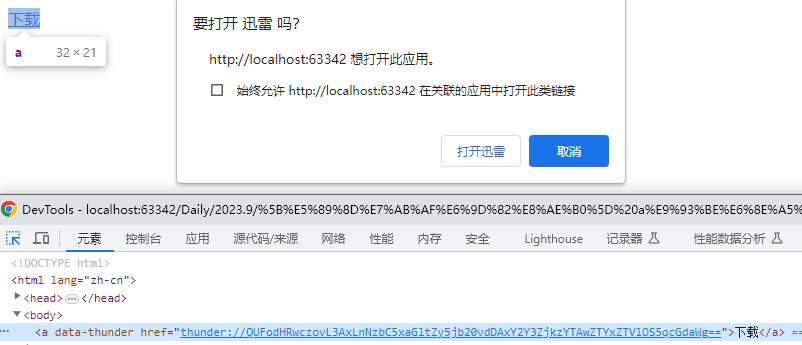

# 触发下载器实现下载

:::note 联合作者：Yiero

由于各种类型的下载器无法全部覆盖，希望大家如果有相关资料积极补足。

:::

## 迅雷下载

:::tip 原理
电脑在安装迅雷之后就会支持 `thunder` 协议, `thunder` 协议是迅雷自己支持的协议, 点击一个 `thunder` 协议的链接就会触发迅雷的下载框.

所以我们需要做的就是将一个下载链接转化成 `thunder` 协议的链接.
:::

### thunder 协议

原理其实很简单:

1. 首先在链接的首尾添加特殊字符: 开头添加 **AA** , 结尾添加 **ZZ**
2. 再将其进行 **base64** 编码;
3. 最后再添加 thunder 协议头, 将其返回 **thunder://**.

比如:

现在有一张图片, 这是我在网上随便搜的一张 Bilibili 图标.

```js
let link = "https://p1.ssl.qhimg.com/t01cf7f93a00e61e5e9.jpg";
```

如果直接打开, 或者通过 `<a href="https://p1.ssl.qhimg.com/t01cf7f93a00e61e5e9.jpg">` 打开, 都是浏览器直接出现一张图片. 因为只有在同源情况下, 才能够直接通过 a 标签下载, 使用 HTML5 的 [`download`](https://developer.mozilla.org/zh-CN/docs/Web/HTML/Element/a#%E5%B1%9E%E6%80%A7) 属性也是一样的.

> 如果需要下载跨域资源, 需要在 Js 中操作链接生成 Blob 再下载, 感兴趣可以查看 [\[downloadjs\]](https://www.npmjs.com/package/downloadjs?activeTab=code) 这个库的实现.

**Step-1 添加特殊字符**

首先, 我们在链接的首尾添加上特殊字符:

```js
link = `AA${link}ZZ`;
// -> 'AAhttps://p1.ssl.qhimg.com/t01cf7f93a00e61e5e9.jpgZZ'
```

**Step-2 进行 base64 编码**

```js
link = btoa(link);
// -> 'QUFodHRwczovL3AxLnNzbC5xaGltZy5jb20vdDAxY2Y3ZjkzYTAwZTYxZTVlOS5qcGdaWg=='
```

> 参考文档(Base64 转换): [MDN-btoa()](https://developer.mozilla.org/zh-CN/docs/Web/API/btoa)

**Step-3 添加 thunder 协议头**

```js
link = `thunder://${link}`;
// -> 'thunder://QUFodHRwczovL3AxLnNzbC5xaGltZy5jb20vdDAxY2Y3ZjkzYTAwZTYxZTVlOS5qcGdaWg=='
```

---

经过这三步, 一个链接就被我们转化成了一个 thunder 协议的链接, 如果将这个链接赋予某个 a 标签的 `href` 属性, 那么点击该 a 标签就会弹出迅雷打开许可通知, 允许之后就会使用迅雷下载这张图片.

### 示例 - 将页面中带有 `data-thunder` 标识的 a 标签转化成迅雷链接

本示例是使用了本地的网页进行演示, 如果是脚本也是一样的, 就是获取需要转换的a标签的 href 链接, 然后调用 `transformThunderLink()` , 最后将原链接替换成转化后的 thunder 链接.

**HTML代码片段**

```html
<a data-thunder href="https://p1.ssl.qhimg.com/t01cf7f93a00e61e5e9.jpg">下载</a>

<script>
    /**
     * 将链接转化成 thunder 协议的链接
     * @param { string } link
     * @Return { string }
     * */
    function transformThunderLink( link ) {
       // 1. 首先在链接的首尾添加特殊字符:首AA, 尾ZZ ( `AA${ link }ZZ` )
       // 2. 再将其进行base64编码 ( btoa() )
       // 3. 最后再添加thunder协议头, 将其返回 thunder://
       return `thunder://${ btoa( `AA${ link }ZZ` ) }`;
    }
    
    // 将所有带data-thunder标识的a链接转化成迅雷链接
    document
          .querySelectorAll( 'a[data-thunder]' )
          .forEach( link => {
             link.href = transformThunderLink( link.href );
          } );
</script>
```

**图示**

