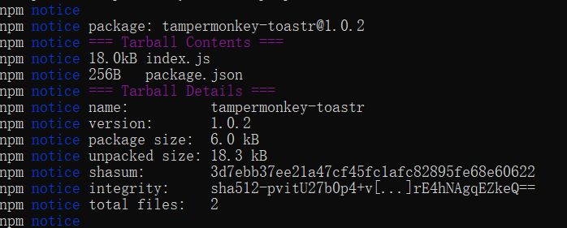
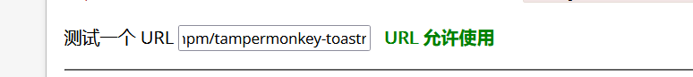

# NPM 发布魔改包

由于可以发布脚本的网站站普遍存在 require 引用限制，但是普遍不会去限制 jsdelivr，所以我们可以通过发布包的方式来通过 require 审核。

## 注册账号

https://www.npmjs.com/signup

输入你的名字、邮箱、密码

然后进入邮箱

验证你的邮箱

## 登录账号

安装 npm

在 cmd 里输入 npm login

如果出现 500 Internal Server Error 则更换镜像源

npm config set registry https://registry.npmjs.org/

再次登录

```
Username:xxxxx
Password:            //密码不会显示星号
Email:(this IS public) example@xx.com  //自己的邮箱
Logged in as username on https://registry.npmjs.org/
```

我们可以创建一个目录并输入 npm init 输入信息来初始化项目

```
mkdir example-project
cd example-project
npm init
```

然后可以创建一个 index.js 并且输入相关的库代码

## 发布

输入 npm publish 等待一会



发布成功

如果我们想更新版本，就修改 package.json 的 version 版本号，再次 npm publish 发布

## 获取 cdn 地址

网址的格式是`https://cdn.jsdelivr.net/npm/<库名字>`

例如我发布的是`https://cdn.jsdelivr.net/npm/tampermonkey-toastr`

## 更新 jsdelivr 地址

访问`https://purge.jsdelivr.net/npm/<库名字>`即可刷新

经过测试，即使强制缓存偶尔也无法正常更新

可以`https://cdn.jsdelivr.net/npm/tampermonkey-toastr@<最新版本号>`

例如`https://cdn.jsdelivr.net/npm/tampermonkey-toastr@1.0.5`

## 测试

我们以 greasyfork 为例，可以访问[外部地址校验](https://greasyfork.org/zh-CN/help/external-scripts)输入你的地址进行测试

