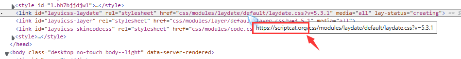
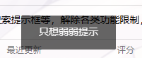

# Layui 库的引用

:::note 联合作者：Hangover/李恒道

其解决方式二基于andywang425解决，在此感谢！

:::

首先尝试正常通过 require 的方式引入 js 文件

```js
// @require   https://unpkg.com/layui@2.6.8/dist/layui.js
```

可以发现引入扩展模块的路径是根据当前域名来加载的



这个时候我们该怎么办？可以有以下处理方法

## 解决方法一

创建 script 标签包含 js 文件再插入到 body 中

````js
    let script = document.createElement("script");
    script.type = "text/javascript";
    script.src="https://unpkg.com/layui@2.6.8/dist/layui.js";
    document.body.appendChild(script);
    unsafeWindow.onload = function () {
        layer.msg('只想弱弱提示');
    }
```

打开F12可以看到扩展模块按照正确的路径加载，并且layer组件的功能可以正常使用


````

## 解决方法二

根据调试我们可以知道加载其他文件的函数是在 addcss 文件中

```js
    ready: function(e) {
        var t = "laydate"
            , i = ""
            , r = (a ? "modules/laydate/" : "theme/") + "default/laydate.css?v=" + l.v + i;
        return a ? layui.addcss(r, e, t) : n.link(r, e, t),
        this
    }
```

其中 addcss 的函数如下

```js
r.prototype.addcss = function (t, e, r) {
  return layui.link(n.dir + "css/" + t, e, r);
};
```

可以看到是根据 n.dir 拼接，我们搜索 n.dir 可以找到在初始化的过程中是从 o.dir 进行赋值的，代码如下

```js
a = (function () {
  var t = e.currentScript
    ? e.currentScript.src
    : (function () {
        for (var t, n = e.scripts, r = n.length - 1, o = r; o > 0; o--)
          if ("interactive" === n[o].readyState) {
            t = n[o].src;
            break;
          }
        return t || n[r].src;
      })();
  return (n.dir = o.dir || t.substring(0, t.lastIndexOf("/") + 1));
})();
```

而 o 来自`o = t.LAYUI_GLOBAL || {}`，t 根据调试是 window

所以我们只需要赋值`window.LAYUI_GLOBAL={dir:'https://unpkg.com/layui@2.6.8/dist/'}`

完整代码

```JS
// ==UserScript==
// @name         Layui测试
// @namespace    http://tampermonkey.net/
// @version      2024-03-20
// @description  try to take over the world!
// @author       You
// @match        https://bbs.tampermonkey.net.cn/
// @icon         https://www.google.com/s2/favicons?sz=64&domain=tampermonkey.net.cn
// @require      data:application/javascript,window.LAYUI_GLOBAL=%7Bdir:'https://unpkg.com/layui@2.6.8/dist/'%7D
// @require      https://unpkg.com/layui@2.6.8/dist/layui.js
// @grant        none
// ==/UserScript==

let myapp = document.createElement("div");
document.body.appendChild(myapp);
myapp.id = "my-app";
myapp.innerHTML = `
<link rel="stylesheet" href="https://unpkg.com/layui@2.6.8/dist/css/layui.css">
<div class="layui-inline">
    <input type="text" class="layui-input" id="test">
</div>`
layer.msg('只想弱弱提示');
layui.use('laydate', function () {
    var laydate = layui.laydate;
    laydate.render({
        elem: '#test',
        value: new Date(),
        zIndex: 99999999,
        theme: '#328dd1',
        ready: function (date) {
            console.log(date)
        },
        change: function (value, date, endDate) {
            console.log(value, date, endDate)
        },
        done: function (value, date, endDate) {
            console.log(value, date, endDate)
        }
    })
})
```
