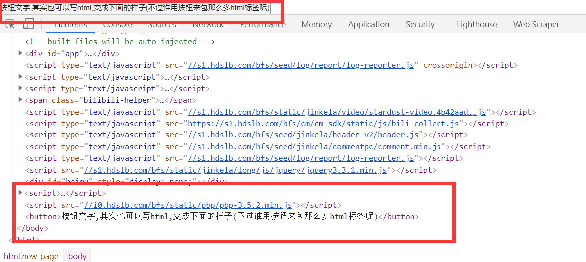
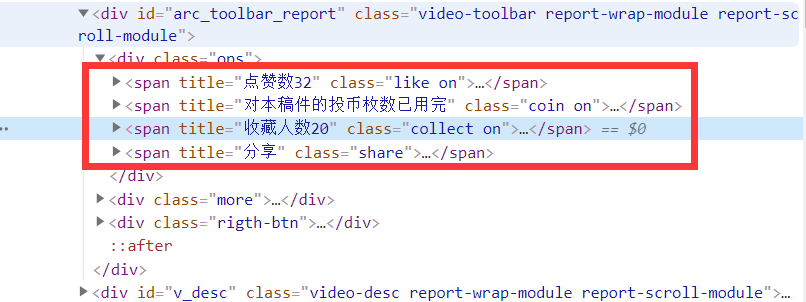
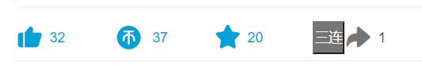

# 脚本往页面上添加新元素

介绍使用脚本往前端页面插入按钮或者一个小框框之类的元素.最后弄一个给 b 站真·一键三连的按钮.

有兴趣也可以写二连,太耗硬币了 T T

# 脚本往页面添加新元素

脚本往页面增加新元素这种需求经常可见,例如百度云的脚本,就会往页面上添加一些解析链接之类的按钮,一些助手类型的会往页面上添加一些小窗口,显示脚本的运行状态等等.

如果要让脚本往页面上添加新元素,原理很简单.

首先使用 `document.createElement`创建好你想插入的元素,例如按钮就` document.createElement("button")`,如果你有很多组件想放进去的话可以用 `document.createElement("div")`,然后往 element 里的 innerHTML 直接写 html 代码.

然后找到你想插入的位置,使用 `append/insertBefore`之类的方法插入你的 element.之后就可以在 `F12 开发者工具`中的 `element`中看到我们插入的内容了.

[append](https://developer.mozilla.org/zh-CN/docs/Web/API/ParentNode/append),[appendChild](https://developer.mozilla.org/zh-CN/docs/Web/API/Node/appendChild),[prepend](https://developer.mozilla.org/zh-CN/docs/Web/API/ParentNode/prepend),[insertBefore](https://developer.mozilla.org/zh-CN/docs/Web/API/Node/insertBefore),具体方法和区别可以自行百度搜索和查看文档(其实是我嫌麻烦,整理一下又可以水一篇了)

像下面的代码,插入到了最后面



当然上述是的原生的方法,例如有些网页自带 jQuery,那么可以用

```js
$("
    html代码
")
```

之类的方式去创建元素,再用 jQuery 的`append`之类的方法插入到页面中去.本系列内容还是使用原生的来进行讲解和使用.

# 新元素的事件监听

元素是添加进去了,但是只能看又不能用那有啥用.所以我们需要监听我们的元素事件,最常用的就是 click 点击事件,点了我们的按钮,让我们的脚本做出一些反应.

如果是类似按钮的方式,我们可以这样写.直接的使用 onclick 的方法.

```js
let btn = document.createElement("button");
btn.innerHTML =
  "按钮文字,其实也可以写html,变成下面的样子(不过谁用按钮来包那么多html标签呢)"; //innerText也可以,区别是innerText不会解析html
btn.onclick = function () {
  //code
  alert("点击了按钮");
};
document.body.append(btn);
```

如果是一个 div,在里面写 html 自由发挥,可以使用下面的方式.event 详细说明:[Event](https://developer.mozilla.org/zh-CN/docs/Web/API/Event)

```js
let div = document.createElement("div");
div.innerHTML =
  '<span id="span-1">span1</span><span class="sp">span class</span>';
div.onclick = function (event) {
  if (event.target.id == "span-1") {
    alert("span-1被点击了");
  } else if (event.target.className == "sp") {
    alert("sp这一类被点了");
  }
};
document.body.append(div);
```

至于为什么会有这样的区别,简单来说就是前一种方法我们**监听的只有一个元素**,那我们肯定就知道就只可能是这一个执行的操作.

后面的因为里面包含了多个元素,我们就可以从 event 里面找到实际被点击的元素,通过 id 或者 class 去判断,来走我们的脚本执行流程.

另外再补充一下,上面的 onclick 可以改写成 addEventListener("click"),类似下面这样.

```js
div.addEventListener("click", function (ev) {
  console.log(ev);
});
```

主要区别 onclick 只能绑定一个 function,addEventListener 可以绑定多个,这又涉及了前端的内容,大家可以课后补习一下,可以看一下[addEventListener](https://developer.mozilla.org/zh-CN/docs/Web/API/EventTarget/addEventListener)的说明.也还有其它的绑定事件的方法,这里就不一一列举了.

对于监听页面上已经有的按钮,推荐用 addEventListener,以防 onclick 将原来的按钮事件覆盖掉(如果按钮也是用 onclick 的话),看情况而定.

而且也可以在事件中 return false;使事件不再向上传递.(有点扯远了,就随口提一句 😂,补充一些脚本的开发小技巧,就像是补充内力一样,以防踩坑,万一遇到了呢,不可能所有的东西都是完全按照教程来的.有兴趣的可以课外去细究,也可以略过有个印象就好.)

## 新元素的 style

为了好看或者放在网页中不突兀,我们可以加上网页自带的 class 或者自己写一些样式,类似下面这样:

```js
btn.className = "default-btn"; //添加class
btn.id = "submit-btn"; //添加id
btn.style.color = "#ff0000"; //给按钮写style样式,查看这个文档,看css与JavaScript的对应:https://developer.mozilla.org/en-US/docs/Web/CSS/CSS_Properties_Reference
div.innerHTML =
  '<span id="span-1" class="span-class" style="font-size:12px">span1</span><span class="sp" style="color:red">span class</span>'; //在html里写style
```

# bilibili 真·一键三连

上面的内容说完后,来做点实际的东西,期望在页面上的收藏按钮和分享按钮中间增加一个三连按钮


我们可以先通过 `F12开发者工具`找到这一块的元素,发现是用的 span,为了样子一样我们可以用 span 来创建.不过!为了方便,我们还是使用 button,大家也可以当作课后作业去完善.(实际上也没什么图标,直接用按钮得了)



创建代码如下:

```js
let triple = document.createElement("button");
triple.innerText = "三连";
triple.style.background = "#757575"; //颜色弄得差不多吧
triple.style.color = "#fff";
triple.onclick = function () {
  //三连代码
};
```

插入我们可以找到 share 的父节点,然后使用 insertBefore,在 share 之前插入我们的三连按钮,代码如下:

```js
let share = document.querySelector(".share");
share.parentElement.insertBefore(triple, share);
```

emmmm 好丑,先这样吧,功能是可以的就行 😂



不过直接的这样插入是不行的,最终代码类似这样,比较复杂需要有点 DOM 之类的知识才好理解,暂时不展开吧,也暴力一点也可以直接用 setTimeout 等一段时间再插入,且 run-at 设置为 document-end.

```js
let ops = document.querySelector("#arc_toolbar_report .ops");
//插入三连之后好像会重新生成,不添加就不会重新生成,暂时没弄清什么情况,先这样处理了.
//主要作用是监听ops的DOMNodeInserted事件,等它修改完成之后再插入我们的三连按钮,另外注意run-at是document-end,要等待ops生成之后再监听,不然query返回null会报错
//这个事件会多次调用,但是我们insertBefore插入如果元素存在,只是修改而不会新增
ops.addEventListener("DOMNodeInserted", function (event) {
  let share = document.querySelector(".share");
  share.parentElement.insertBefore(triple, share);
});
```

然后我们可以长按大拇指,抓一下三连的 http 请求,就像上一节的 ajax 自动关注 up 主一样


aid 是我们的视频 id,csrf 的在 cookie 里面,这里就暂时不细说了,因为我们就是在 bilibili 的页面上,所以我们不需要使用 GM 跨域(所以我的 grant 是 none,不需要沙盒环境,另外用 unsafeWindow 也挺麻烦的),而且也可以直接通过 cookie 取到 csrf,直接用 xhr 请求接口就行了.代码如下:

```js
let httpRequest = new XMLHttpRequest();
httpRequest.open('POST', 'https://api.bilibili.com/x/web-interface/archive/like/triple');
httpRequest.setRequestHeader("Content-type","application/x-www-form-urlencoded");
httpRequest.withCredentials = true;//设置跨域发送带上cookie
let aid=window.__INITIAL_STATE__.aid;
let sKey="bili_jct";
let csrf=decodeURIComponent(document.cookie.replace(new RegExp("(?:(?:^|.*;)\\s*" + encodeURIComponent(sKey).replace(/[-.+*]/g, "\\$&amp;") + "\\s*\\=\\s*([^;]*).*$)|^.*$"), "$1")) || null;
//上面这一段就是取出csrf,在cookie里面是bili_jct,这一段我是直接copy的,总之获取到就好了啦
httpRequest.send('aid='+aid+'&amp;csrf='+csrf);
httpRequest.onreadystatechange = function () {
    if (httpRequest.readyState == 4 &amp;&amp; httpRequest.status == 200) {
        var json = JSON.parse(httpRequest.responseText);
        console.log(json);
        if(json.code==0){
           alert("三连成功!刷新页面可见");
        }else{
            alert("三连失败/(ㄒoㄒ)/~~");
        }
    }
};
```

上述取csrf代码来自:[Document.cookie](https://developer.mozilla.org/zh-CN/docs/Web/API/Document/cookie%E4%B8%80%E4%B8%AA%E5%B0%8F%E6%A1%86%E6%9E%B6%EF%BC%9A%E4%B8%80%E4%B8%AA%E5%AE%8C%E6%95%B4%E6%94%AF%E6%8C%81unicode%E7%9As%84cookie%E8%AF%BB%E5%8F%96%E5%86%99%E5%85%A5%E5%99%A8)

# end

我们脚本本次用了 `run-at`,`grant none`,这是之前学习过的,大家可以多多注意一下.

脚本安装地址

https://bbs.tampermonkey.net.cn/thread-238-1-1.html