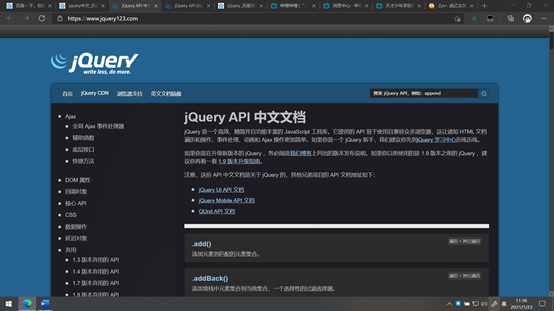
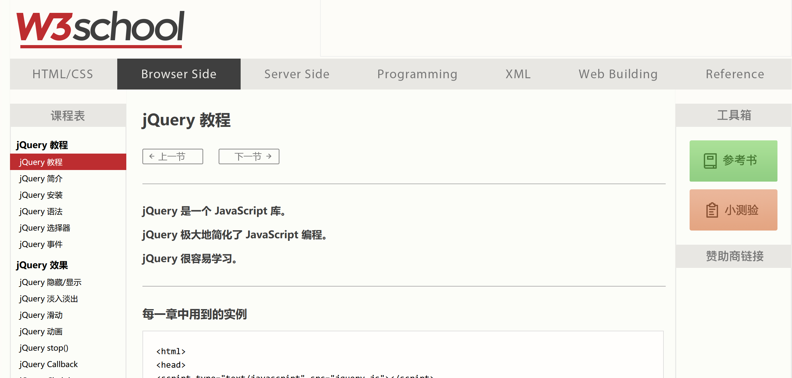

# jQuery 引用

你将学到如何使用油猴来使用 jQuery

# 警告

目前 jQuery 已经并非主流的开发工具，浏览器自身所提供的 api 足够日常开发脚本所用。

如果并非个人喜好并且为初学者，可以直接跳过本章节。

# 基础介绍

jQuery 是一个快速、简洁的，优秀的 JavaScript 代码库（或 JavaScript 框架）。jQuery 设计的宗旨是“write Less，Do More”，即倡导写更少的代码，做更多的事情。它封装 JavaScript 常用的功能代码，提供一种简便的 JavaScript 设计模式，优化 HTML 文档操作、事件处理、动画设计和 Ajax 交互。

核心特性可以总结为：具有独特的链式语法和短小清晰的多功能接口；具有高效灵活的 css 选择器，并且可对 CSS 选择器进行扩展；拥有便捷的插件扩展机制和丰富的插件。jQuery 兼容各种主流浏览器，如 IE 6.0+、FF 1.5+、Safari 2.0+、Opera 9.0+等。对于现在的主流浏览器基本支持。

# 使用方式

1：自己引入 jQuery 库 ，注入 script 元素标签
2: 使用油猴脚本的`@require` 注入脚本

# 关于引用冲突问题

在油猴用户脚本中引入 jQuery 库，最好运行在沙盒环境下，简单地加一条元数据@grant unsafeWindow 即可；

如果运行在@grant none 情形下，在脚本的顶部一定要添加一条`this.$ = this.jQuery = jQuery.noConflict(true);`

以防止与原页面 jQuery 库冲突，导致原页面功能异常。

原资料出处 : https://blog.csdn.net/nalan_yc/article/details/84769012

这里其实核心就是一个思路

1.当为 none 的时候，原网页存在 jQuery，再进行引入会出现两个 jQuery，发生冲突，需要对 jQuery 进行冲突处理

2.当为沙盒模式的时候，可以在沙盒中引入 jQuery

但一般开发通常行为是网页存在 jQuery 我们就用网页的 jQuery，如果不存在，再进行 jQuery 的引入

# 学习资料

1 官网文档

https://api.jquery.com/ 访问较慢，内容为英文


2 国内翻译

https://www.jquery123.com/

中文文档，方便搜索。



3 w3school 教程

https://www.w3school.com.cn/jquery/index.asp



# 简易使用

### 元素选取

在进行网页的操作中，最重要的一步就是定位要操作的元素，如果使用 js 自带的元素选择器，进行定位会比较麻烦，而使用 jQuery 会比较简单。
jQuery 是使用 CSS 选择器进行定位的，使用标准的 CSS 选择器即可进行元素的选取和定位。
例如 ：

> ` p = $("p");` 选取所有的 p 元素。

### 发送 Ajax 请求

使用 js 的原生 Ajax 请求比较麻烦，同时不同的浏览器内核的 Ajax 的接口样式和使用方式也不尽相同，使用 jQuery 能使用统一的方式在所有平台上便捷的使用 Ajax 请求。

```js
$.ajax({
  url: "test.html",
  context: document.body,
}).done(function () {
  $(this).addClass("done");
});
```

### 简化属性操作

使用jQuery可以方便的操作DOM 元素的各种属性

### 简化CSS操作

使用jQuery可以简化对DOM元素的CSS属性的动态设置。可以进行简单的动画操作.

### 简化各种事件的处理

使用jQuery可以注册和拦截所有元素的事件,并对之进行处理拦截,包括windows窗体对象.

注册新的处理事件和监听事件变得很容易.

### 简化对字段值的获取

使用jQuery可以轻松的获得DOM元素的属性值,设置并获得其值.

### 简化对DOM对象的插入删除操作

也可以叫做简化对HTML文档的结构进行动态的改变,添加子元素或者删除子元素.


