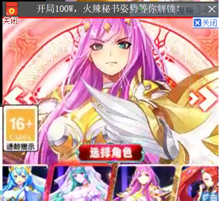
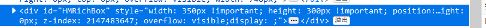
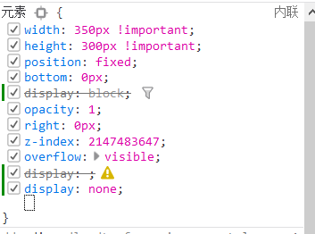
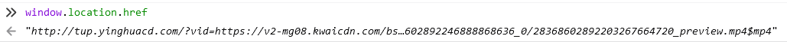
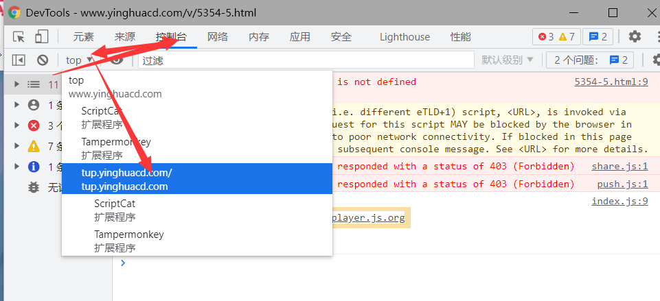
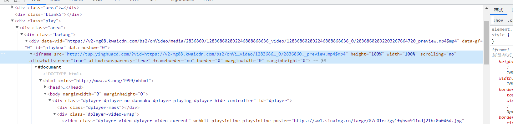
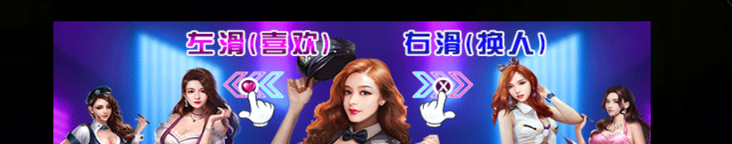

# GM_addStyle 介绍

GM_addStyle 函数是添加 CSS 到网页中

创建了一个 style 元素标签，并且将函数传入的文本内容插入到标签当中

# GM_addStyle 使用

这节课我们以樱花动漫网为例子

由于貌似存在好多网站

所以这节课我就简单以这两个网站为例子

网站http://www.yhdm.io/

网站http://www.imomoe.ai

首先解决http://www.imomoe.ai

我们先看右下角的广告问题



用元素定位找到了



然后在右边写上 display:none 发现广告消失了
这里我们写的是 css 样式
display 是展示的意思,none 代表无



接下来视频两边的广告，可以找到


同样设置`display:none`就可以了

但是这里我发现一个非常有意思的事情

就是第一个右下角的广告如果不加载

两边的广告也不会加载

所以我就稍微偷一下懒了！

```js
if (weburl.indexOf("www.imomoe.ai") != -1) {
  GM_addStyle("#HMRichBox{display:none !important}");
  GM_addStyle("#bdshare{display:none !important}");
}
```

bdshare 是分享按钮，我觉得没什么用，就也给去掉了
`#HMRichBox`是定位 css 样式的名字，其中`#`表示属于一个 id 元素，HMRichBox 是这个 id 的名字

我们用一个大括号包含我们想写的内容，之间每一个规则都用`;`来分割，这次只有一个规则，所以也可不加，直接写上 display:none 就好了

!important 是什么意思呢？因为原网页就有 display:xxxx，不同的 css 规则具有不同的高低等级，important 通常可以提高到最高等级

这里为了防止原网页的覆盖，所以加上了 important

同时发现暂停的时候偶尔也会出现广告

确定 class 为 player_pause

所以我们可以写`.player_pause{display:none !important}`,其中.代表根据 class 名来定位元素，player_pause 是我们要查找的 class 名

我们写出 css 样式后发现使用 GM_addstyle 是不好使的

查看网页发现其实播放器是一个 iframe，就是一个网页包含了另一个网页


那我们应该怎么处理？

油猴不仅仅会加载在当前页面，如果我们在 match 填入 iframe 的链接，也会匹配到 ifame 内的网页进行处理

首先测试添加 saas.jialingmm.net/\*是不好使的

所以直接访问了一下地址

```
https://saas.jialingmm.net/code.php?type=qiyi&vid=5680af4a488b920b2e2bbba3fb8abae3,302725300&userlink=http%3A%2F%2Fwww.imomoe.ai%2Fplayer%2F209-0-0.html&adress=HeiLongJiang
```

切换作用域打印 window.location.href 获取到地址



# 如何切换作用域

### 火狐切换


### 谷歌切换



也可以通过点击 iframe 切换当前作用域



切换作用域后，发现这是一个动态跳转的网页，目前的 api 链接是`api.xiaomingming.org`

所以我在 match 添加`// @match api.xiaomingming.org/*`

并且写入 addstyle

这样就彻底干净了!

# 第二个网页的复杂处理

http://www.yhdm.io

右下角的广告问题相信大家已经知道怎么处理了(吐槽：为什么都叫樱花动漫，但是域名不同，广告 id 都相同！)

我们继续谈谈视频内的暂停广告



这里依然使用了 iframe


我们访问这个链接是`http://tup.yhdm.io`

所以直接跟上一个网站同样处理就好了

最后附上脚本代码

```js
// ==UserScript==
// @name         【油猴中文网bbs.tampermonkey.net.cn】樱花去右下角广告以及弹窗
// @namespace    http://www.yhdm.io/
// @version      0.1
// @description  去除樱花动漫网广告，来源油猴中文网，bbs.tampermonkey.net.cn
// @author       【李恒道】来源油猴中文网，bbs.tampermonkey.net.cn
// @match        http://tup.yhdm.io/*
// @match        http://www.yhdm.io/*
// @match        http://www.imomoe.ai/*
// @match        api.xiaomingming.org/*
// @grant       GM_addStyle
// @grant       unsafeWindow
// @supportURL   https://bbs.tampermonkey.net.cn/forum.php?mod=viewthread&tid=270
// @homepage     https://bbs.tampermonkey.net.cn/forum.php?mod=viewthread&tid=270
// ==/UserScript==
let weburl = unsafeWindow.location.href;
if (weburl.indexOf("api.xiaomingming.org") != -1) {
  GM_addStyle("#player_pause{display:none !important}");
}
if (weburl.indexOf("tup.yhdm.io") != -1) {
  GM_addStyle("#img-random-hm1{display:none !important}");
}
if (weburl.indexOf("www.yhdm.io") != -1) {
  GM_addStyle("#HMRichBox{display:none !important}");
  GM_addStyle("#bdshare{display:none !important}");
}

if (weburl.indexOf("www.imomoe.ai") != -1) {
  GM_addStyle("#HMRichBox{display:none !important}");
  GM_addStyle("#bdshare{display:none !important}");
}
```
