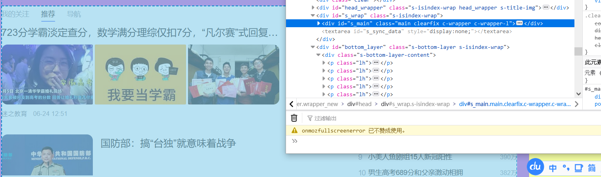
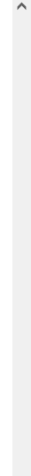
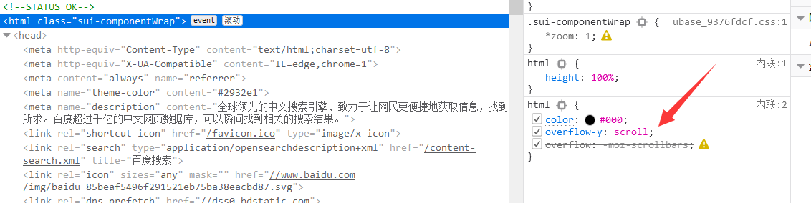
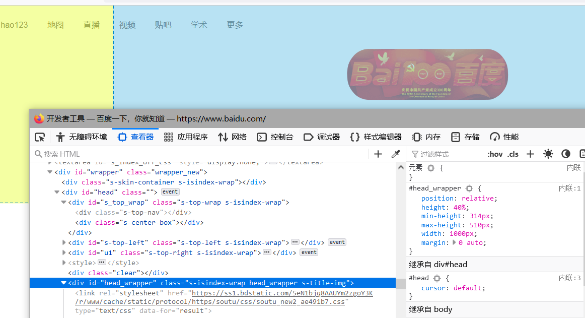
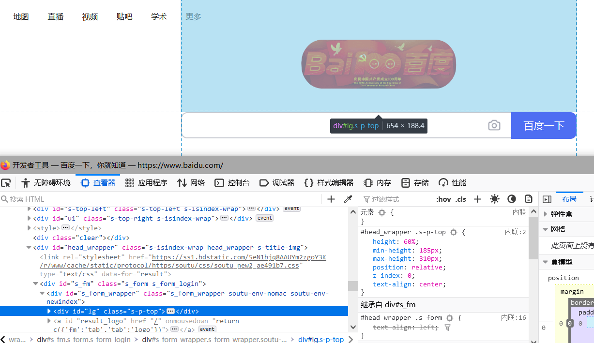
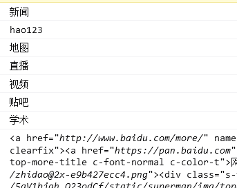
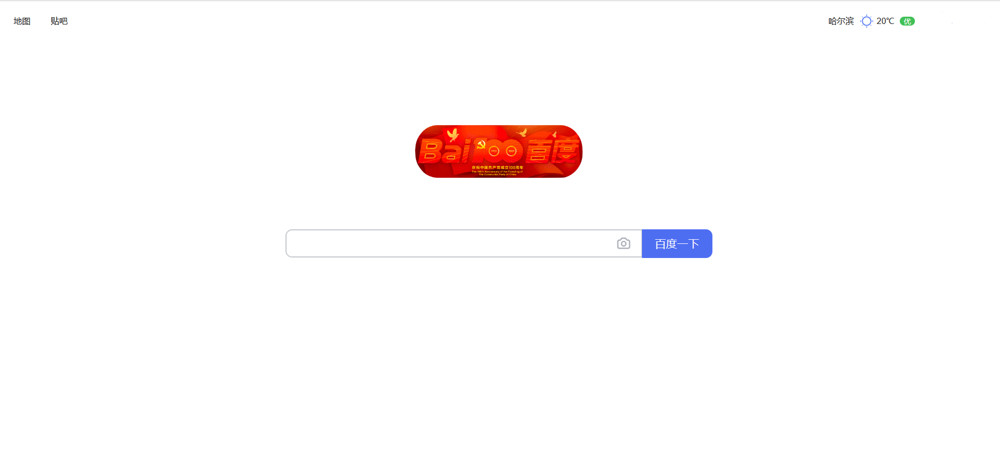

# 百度去广告及判断去除元素

本节我们将学习利用 CSS 去除广告，排布位置，修改 CSS 等并对网页元素进行循环遍历判断。

# 去除广告

首先我们找到下面的广告 id 是 s_main



书写代码

```js
GM_addStyle("#s_main{display:none !important}");
```

但是这个时候发现还存在滚轴，这个时候通常是因为有某些元素设置了最小高度导致的

我们可以直接选择元素点击一下，找到了


将其设置为 auto 即为默认

```js
GM_addStyle("#head{min-height:auto !important}");
```

我们接下来查看代码，发现虽然滚轴变成灰色的了，但是依然存在



这个时候可以排查是否一些上层元素存在 scroll 等 css 属性存在，经过排查，在 html 上找到了 overflow-y，这个需要改为 hidden 才可以隐藏，具体某个值可以直接双击页面上的 css 属性进行更改。



我们查CSS属性发现默认值是hidden，所以可以写一些CSS代码

```js
GM_addStyle('html{overflow-y: hidden !important}')
```

接下来我们就得到了一个相对干净的百度，这个输入框有点太靠上了，可以挪下去一点


我们通过元素选择找到了



修改 height 或者 min-height 都是可以的

```js
GM_addStyle('#head_wrapper{min-height: 600px; !important}')
```

再找到图标，将图标与按钮稍稍分离一点



这个时候我们可以使用 margin-bottom 属性进行分割

书写代码

```js
GM_addStyle("#lg{margin-bottom: 40px; !important}");
```


我们就得到了一个相对干净的百度了，接下来对左上角的元素进行清理


我们查看元素可能发现 class 都是一致的，这个时候我们可以使用 querySelectorAll 获取全部的元素，然后循环元素数组，通过 innerHTML 判断我们想要删除那个(注意，返回的并非一个数组，而是一个节点列表，虽然与数组相似，但是不要对其进行删除等操作！)

```js
const list = document.querySelectorAll(".mnav");
```

然后使用 for 进行循环

```js
//首先运行第一个参数内语句，然后进入循环流程
//对第二个参数进行判断，如果为真则执行{}内语句
//执行结束后运行第三个参数内语句
//并在此运行第二个参数语句进行判断是否进入执行流程
//以此反复
for (let index = 0; index < list.length; index++) {}
```

我们可以书写代码

```js
for (let index = 0; index < list.length; index++) {
  let item = list[index];
  console.log(item.innerHTML);
}
```

并且查看输出



我个人比较喜欢贴吧和地图，所以对其他进行删除，可以对元素使用 remove 来删除元素

```js
for (let index = 0; index < list.length; index++) {
  let item = list[index];
  console.log(item.innerHTML);
  if (item.innerHTML !== "贴吧" && item.innerHTML !== "地图") {
    item.remove();
  }
}
```
接下来我们就得到了一个干净的百度

脚本地址:[百度去广告测试脚本](https://bbs.tampermonkey.net.cn/forum.php?mod=viewthread&tid=689)




