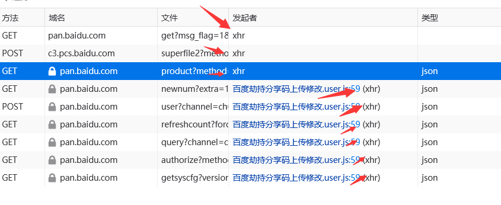

# 实战百度自定义分享码

简要：通过 XmlhttpRequest 监听提交内容劫持

知识学习：[XmlhttpRequest 返回内容监听](/docs/basics/XmlhttpRequest返回内容监听/)

# 正文

首先我们需要先建立一个前提，修改提交内容必须后端没有对该内容进行过滤，如百度的分享密码，是由前端生成然后进行上传到后端，后端记录下来的，如果是由后端返回一个分享密码并且禁止修改，那即使你在前端修改了显示，也是没有任何作用的，依然需要输入后端返回的密码，那么我们开始实战。

首先我们看一下 xhr 的例子

```js
// 1. 创建 XHR 对象
var xhr = new XMLHttpRequest();
// 2. 调用 open 函数
xhr.open("POST", "http://www.xxx.com");
// 3. 调用 send 函数
xhr.send("a=1&b=2");
// 4. 监听 onreadystatechange 事件
xhr.onreadystatechange = function () {
  if (xhr.readyState === 4 && xhr.status === 200) {
    // 获取服务器响应的数据
    console.log(xhr.responseText);
  }
};
```

我们需要先创建 XHR 对象，然后 open 设置地址，最后 send 发送数据，然后在 onreadystatechange 进行监听，如果我们想要修改提交的数据，那么自然而然应该劫持 send 函数，那我们先劫持掉 send 函数。

```js
let oldSend = XMLHttpRequest.prototype.send;
XMLHttpRequest.prototype.send = function () {
  console.log("send", arguments);
  oldSend.apply(this, arguments);
};
```

通常我们运行劫持脚本后在堆栈跟踪里看到了我们的脚本名字就是代表已经成功劫持了，如果发现没有成功劫持，可能是在脚本劫持之前已经被网页获取到了 xhr，这个时候我们可以考虑使用 run-at document-start 抢先执行试图比网页发送数据之前更快注入。


注意，判断一个请求是否是 xhr 需要看网络请求里的发起者部分。



我们这里代码最核心的部分就是对提交的数据进行劫持，我们直接亮出来代码吧

```js
//arguments是对send传入的参数，我们首先判断长度是否为0，如果不为0就执行
if (arguments.length !== 0) {
  //然后去判断是否不为空，因为我们属于侵入式脚本，需要尽量考虑到网页的各种可能存在的问题
  //如果脚本劫持通信出现问题会导致无法正常浏览网页，所以一定要谨慎。
  //判断是否存在indexOf函数则是接下来我们使用了indexOf函数
  //他是一个属于字符串对象使用的函数，一些其他对象是不存在这个函数的
  //所以我们最好对使用的函数进行判断。
  if (arguments[0] !== null && arguments[0].indexOf !== undefined) {
    //如果判断存在 pwd 和 vcode，就执行下一步，这是我们在 f12 抓包的提交数据里看到的
    //我挑了几个关键的字符进行判断，但是依然可能在其他功能上出现错误
    //其实更好的办法可以通过 url 判断，这个我们接下来会处理。
    if (
      arguments[0].indexOf("pwd") !== -1 &&
      arguments[0].indexOf("vcode") === -1
    ) {
      //提示用户输入分享码，如果长度不为 4 或不输入默认 8888
      var number = prompt("输入默认修改的四位分享码，默认:8888", "8888");
      if (number.length !== 4) {
        number = "8888";
      }
      //这里我对提交的字符串使用了 replace，replace 是字符串的替换函数，/pwd=[a-zA-Z0-9]{0,4}&/i 是什么意思？
      //这个是一个正则表达式，因为不涉及教程的内容，所以我大概对这条进行讲解
      //前后的/和/i 可以忽略，/i 是忽略大小写的意思，pwd=和&都是一个固定的字符串，唯一变动搜索的就是[a-zA-Z0-9]{0,4}
      //[]内表示搜索字符可以是括号内的任意一个字符,A-Z 表示大写 A 到 Z，a-z 表示小写 a-z，0-9 表示数字 0-9
      //说明我们匹配的字符可以是 A 到 Z，a-z，0-9 之中的任意一个字符，而{0,4}表示我们会匹配到 0 个到 4 个这样的字符
      //最后将 pwd=[a-zA-Z0-9]{0,4}&匹配的内容替换成"pwd="+number+"&"
      //这里非常简单，就是把默认的提取码替换成用户自定义的提取码并且提交就大功告成了。
      arguments[0] = arguments[0].replace(
        /pwd=[a-zA-Z0-9]{0,4}&/i,
        "pwd=" + number + "&"
      );
    }
  }
}
```

接下来还有一个问题，我们没有办法获取到 url 来判断到底应不应该劫持提取码，因为 url 是在 open 的时候提交的，我们在 send 里只能看到提交数据，无法看到 url，那我们应该怎么办呢？可以考虑对 open 进行劫持，然后将 url 挂载到 this 上，因为调用是`xhr.open("POST", "http://www.xxx.com");`，这个时候 this 就是 new 出来的 xhr 对象，而 send 的 this 也是 xhr 对象，那么我们就可以劫持 open 并且通过`this._url = url;`将路径写入到 xhr 对象上，然后在 send 里做判断。

```js
let oldOpen = XMLHttpRequest.prototype.open;
XMLHttpRequest.prototype.open = function (method, url, async, user, password) {
  this._url = url;
  return oldOpen.call(this, method, url, async, user, password);
};
```

就可以了，接下来我们看看完整代码

```js
let oldOpen = XMLHttpRequest.prototype.open;
XMLHttpRequest.prototype.open = function (method, url, async, user, password) {
  this._url = url;
  return oldOpen.call(this, method, url, async, user, password);
};
let oldSend = XMLHttpRequest.prototype.send;
XMLHttpRequest.prototype.send = function () {
  //一些兼容性判断，防止不存在_url属性或该属性没有indexOf函数，如果都存在再判断是否是生成提取码的url，然后判断参数
  if (
    this._url &&
    this._url.indexOf &&
    this._url.indexOf("/share/set?channel=") !== -1 &&
    arguments.length !== 0
  ) {
    if (arguments[0] !== null && arguments[0].indexOf !== undefined) {
      if (
        arguments[0].indexOf("pwd") !== -1 &&
        arguments[0].indexOf("vcode") === -1
      ) {
        var number = prompt("输入默认修改的四位分享码，默认:8888", "8888");
        if (number.length !== 4) {
          number = "8888";
        }
        arguments[0] = arguments[0].replace(
          /pwd=[a-zA-Z0-9]{0,4}&/i,
          "pwd=" + number + "&"
        );
      }
    }
  }
  oldSend.apply(this, arguments);
};
```
