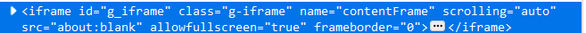

# 常见误区 (一)

简要：介绍了元素查找，iframe处理，querySelector使用，作用域问题，目录如下

1.无法找到元素的问题

2.iframe 的处理方法

3.querySelector 的简单使用

4.脚本作用域问题

# 无法找到元素

一般可能有两个因素，一个是存在 ifame，另一个则是页面加载的问题

## 页面元素加载的处理方法

页面加载不等于元素已经出现，我们通常在 f12 控制台调试和查看的是现有的页面，并不代表页面加载完毕后就一定具备这个元素

尽管很多页面会在加载的时候就出现所有元素

但是也有很多页面，会在渲染完毕后，再根据 xhr 请求数据等方式，再在页面上绘制新的数据，这个时候如果我们在页面加载完毕和获取数据绘制之间进行获取元素

是获取不到的。

解决方法也很简单，

这里我提供两个常见的方法

1.使用 setInterval 来进行循环判断，当获取元素不为空的时候继续执行，但需要注意不要创建过多的定时器，以及不使用的时候可以考虑销毁定时器，这里以找 class 名为 main 的元素为例。

```js
let timer = setInterval(() => {
  if (document.querySelector(".main") !== null) {
    //找到了定时器
    clearInterval(timer);
  }
}, 1000);
```

2.通过 DOM 插入监控来判断

在 bilibili 的例子中我们已经搞过了，通过上层已经存在的元素对其进行 dom 监听，然后再插入的时候会触发这个函数，来进行一些操作

但是需要注意把握好下层元素的数量问题，如果绘制元素过多反复触发，会极大的延迟运行速度。

```js
let ops = document.querySelector("#arc_toolbar_report .ops");
ops.addEventListener("DOMNodeInserted", function (event) {
    //触发了dom插入
});
```

如果对性能有一定的追求，可以考虑使用`MutationObserve`，也建议使用 `cxxjackie` 作者的 `ElementGetter` 库

## iframe的处理方法

可以参考https://music.163.com/#

我们可以获取到iframe元素后通过conetentWindow进入iframe的作用域来执行相应的函数

```js
document.querySelector('#g_iframe').contentWindow.document.querySelector
```

注意contentWindow内的document必须同域下才可以使用，而非同域是没有办法的

但是无法调用contentWindow下的document我们也有其他办法的

相信你一定想到了樱花动漫那一节课吧？

通过match匹配让脚本运行在iframe内就好了！

[点我跳转](/docs/basics/GM_addStyle去除网页广告/)

# queryselect的临时培训

很多读者都说用`document.querySelector`的时候经常不知道怎么找元素

我这里列几个例子



以这个iframe为例，我们可以根据id来获取
```js
document.querySelector('#g_iframe')
```
也可以使用除了id和class的其他属性来获取，比如`name='contentFrame'`

像这种除了id和class的其他属性，需要加上中括号和等于来进行判断
```js
document.querySelector('[name="contentFrame"]')
```

另外queryslector是按层级匹配，但是不需要把每层都写上，即使隔层也可以匹配到的


这里我们想获取class名为`updn`的元素

```js
document.querySelector('.g-btmbar .updn')
```

就可以了，不需要填写`btmbar`和`updn`中间那层元素

html中的标签也可以作为querySelector的搜索元素的

比如


网页只有这一个iframe标签，那我们可以直接通过`iframe`标签名来获取

```js
document.querySelector('iframe')
```

如果存在大量的相同的class元素，并且没什么特征，我们可以通过`querySelectorAll`获取全部匹配的元素，然后通过for循环，根据每个元素的特征来判断是否是我们需要的元素，这个在[百度去广告](/docs/basics/百度去广告及判断去除元素/)章节中我们曾经讨论过。

# 脚本作用域问题警告

一旦你开启了沙盒模式，你的沙盒中的函数与网页的函数是隔离的

如果出现函数无法找到另一个明明已经声明的函数，极有可能是沙箱与网页作用域的函数隔离所导致的问题。

这个时候，如果你处于沙箱中，想要访问网页函数，可以尝试使用unsafeWindow来读取网页的数据

如果处于网页中想要访问沙箱中的函数，可以将沙箱的函数挂载到unsafeWindow上来让网页读取。


