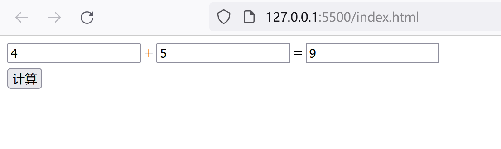

```mdx-code-block
import Tabs from '@theme/Tabs';
import TabItem from '@theme/TabItem';
```

## 前言

<details>

<summary>

点我吃瓜

</summary>

一开始因为我跟一之在greasyfork发生了一些不愉快的事情，于是决定不如我们自己来做一个国人自己的社区！于是说干就干，我们就建立起了油猴中文网，同时为了能帮助开发者更好的入门油猴脚本，我们决定写一些小短篇来帮助新人入门，这就是油猴中文网以及指南的由来，发展成如今这样几乎是当时的我们所无法想象的。

要知道在建立论坛之前，学习油猴脚本的开发是一个非常困难的事情，几乎CSDN上所有的资料都是在互相抄袭，甚至我看到了一个网站上有付费的油猴开发的教程，于是我付款买了一下，最后发现依然没有逃离CSDN的魔爪，几乎就是无脑的疯狂搬运，这种劣质的资料以及没有规划的文章劝退了大量的想要入门的开发者，于是我们决定整理资料做一个比较系统的短篇教程.

开始有王一之来负责攥写，我负责校阅，但是审核了一段时间后，我开始迸发出强烈的书写欲望，于是一篇接一篇的产出，导致油猴开发指南目前还没完结但是已经膨胀到了150篇以上，已经几乎没办法用短篇教程形容了，并且涉及大量的其他方面的内容和知识，并且一直以来油猴开发指南都是在论坛进行更新，目录和观感都不如专门独立出来一个网站来进行阅读更为舒适，所以我们很早之前就把油猴开发指南的重新整理纳入到计划了，只是因为我的拖延症极其严重，几乎间隔一年，我终于开始重新整理。

</details>

本次整理的目标是重新编排油猴开发指南的目录，同时对内容进行再校核，有条件的情况下会逐步对图片进行重新绘制，需要注意的是，因为目前开发指南只有我一个人在负责推进进度，我个人精力还是极其有限的，如果按目前的情况来说，我可以不负责任的说，油猴开发指南的新篇撰写以及重制的完成日期几乎可以说是遥遥无期，如果你对油猴方面做一点微小的贡献，并且有空闲时间，希望您联系我们[^1]，我们进行沟通并承担一部分指南工作。

顺便立下一个很遥远的flag，如果有机会，我们想尝试将这本指南申请出一个版号印刷出来书籍，虽然可能不太现实，因为大陆的版号购买是非常贵的，有时候我也觉得很无可奈何，一方面每年有大量的我的青春不迷茫，恋爱21天，我的青春日记等等充满着复制，粘贴，抄袭的书籍海量出版，而凝聚许多人的心血结出的果实却要想法设法凑钱来购买版号自费出版，有时候我甚至觉得如果购买版号是在玷污我们的劳动成果。

对这本指南我们的投入真的比各位想象中的大的多，有的时候一篇小小的文章实际背后需要看很多的资料和文章，甚至要研究半个月的资料才能动笔写下一篇，几乎牺牲了我所有的休息时间来做这些额外的劳动，并且这是没有任何收益的，不过同时我也收获了许多知识，提升了自我的能力，并且在路上收获到了很多志同道合的朋友，如果用一句话形容，那就是我虽然痛苦的往前爬行，但是从未后悔过选择这条路。

## 我们到底该如何学习油猴脚本编写

既然我个人的感慨已经说完了，那么接下来的课题就是我们到底该如何进行油猴脚本的学习，首先需要给大家进行心理建设。

很多人都喜欢建立一个心理预期，比如我的文章假设100篇，如果我每天看3篇，一个月就学完了所有内容，虽然道理是没问题的，但是这是建立在你是爱因斯坦上的。试图在短期掌握如果你并没有什么编程基础是完全不现实的，所以请放宽心态，徐徐渐进的往前学。要知道，敬畏，是知识的开端；愚妄的人藐视智慧和训诲。

如果目前某些篇目看不懂，可以先放一下，去看看其他的章节，或者继续去编写你感兴趣的网站的油猴脚本，等以后突然想起来某篇可以解决你眼下的一个小问题的时候，你可能会惊呼太棒了！

## 学油猴需要什么基础

学油猴其实就是相当于一个加强版的js环境，同时需要操纵页面

所以需要你有一定的HTML，JS，CSS基础

可以尝试按菜鸟教程进行学习([HTML](https://www.runoob.com/html/html-tutorial.html), [JS](https://www.runoob.com/js/js-tutorial.html), [CSS](https://www.runoob.com/css/css-tutorial.html))

如果感觉文字版比较枯燥无味，也可以去b站看一些视频版，这个就不做推荐了，基本都是差不多的，但是关于js的方面可以参考MDN，是一个非常标准且亲民的手册。[MDN 参考](https://developer.mozilla.org/zh-CN/docs/Web/JavaScript/Reference)

## 如何考察我是否已经及格

请尝试使用该html，通过js来创建dom，实现一个简易的加法计算器

<Tabs>
  <TabItem value="html" label="HTML代码" default>
    ```html showLineNumbers
    <!DOCTYPE html>
    <html lang="en">
    <head>
        <meta charset="UTF-8">
        <meta http-equiv="X-UA-Compatible" content="IE=edge">
        <meta name="viewport" content="width=device-width, initial-scale=1.0">
        <title>Document</title>
    </head>
    <body>
        <div class="main">
        </div>
        <div style="margin-top: 5px;">
            <button class="btn">计算</button>
        </div>
    </body>
    <script src="./main.js"></script>
    </html>
    ```
  </TabItem>
  <TabItem value="display" label="示意图">
    
  </TabItem>
</Tabs>

## 正式学习

当你完成测验后，说明你已经初步了解了HTML，CSS，JS，完全可以进行油猴脚本的学习了，这里建议先学习前20章

你将会学会初步的API调用，页面渲染，js的外部引用，如何进行跨域，hook的概念等等

如果你学到某一节卡壳了，也可以先停下，尝试去写一些自己感兴趣的脚本

碰到问题再回来查找论坛是否指南早已经提出并且处理过了，以及是否有人提过类似的问题，大部分的问题其实指南早已经告诉你了答案，其可能性高达97%，只不过你没有经常查阅罢了。

如果碰到问题，首先推荐查阅常见误区

[[油猴脚本开发指南] 基本油猴编程的一些常见误区](https://bbs.tampermonkey.net.cn/thread-835-1-1.html)

[[油猴脚本开发指南] 基本油猴编程的一些常见误区(二)](https://bbs.tampermonkey.net.cn/thread-1537-1-1.html)

该指南不仅仅局限于油猴的API方面，同时也在教会你如何更合理的设计代码，以及进行js的代码分析，关于一些概念性东西的理解。

所以大家也可以尝试学习我在文章中跟大家分享的一些代码的设计思路，虽然我个人不能保证一定准确

但如果你是一个编程菜鸟，可以快速帮助你建立起一个相对标准的代码风格和思路，这对你初期编写代码具有极大的好处。

总而言之

:::tip

经常学习，经常使用[^2]，经常查阅，是学习油猴不可或缺的一步！

:::

## 友情提醒

:::danger

最后一点警告，请不要试图造过于通用的轮子

:::

比如要节省操作可以去体验一下jquery库

如果需要监听dom可以试试[cxxjackie大佬的库](https://bbs.tampermonkey.net.cn/forum.php?mod=viewthread&tid=2726)

需要xhr的劫持也可以使用[ajaxhook库](https://bbs.tampermonkey.net.cn/forum.php?mod=viewthread&tid=3284)

不要去试图自己来写复杂性过高的已经实现过的轮子

通过去学习和使用第三方库将会节省你的大量时间以及写代码所付出的精力

如果有额外的精力，可以去学习代码的设计思路和思想。

## 结语  

希望你在油猴之路上可以越走越远！


[^1]: 联系方式：QQ:4548212 或 [email](mailto:4548212@qq.com), [Github](https://github.com/scriptscat/tampermonkey-learn-guide), 或[油猴中文网](https://bbs.tampermonkey.net.cn)

[^2]: “经常使用”为涛之雨添加